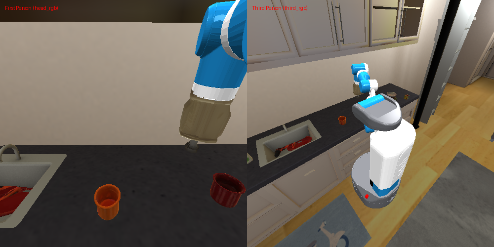
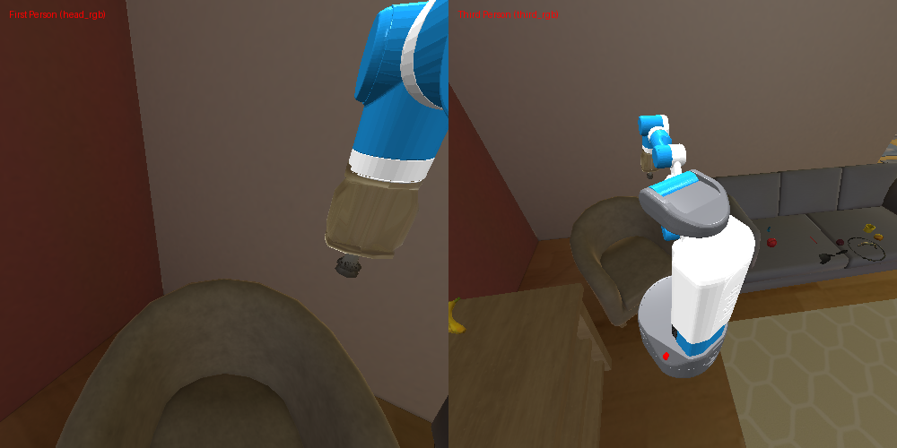
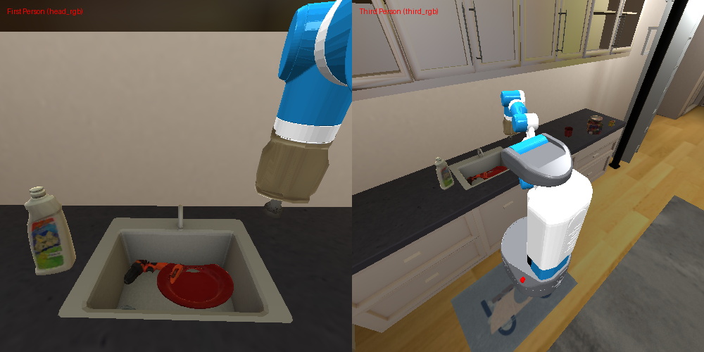
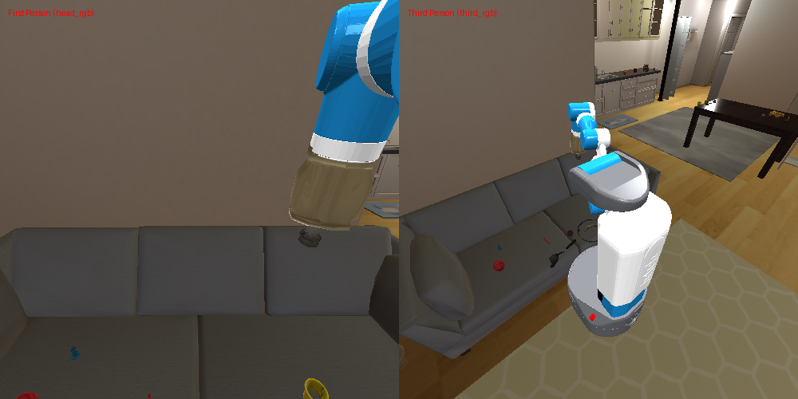
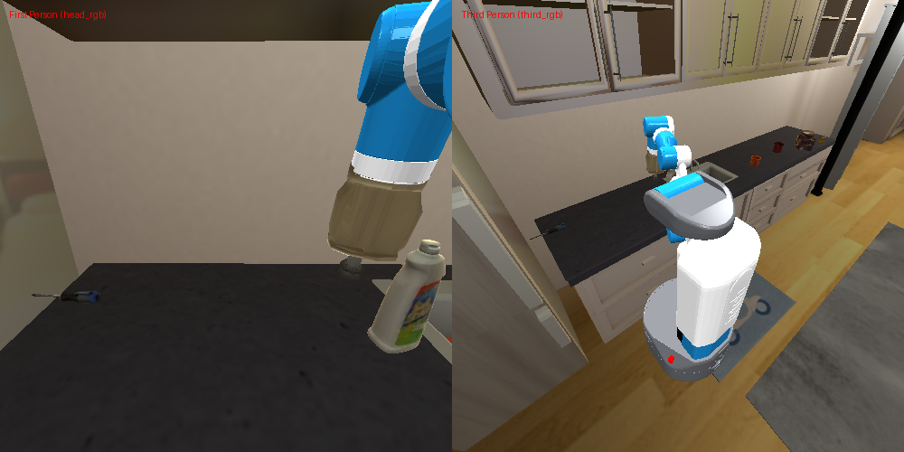
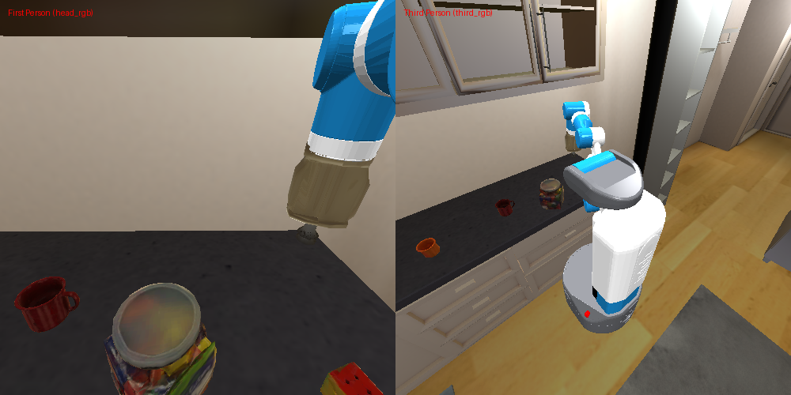

# Intent Reasoning Agent Run Summary
**Episode ID:** test_ep3_quickstart  
**Timestamp:** 20260503_170109  

---

### Ground Truth Locations

```json
{
  "episode_index": 3,
  "target_object": "orange",
  "spawn_location (receptacle)": "receptacle_aabb_TvStnd1_Top1_frl_apartment_tvstand",
  "destination (receptacle)": "receptacle_aabb_sink_kitchen_counter",
  "all_scene_objects": [
    "apple",
    "ball",
    "banana",
    "block",
    "book",
    "bowl",
    "box",
    "can",
    "clamp",
    "cleanser",
    "cup",
    "drill",
    "hammer",
    "knife",
    "lego",
    "lemon",
    "lid",
    "mug",
    "orange",
    "padlock",
    "peach",
    "pear",
    "plate",
    "plum",
    "rubriks cube",
    "scissors",
    "screwdriver",
    "spatula",
    "sponge",
    "spoon",
    "strawberry",
    "toy airplane",
    "wrench"
  ]
}
```

---

### Step 0 - GoalReasoner (Module A)

```json
{
  "original_target": "the apple from the TV stand",
  "reasoning_chain": [
    {
      "question": "Why does the user want this object?",
      "answer": "The user is thirsty and wants to consume something to quench their thirst."
    },
    {
      "question": "Why is that important?",
      "answer": "The user needs to hydrate themselves to satisfy their thirst."
    }
  ],
  "deep_intent": "The user wants to hydrate themselves.",
  "acceptable_alternatives_properties": [
    {
      "priority": 1,
      "description": "Items that can provide hydration, such as water, juice, or any liquid beverage."
    },
    {
      "priority": 2,
      "description": "Fruits or foods with high water content that can help in hydrating, such as watermelon, cucumber, or oranges."
    }
  ]
}
```

---

### Step 0 - SolutionSpaceAnalyzer (Module B)


```json
{
  "capabilities_count": 70,
  "currently_visible": [
    "ball"
  ],
  "memory_objects": {
    "ball": "unknown starting location"
  }
}
```

---

### Step 0 - TaskValidator (Module C & D merged)

```json
{
  "reasoning": "The original target, 'the apple from the TV stand', is not visible and not in memory. Therefore, I need to explore. The TV stand is a legal location that I have not yet visited, so I will navigate to the TV stand to check for the apple.",
  "selected_target": "TV stand",
  "action_id": 8,
  "communication_to_user": null
}
```

---

### Step 1 - SolutionSpaceAnalyzer (Module B)


```json
{
  "capabilities_count": 70,
  "currently_visible": [],
  "memory_objects": {
    "ball": "unknown starting location"
  }
}
```

---

### Step 1 - TaskValidator (Module C & D merged)

```json
{
  "reasoning": "The original target, 'the apple from the TV stand', is not visible and is not listed in Memory. Therefore, I cannot pick it up. Since I cannot find the apple, I need to explore new locations to potentially find it. The TV stand is already visited, so I will navigate to one of the unvisited locations. I will choose to navigate to 'cabinet 7', as it is one of the unvisited locations and could potentially contain items that provide hydration.",
  "selected_target": "cabinet 7",
  "action_id": 0,
  "communication_to_user": null
}
```

---

### Step 2 - SolutionSpaceAnalyzer (Module B)


```json
{
  "capabilities_count": 70,
  "currently_visible": [],
  "memory_objects": {
    "ball": "unknown starting location"
  }
}
```

---

### Step 2 - TaskValidator (Module C & D merged)

```json
{
  "reasoning": "The original target, 'the apple from the TV stand', is not visible and has not been found in memory. Since I have already visited the TV stand and it is not in the visible objects list, I need to explore new locations. The next logical step is to navigate to an unvisited location that may have the apple or other hydrating items. I will choose to navigate to 'cabinet 6' as it is the first unvisited location in the list.",
  "selected_target": "cabinet 6",
  "action_id": 1,
  "communication_to_user": null
}
```

---

### Step 3 - SolutionSpaceAnalyzer (Module B)



```json
{
  "capabilities_count": 70,
  "currently_visible": [
    "cup"
  ],
  "memory_objects": {
    "ball": "unknown starting location",
    "cup": "cabinet 6"
  }
}
```

---

### Step 3 - TaskValidator (Module C & D merged)

```json
{
  "reasoning": "The original target, 'the apple from the TV stand', is not currently visible and was previously visited. It is also not in memory. According to the rules, since the original target is not visible but exists in memory, I should explore unvisited locations to find it. The unvisited locations include several cabinets and kitchen areas. I will navigate to 'cabinet 5' as it is a new location that may contain the apple or other items that can help hydrate the user.",
  "selected_target": "cabinet 5",
  "action_id": 2,
  "communication_to_user": null
}
```

---

### Step 4 - SolutionSpaceAnalyzer (Module B)


```json
{
  "capabilities_count": 70,
  "currently_visible": [
    "cup",
    "can"
  ],
  "memory_objects": {
    "ball": "unknown starting location",
    "cup": "cabinet 5",
    "can": "cabinet 5"
  }
}
```

---

### Step 4 - TaskValidator (Module C & D merged)

```json
{
  "reasoning": "The original target, 'the apple from the TV stand', is not visible and has not been found in memory. I have already visited the TV stand and the apple is not in memory. Therefore, I need to explore new locations. The unvisited locations include several cabinets and kitchen areas. I will navigate to 'cabinet 4', as it is a new location that may contain food items or beverages that can help quench the user's thirst.",
  "selected_target": "cabinet 4",
  "action_id": 3,
  "communication_to_user": null
}
```

---

### Step 5 - SolutionSpaceAnalyzer (Module B)


```json
{
  "capabilities_count": 70,
  "currently_visible": [
    "cup",
    "can"
  ],
  "memory_objects": {
    "ball": "unknown starting location",
    "cup": "cabinet 4",
    "can": "cabinet 4"
  }
}
```

---

### Step 5 - TaskValidator (Module C & D merged)

```json
{
  "reasoning": "The original target, 'the apple from the TV stand', is not currently visible and has not been found in memory. The TV stand has already been visited, and the apple is not in memory. Therefore, I must explore new locations to find the apple. The unvisited locations include several options, but I should prioritize locations that are likely to contain food or beverages. The refrigerator is a logical choice as it may contain fruits or drinks that can help hydrate the user. Thus, I will navigate to the refrigerator push point.",
  "selected_target": "refrigerator push point",
  "action_id": 4,
  "communication_to_user": null
}
```

---

### Step 6 - SolutionSpaceAnalyzer (Module B)


```json
{
  "capabilities_count": 70,
  "currently_visible": [],
  "memory_objects": {
    "ball": "unknown starting location",
    "cup": "cabinet 4",
    "can": "cabinet 4"
  }
}
```

---

### Step 6 - TaskValidator (Module C & D merged)

```json
{
  "reasoning": "The original target, 'the apple from the TV stand', is not visible and has not been found in memory. Since it is not visible, I cannot pick it up. I need to explore new locations to find it. The only locations I haven't visited yet are 'chair 1', 'table 1', 'table 2', 'sink in the kitchen', 'right counter in the kitchen', 'left counter in the kitchen', 'sofa', 'refrigerator', 'left drawer of the kitchen counter', and 'right drawer of the kitchen counter'. I will choose to navigate to 'chair 1' as my first unvisited location to explore, which may potentially have items that can help with hydration.",
  "selected_target": "chair 1",
  "action_id": 5,
  "communication_to_user": null
}
```

---

### Step 7 - SolutionSpaceAnalyzer (Module B)



```json
{
  "capabilities_count": 70,
  "currently_visible": [],
  "memory_objects": {
    "ball": "unknown starting location",
    "cup": "cabinet 4",
    "can": "cabinet 4"
  }
}
```

---

### Step 7 - TaskValidator (Module C & D merged)

```json
{
  "reasoning": "The original target, 'the apple from the TV stand', is not visible and has not been found in memory. Since I have already visited the TV stand and it is not in memory, I must explore new locations. The unvisited locations include 'table 1', 'table 2', 'sink in the kitchen', 'right counter in the kitchen', 'left counter in the kitchen', 'sofa', 'refrigerator', 'left drawer of the kitchen counter', and 'right drawer of the kitchen counter'. I will navigate to 'table 1' as it is a new location that may contain items that can help with hydration.",
  "selected_target": "table 1",
  "action_id": 6,
  "communication_to_user": null
}
```

---

### Step 8 - SolutionSpaceAnalyzer (Module B)


```json
{
  "capabilities_count": 70,
  "currently_visible": [
    "strawberry",
    "lego",
    "box"
  ],
  "memory_objects": {
    "ball": "unknown starting location",
    "cup": "cabinet 4",
    "can": "cabinet 4",
    "strawberry": "table 1",
    "lego": "table 1",
    "box": "table 1"
  }
}
```

---

### Step 8 - TaskValidator (Module C & D merged)

```json
{
  "reasoning": "The original target, 'the apple from the TV stand', is not currently visible, and I have already visited the TV stand. However, it is not in memory either, meaning I cannot navigate to its known location. Since I need to explore new locations to find the apple, I will choose to navigate to a location that has not been visited yet. Among the unvisited locations, 'table 2' is a logical choice as it may contain food items or beverages that can help hydrate the user. Therefore, I will navigate to 'table 2'.",
  "selected_target": "table 2",
  "action_id": 7,
  "communication_to_user": null
}
```

---

### Step 9 - SolutionSpaceAnalyzer (Module B)


```json
{
  "capabilities_count": 70,
  "currently_visible": [
    "scissors",
    "banana",
    "lemon"
  ],
  "memory_objects": {
    "ball": "unknown starting location",
    "cup": "cabinet 4",
    "can": "cabinet 4",
    "strawberry": "table 1",
    "lego": "table 1",
    "box": "table 1",
    "scissors": "table 2",
    "banana": "table 2",
    "lemon": "table 2"
  }
}
```

---

### Step 9 - TaskValidator (Module C & D merged)

```json
{
  "reasoning": "The original target, 'the apple from the TV stand', is not visible in the current location (table 2) and is also not in memory, as it was not previously recorded. Since I have already visited the TV stand and did not find the apple, I need to explore new locations. The unvisited locations include the sink in the kitchen, right counter in the kitchen, left counter in the kitchen, sofa, refrigerator, left drawer of the kitchen counter, and right drawer of the kitchen counter. I will choose to navigate to the refrigerator, as it is a likely place to find items that can provide hydration, such as drinks or fruits. This aligns with the exploration mode rule, as I must explore a new location to find the original target.",
  "selected_target": "refrigerator",
  "action_id": 13,
  "communication_to_user": null
}
```

---

### Step 10 - SolutionSpaceAnalyzer (Module B)


```json
{
  "capabilities_count": 70,
  "currently_visible": [],
  "memory_objects": {
    "ball": "unknown starting location",
    "cup": "cabinet 4",
    "can": "cabinet 4",
    "strawberry": "table 1",
    "lego": "table 1",
    "box": "table 1",
    "scissors": "table 2",
    "banana": "table 2",
    "lemon": "table 2"
  }
}
```

---

### Step 10 - TaskValidator (Module C & D merged)

```json
{
  "reasoning": "The original target, 'the apple from the TV stand', is not visible and is not in memory. Therefore, I must explore new locations. The apple is likely to be found in locations where food items are stored. The only unvisited locations that could potentially contain food items are 'sink in the kitchen', 'right counter in the kitchen', 'left counter in the kitchen', 'sofa', 'left drawer of the kitchen counter', and 'right drawer of the kitchen counter'. I will choose to navigate to the 'sink in the kitchen' as my first unvisited location to explore.",
  "selected_target": "sink in the kitchen",
  "action_id": 9,
  "communication_to_user": null
}
```

---

### Step 11 - SolutionSpaceAnalyzer (Module B)



```json
{
  "capabilities_count": 70,
  "currently_visible": [
    "drill",
    "cleanser",
    "bowl",
    "lid"
  ],
  "memory_objects": {
    "ball": "unknown starting location",
    "cup": "cabinet 4",
    "can": "cabinet 4",
    "strawberry": "table 1",
    "lego": "table 1",
    "box": "table 1",
    "scissors": "table 2",
    "banana": "table 2",
    "lemon": "table 2",
    "drill": "sink in the kitchen",
    "cleanser": "sink in the kitchen",
    "bowl": "sink in the kitchen",
    "lid": "sink in the kitchen"
  }
}
```

---

### Step 11 - TaskValidator (Module C & D merged)

```json
{
  "reasoning": "The original target, 'the apple from the TV stand', is not visible and has not been recorded in memory. Since I have already visited the TV stand and it is not in memory, I need to explore new locations. The unvisited locations include 'right counter in the kitchen', 'left counter in the kitchen', 'sofa', 'left drawer of the kitchen counter', and 'right drawer of the kitchen counter'. I will choose to navigate to the 'right counter in the kitchen' as it is a new location that may contain items that can provide hydration.",
  "selected_target": "right counter in the kitchen",
  "action_id": 10,
  "communication_to_user": null
}
```

---

### Step 12 - SolutionSpaceAnalyzer (Module B)


```json
{
  "capabilities_count": 70,
  "currently_visible": [
    "cup"
  ],
  "memory_objects": {
    "ball": "unknown starting location",
    "cup": "right counter in the kitchen",
    "can": "cabinet 4",
    "strawberry": "table 1",
    "lego": "table 1",
    "box": "table 1",
    "scissors": "table 2",
    "banana": "table 2",
    "lemon": "table 2",
    "drill": "sink in the kitchen",
    "cleanser": "sink in the kitchen",
    "bowl": "sink in the kitchen",
    "lid": "sink in the kitchen"
  }
}
```

---

### Step 12 - TaskValidator (Module C & D merged)

```json
{
  "reasoning": "The original target, 'the apple from the TV stand', is not visible and not in memory. Since I have already visited the TV stand, I need to explore new locations to find the apple. The unvisited locations are 'left counter in the kitchen', 'sofa', 'left drawer of the kitchen counter', and 'right drawer of the kitchen counter'. I will choose to navigate to the 'left counter in the kitchen' as it is a new location that may contain items related to hydration.",
  "selected_target": "left counter in the kitchen",
  "action_id": 11,
  "communication_to_user": null
}
```

---

### Step 13 - SolutionSpaceAnalyzer (Module B)


```json
{
  "capabilities_count": 70,
  "currently_visible": [
    "screwdriver",
    "cleanser",
    "box"
  ],
  "memory_objects": {
    "ball": "unknown starting location",
    "cup": "right counter in the kitchen",
    "can": "cabinet 4",
    "strawberry": "table 1",
    "lego": "table 1",
    "box": "left counter in the kitchen",
    "scissors": "table 2",
    "banana": "table 2",
    "lemon": "table 2",
    "drill": "sink in the kitchen",
    "cleanser": "left counter in the kitchen",
    "bowl": "sink in the kitchen",
    "lid": "sink in the kitchen",
    "screwdriver": "left counter in the kitchen"
  }
}
```

---

### Step 13 - TaskValidator (Module C & D merged)

```json
{
  "reasoning": "The original target, 'the apple from the TV stand', is not visible and has not been encountered in the previous actions. Since it is not in memory, I need to explore new locations. The only unvisited locations are 'sofa', 'left drawer of the kitchen counter', and 'right drawer of the kitchen counter'. I will choose to navigate to the 'sofa' as it is a new location that has not been explored yet, which may potentially have the apple or other items that can help with hydration.",
  "selected_target": "sofa",
  "action_id": 12,
  "communication_to_user": null
}
```

---

### Step 14 - SolutionSpaceAnalyzer (Module B)



```json
{
  "capabilities_count": 70,
  "currently_visible": [],
  "memory_objects": {
    "ball": "unknown starting location",
    "cup": "right counter in the kitchen",
    "can": "cabinet 4",
    "strawberry": "table 1",
    "lego": "table 1",
    "box": "left counter in the kitchen",
    "scissors": "table 2",
    "banana": "table 2",
    "lemon": "table 2",
    "drill": "sink in the kitchen",
    "cleanser": "left counter in the kitchen",
    "bowl": "sink in the kitchen",
    "lid": "sink in the kitchen",
    "screwdriver": "left counter in the kitchen"
  }
}
```

---

### Step 14 - TaskValidator (Module C & D merged)

```json
{
  "reasoning": "The original target, 'the apple from the TV stand', is not visible and has not been encountered in the previous actions. Since it is not in memory, I must explore new locations. The only unvisited locations are 'left drawer of the kitchen counter' and 'right drawer of the kitchen counter'. I will choose to navigate to one of these locations to explore for potential hydration sources. The left drawer of the kitchen counter seems like a reasonable choice to start exploring for items that could provide hydration.",
  "selected_target": "left drawer of the kitchen counter",
  "action_id": 14,
  "communication_to_user": null
}
```

---

### Step 15 - SolutionSpaceAnalyzer (Module B)



```json
{
  "capabilities_count": 70,
  "currently_visible": [
    "screwdriver",
    "cleanser"
  ],
  "memory_objects": {
    "ball": "unknown starting location",
    "cup": "right counter in the kitchen",
    "can": "cabinet 4",
    "strawberry": "table 1",
    "lego": "table 1",
    "box": "left counter in the kitchen",
    "scissors": "table 2",
    "banana": "table 2",
    "lemon": "table 2",
    "drill": "sink in the kitchen",
    "cleanser": "left drawer of the kitchen counter",
    "bowl": "sink in the kitchen",
    "lid": "sink in the kitchen",
    "screwdriver": "left drawer of the kitchen counter"
  }
}
```

---

### Step 15 - TaskValidator (Module C & D merged)

```json
{
  "reasoning": "The original target, 'the apple from the TV stand', is not visible and not in memory. The only unvisited location is 'right drawer of the kitchen counter'. Since the apple is not in memory, I need to explore a new location. The right drawer of the kitchen counter is the only option available for exploration. Therefore, I will navigate to the right drawer of the kitchen counter.",
  "selected_target": "right drawer of the kitchen counter",
  "action_id": 15,
  "communication_to_user": null
}
```

---

### Step 16 - SolutionSpaceAnalyzer (Module B)



```json
{
  "capabilities_count": 70,
  "currently_visible": [
    "cup",
    "can"
  ],
  "memory_objects": {
    "ball": "unknown starting location",
    "cup": "right drawer of the kitchen counter",
    "can": "right drawer of the kitchen counter",
    "strawberry": "table 1",
    "lego": "table 1",
    "box": "left counter in the kitchen",
    "scissors": "table 2",
    "banana": "table 2",
    "lemon": "table 2",
    "drill": "sink in the kitchen",
    "cleanser": "left drawer of the kitchen counter",
    "bowl": "sink in the kitchen",
    "lid": "sink in the kitchen",
    "screwdriver": "left drawer of the kitchen counter"
  }
}
```

---

### Step 16 - TaskValidator (Module C & D merged)

```json
{
  "reasoning": "The original target, 'the apple from the TV stand', is not visible and has not been found in memory. All legal locations have been visited, and there are no unvisited locations left to explore. According to the rules, since I have explored all logical locations and the original target is still missing, I must consider alternatives. The acceptable alternatives are items that can provide hydration. In memory, I have a 'cup' and a 'can', both located in the right drawer of the kitchen counter. The 'cup' can be used to hold a liquid for hydration. Therefore, I will select the 'cup' as the best alternative to fulfill the user's intent to hydrate themselves.",
  "selected_target": "cup",
  "action_id": 16,
  "communication_to_user": "I explored the whole scene but couldn't find the apple. However, I found a cup which can hold a drink for hydration. Would you like me to grab it?"
}
```

---

