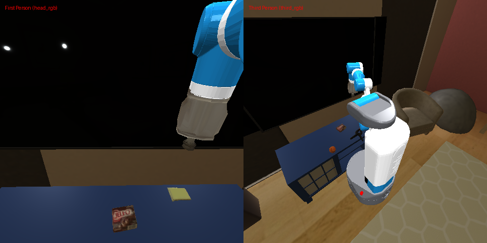
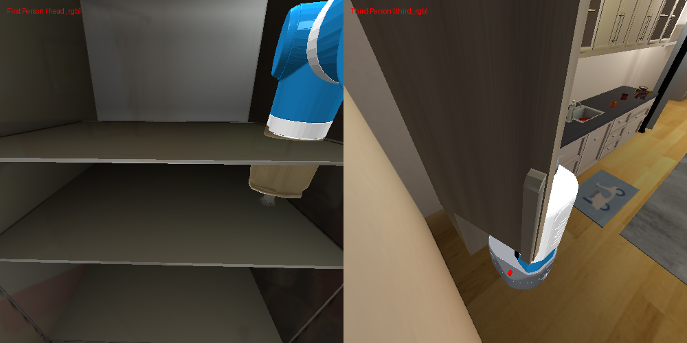
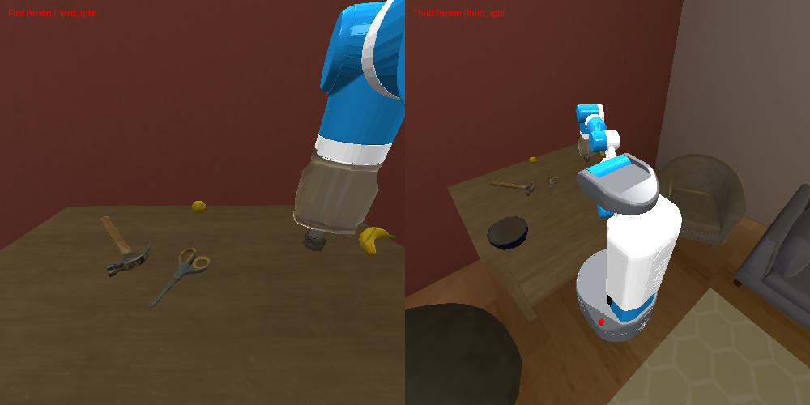

# Intent Reasoning Agent Run Summary
**Episode ID:** test_ep3_quickstart  
**Timestamp:** 20260507_170338  

---

### Ground Truth Locations

```json
{
  "episode_index": 3,
  "target_object": "orange",
  "spawn_location (receptacle)": "receptacle_aabb_TvStnd1_Top1_frl_apartment_tvstand",
  "destination (receptacle)": "receptacle_aabb_sink_kitchen_counter",
  "all_scene_objects": [
    "apple",
    "ball",
    "banana",
    "block",
    "book",
    "bowl",
    "box",
    "can",
    "clamp",
    "cleanser",
    "cup",
    "drill",
    "hammer",
    "knife",
    "lego",
    "lemon",
    "lid",
    "mug",
    "orange",
    "padlock",
    "peach",
    "pear",
    "plate",
    "plum",
    "rubriks cube",
    "scissors",
    "screwdriver",
    "spatula",
    "sponge",
    "spoon",
    "strawberry",
    "toy airplane",
    "wrench"
  ]
}
```

---

### Step 0 - GoalReasoner (Module A)

```json
{
  "original_target": "the apple from the TV stand",
  "reasoning_chain": [
    {
      "question": "Why does the user want this object?",
      "answer": "The user is thirsty and might want to consume the apple to quench their thirst."
    },
    {
      "question": "Why is that important?",
      "answer": "The user needs to address their thirst, which is a basic human need."
    }
  ],
  "deep_intent": "The user wants to quench their thirst.",
  "acceptable_alternatives_properties": [
    {
      "priority": 1,
      "description": "Items that can provide hydration, such as water or other beverages."
    },
    {
      "priority": 2,
      "description": "Fruits or foods with high water content that can help alleviate thirst, like cucumbers or oranges."
    }
  ]
}
```

---

### Step 0 - SolutionSpaceAnalyzer (Module B - 3 Layers)


```json
{
  "composition": {
    "actions": [
      "open",
      "pick",
      "navigate",
      "close"
    ],
    "objects": [
      "scissors",
      "book",
      "mug",
      "clamp",
      "lemon",
      "hammer",
      "rubriks cube",
      "sponge",
      "peach",
      "screwdriver",
      "cabinet 5",
      "plate",
      "padlock",
      "cabinet 7",
      "spatula",
      "strawberry",
      "cabinet 4",
      "lego",
      "lid",
      "knife",
      "toy airplane",
      "banana",
      "bowl",
      "ball",
      "spoon",
      "wrench",
      "refrigerator",
      "pear",
      "orange",
      "cabinet 6",
      "cup",
      "block",
      "plum",
      "can",
      "cleanser",
      "box",
      "drill",
      "apple"
    ],
    "locations": [
      "cabinet 6",
      "right counter in the kitchen",
      "table 2",
      "TV stand",
      "left drawer of the kitchen counter",
      "sofa",
      "sink in the kitchen",
      "right drawer of the kitchen counter",
      "refrigerator push point",
      "cabinet 7",
      "left counter in the kitchen",
      "table 1",
      "refrigerator",
      "chair 1",
      "cabinet 4",
      "cabinet 5"
    ]
  },
  "refined_items": {
    "visible": [
      "ball"
    ],
    "in_memory_only": [],
    "all_locations": [
      "cabinet 6",
      "right counter in the kitchen",
      "table 2",
      "TV stand",
      "left drawer of the kitchen counter",
      "sofa",
      "sink in the kitchen",
      "right drawer of the kitchen counter",
      "refrigerator push point",
      "cabinet 7",
      "left counter in the kitchen",
      "table 1",
      "refrigerator",
      "chair 1",
      "cabinet 4",
      "cabinet 5"
    ]
  },
  "legal_combinations_count": 17,
  "legal_combinations_sample": [
    "navigate to the cabinet 7",
    "navigate to the cabinet 6",
    "navigate to the cabinet 5",
    "navigate to the cabinet 4",
    "navigate to the refrigerator push point"
  ],
  "currently_visible": [
    "ball"
  ],
  "memory_objects": {
    "ball": "unknown starting location"
  }
}
```

---

### Step 0 - SolutionRanker (Solution Generation & Ranking)

```json
{
  "all_generated_plans": [
    {
      "plan_description": "Navigate to the TV stand to look for the apple.",
      "first_action_id": 8,
      "success_probability": "Medium",
      "step_overhead_estimate": 2,
      "budget_check": "Pass",
      "rank_score": 80
    },
    {
      "plan_description": "Navigate to the refrigerator to find a beverage.",
      "first_action_id": 13,
      "success_probability": "High",
      "step_overhead_estimate": 3,
      "budget_check": "Pass",
      "rank_score": 90
    },
    {
      "plan_description": "Navigate to the table to check for any fruits or beverages.",
      "first_action_id": 6,
      "success_probability": "Medium",
      "step_overhead_estimate": 3,
      "budget_check": "Pass",
      "rank_score": 75
    }
  ],
  "filtered_ranked_plans": [
    {
      "plan_description": "Navigate to the refrigerator to find a beverage.",
      "first_action_id": 13,
      "success_probability": "High",
      "step_overhead_estimate": 3,
      "budget_check": "Pass",
      "rank_score": 90
    },
    {
      "plan_description": "Navigate to the TV stand to look for the apple.",
      "first_action_id": 8,
      "success_probability": "Medium",
      "step_overhead_estimate": 2,
      "budget_check": "Pass",
      "rank_score": 80
    },
    {
      "plan_description": "Navigate to the table to check for any fruits or beverages.",
      "first_action_id": 6,
      "success_probability": "Medium",
      "step_overhead_estimate": 3,
      "budget_check": "Pass",
      "rank_score": 75
    }
  ],
  "reasoning": "Plan B is ranked highest because it directly addresses the user's thirst by navigating to the refrigerator, which is likely to contain beverages. It has a high success probability and a reasonable step overhead. Plan A is next as it attempts to retrieve the original target, but the success probability is lower since the apple may not be there. Plan C is also valid but less direct in addressing thirst.",
  "selected_action_id": 13
}
```

---

### Step 1 - SolutionSpaceAnalyzer (Module B - 3 Layers)


```json
{
  "composition": {
    "actions": [
      "open",
      "pick",
      "navigate",
      "close"
    ],
    "objects": [
      "scissors",
      "book",
      "mug",
      "clamp",
      "lemon",
      "hammer",
      "rubriks cube",
      "sponge",
      "peach",
      "screwdriver",
      "cabinet 5",
      "plate",
      "padlock",
      "cabinet 7",
      "spatula",
      "strawberry",
      "cabinet 4",
      "lego",
      "lid",
      "knife",
      "toy airplane",
      "banana",
      "bowl",
      "ball",
      "spoon",
      "wrench",
      "refrigerator",
      "pear",
      "orange",
      "cabinet 6",
      "cup",
      "block",
      "plum",
      "can",
      "cleanser",
      "box",
      "drill",
      "apple"
    ],
    "locations": [
      "cabinet 6",
      "right counter in the kitchen",
      "table 2",
      "TV stand",
      "left drawer of the kitchen counter",
      "sofa",
      "sink in the kitchen",
      "right drawer of the kitchen counter",
      "refrigerator push point",
      "cabinet 7",
      "left counter in the kitchen",
      "table 1",
      "refrigerator",
      "chair 1",
      "cabinet 4",
      "cabinet 5"
    ]
  },
  "refined_items": {
    "visible": [],
    "in_memory_only": [
      "ball"
    ],
    "all_locations": [
      "cabinet 6",
      "right counter in the kitchen",
      "table 2",
      "TV stand",
      "left drawer of the kitchen counter",
      "sofa",
      "sink in the kitchen",
      "right drawer of the kitchen counter",
      "refrigerator push point",
      "cabinet 7",
      "left counter in the kitchen",
      "table 1",
      "refrigerator",
      "chair 1",
      "cabinet 4",
      "cabinet 5"
    ]
  },
  "legal_combinations_count": 18,
  "legal_combinations_sample": [
    "navigate to the cabinet 7",
    "navigate to the cabinet 6",
    "navigate to the cabinet 5",
    "navigate to the cabinet 4",
    "navigate to the refrigerator push point"
  ],
  "currently_visible": [],
  "memory_objects": {
    "ball": "unknown starting location"
  }
}
```

---

### Step 1 - SolutionRanker (Solution Generation & Ranking)

```json
{
  "all_generated_plans": [
    {
      "plan_description": "Open the refrigerator, then look for an alternative hydration source like water or juice.",
      "first_action_id": 60,
      "success_probability": "High",
      "step_overhead_estimate": 2,
      "budget_check": "Pass",
      "rank_score": 95
    },
    {
      "plan_description": "Navigate to the TV stand to look for the apple.",
      "first_action_id": 8,
      "success_probability": "Medium",
      "step_overhead_estimate": 2,
      "budget_check": "Pass",
      "rank_score": 80
    }
  ],
  "filtered_ranked_plans": [
    {
      "plan_description": "Open the refrigerator, then look for an alternative hydration source like water or juice.",
      "first_action_id": 60,
      "success_probability": "High",
      "step_overhead_estimate": 2,
      "budget_check": "Pass",
      "rank_score": 95
    },
    {
      "plan_description": "Navigate to the TV stand to look for the apple.",
      "first_action_id": 8,
      "success_probability": "Medium",
      "step_overhead_estimate": 2,
      "budget_check": "Pass",
      "rank_score": 80
    }
  ],
  "reasoning": "Plan A is ranked highest because it directly addresses the user's need for hydration by looking for an alternative source in the refrigerator, which is likely to be successful and requires fewer steps. Plan B is still valid but relies on the apple being present at the TV stand, which may not be guaranteed.",
  "selected_action_id": 60
}
```

---

### Step 2 - SolutionSpaceAnalyzer (Module B - 3 Layers)


```json
{
  "composition": {
    "actions": [
      "open",
      "pick",
      "navigate",
      "close"
    ],
    "objects": [
      "scissors",
      "book",
      "mug",
      "clamp",
      "lemon",
      "hammer",
      "rubriks cube",
      "sponge",
      "peach",
      "screwdriver",
      "cabinet 5",
      "plate",
      "padlock",
      "cabinet 7",
      "spatula",
      "strawberry",
      "cabinet 4",
      "lego",
      "lid",
      "knife",
      "toy airplane",
      "banana",
      "bowl",
      "ball",
      "spoon",
      "wrench",
      "refrigerator",
      "pear",
      "orange",
      "cabinet 6",
      "cup",
      "block",
      "plum",
      "can",
      "cleanser",
      "box",
      "drill",
      "apple"
    ],
    "locations": [
      "cabinet 6",
      "right counter in the kitchen",
      "table 2",
      "TV stand",
      "left drawer of the kitchen counter",
      "sofa",
      "sink in the kitchen",
      "right drawer of the kitchen counter",
      "refrigerator push point",
      "cabinet 7",
      "left counter in the kitchen",
      "table 1",
      "refrigerator",
      "chair 1",
      "cabinet 4",
      "cabinet 5"
    ]
  },
  "refined_items": {
    "visible": [
      "refrigerator"
    ],
    "in_memory_only": [
      "ball"
    ],
    "all_locations": [
      "cabinet 6",
      "right counter in the kitchen",
      "table 2",
      "TV stand",
      "left drawer of the kitchen counter",
      "sofa",
      "sink in the kitchen",
      "right drawer of the kitchen counter",
      "refrigerator push point",
      "cabinet 7",
      "left counter in the kitchen",
      "table 1",
      "refrigerator",
      "chair 1",
      "cabinet 4",
      "cabinet 5"
    ]
  },
  "legal_combinations_count": 18,
  "legal_combinations_sample": [
    "navigate to the cabinet 7",
    "navigate to the cabinet 6",
    "navigate to the cabinet 5",
    "navigate to the cabinet 4",
    "navigate to the refrigerator push point"
  ],
  "currently_visible": [
    "refrigerator"
  ],
  "memory_objects": {
    "ball": "unknown starting location",
    "refrigerator": "refrigerator"
  }
}
```

---

### Step 2 - SolutionRanker (Solution Generation & Ranking)

```json
{
  "all_generated_plans": [
    {
      "plan_description": "Navigate to the TV stand to look for the apple.",
      "first_action_id": 8,
      "success_probability": "High",
      "step_overhead_estimate": 2,
      "budget_check": "Pass",
      "rank_score": 95
    },
    {
      "plan_description": "Navigate to the refrigerator, then check for water or other beverages.",
      "first_action_id": 60,
      "success_probability": "High",
      "step_overhead_estimate": 2,
      "budget_check": "Pass",
      "rank_score": 90
    },
    {
      "plan_description": "Navigate to the table, then look for the apple.",
      "first_action_id": 7,
      "success_probability": "Medium",
      "step_overhead_estimate": 3,
      "budget_check": "Pass",
      "rank_score": 80
    }
  ],
  "filtered_ranked_plans": [
    {
      "plan_description": "Navigate to the TV stand to look for the apple.",
      "first_action_id": 8,
      "success_probability": "High",
      "step_overhead_estimate": 2,
      "budget_check": "Pass",
      "rank_score": 95
    },
    {
      "plan_description": "Navigate to the refrigerator, then check for water or other beverages.",
      "first_action_id": 60,
      "success_probability": "High",
      "step_overhead_estimate": 2,
      "budget_check": "Pass",
      "rank_score": 90
    },
    {
      "plan_description": "Navigate to the table, then look for the apple.",
      "first_action_id": 7,
      "success_probability": "Medium",
      "step_overhead_estimate": 3,
      "budget_check": "Pass",
      "rank_score": 80
    }
  ],
  "reasoning": "Plan A is ranked highest because it directly targets the original intent of obtaining the apple from the TV stand, which is likely visible and accessible. Plan B is also strong as it seeks an alternative hydration source, but it involves checking the refrigerator which may take slightly longer. Plan C is less optimal as it involves navigating to the table, which is not the original target.",
  "selected_action_id": 8
}
```

---

### Step 3 - SolutionSpaceAnalyzer (Module B - 3 Layers)


```json
{
  "composition": {
    "actions": [
      "open",
      "pick",
      "navigate",
      "close"
    ],
    "objects": [
      "scissors",
      "book",
      "mug",
      "clamp",
      "lemon",
      "hammer",
      "rubriks cube",
      "sponge",
      "peach",
      "screwdriver",
      "cabinet 5",
      "plate",
      "padlock",
      "cabinet 7",
      "spatula",
      "strawberry",
      "cabinet 4",
      "lego",
      "lid",
      "knife",
      "toy airplane",
      "banana",
      "bowl",
      "ball",
      "spoon",
      "wrench",
      "refrigerator",
      "pear",
      "orange",
      "cabinet 6",
      "cup",
      "block",
      "plum",
      "can",
      "cleanser",
      "box",
      "drill",
      "apple"
    ],
    "locations": [
      "cabinet 6",
      "right counter in the kitchen",
      "table 2",
      "TV stand",
      "left drawer of the kitchen counter",
      "sofa",
      "sink in the kitchen",
      "right drawer of the kitchen counter",
      "refrigerator push point",
      "cabinet 7",
      "left counter in the kitchen",
      "table 1",
      "refrigerator",
      "chair 1",
      "cabinet 4",
      "cabinet 5"
    ]
  },
  "refined_items": {
    "visible": [],
    "in_memory_only": [
      "ball",
      "refrigerator"
    ],
    "all_locations": [
      "cabinet 6",
      "right counter in the kitchen",
      "table 2",
      "TV stand",
      "left drawer of the kitchen counter",
      "sofa",
      "sink in the kitchen",
      "right drawer of the kitchen counter",
      "refrigerator push point",
      "cabinet 7",
      "left counter in the kitchen",
      "table 1",
      "refrigerator",
      "chair 1",
      "cabinet 4",
      "cabinet 5"
    ]
  },
  "legal_combinations_count": 16,
  "legal_combinations_sample": [
    "navigate to the cabinet 7",
    "navigate to the cabinet 6",
    "navigate to the cabinet 5",
    "navigate to the cabinet 4",
    "navigate to the refrigerator push point"
  ],
  "currently_visible": [],
  "memory_objects": {
    "ball": "unknown starting location",
    "refrigerator": "refrigerator"
  }
}
```

---

### Step 3 - SolutionRanker (Solution Generation & Ranking)

```json
{
  "all_generated_plans": [
    {
      "plan_description": "Look for the apple on the TV stand.",
      "first_action_id": 8,
      "success_probability": "High",
      "step_overhead_estimate": 1,
      "budget_check": "Pass",
      "rank_score": 95
    },
    {
      "plan_description": "Navigate to the refrigerator to find a drink.",
      "first_action_id": 13,
      "success_probability": "Medium",
      "step_overhead_estimate": 3,
      "budget_check": "Pass",
      "rank_score": 80
    }
  ],
  "filtered_ranked_plans": [
    {
      "plan_description": "Look for the apple on the TV stand.",
      "first_action_id": 8,
      "success_probability": "High",
      "step_overhead_estimate": 1,
      "budget_check": "Pass",
      "rank_score": 95
    },
    {
      "plan_description": "Navigate to the refrigerator to find a drink.",
      "first_action_id": 13,
      "success_probability": "Medium",
      "step_overhead_estimate": 3,
      "budget_check": "Pass",
      "rank_score": 80
    }
  ],
  "reasoning": "Plan A is ranked highest because it directly addresses the original target, which is known to be on the TV stand, and requires only one step. Plan B, while a viable alternative for hydration, involves more steps and has a lower success probability since it relies on finding a drink in the refrigerator.",
  "selected_action_id": 8
}
```

---

### Step 4 - SolutionSpaceAnalyzer (Module B - 3 Layers)



```json
{
  "composition": {
    "actions": [
      "open",
      "pick",
      "navigate",
      "close"
    ],
    "objects": [
      "scissors",
      "book",
      "mug",
      "clamp",
      "lemon",
      "hammer",
      "rubriks cube",
      "sponge",
      "peach",
      "screwdriver",
      "cabinet 5",
      "plate",
      "padlock",
      "cabinet 7",
      "spatula",
      "strawberry",
      "cabinet 4",
      "lego",
      "lid",
      "knife",
      "toy airplane",
      "banana",
      "bowl",
      "ball",
      "spoon",
      "wrench",
      "refrigerator",
      "pear",
      "orange",
      "cabinet 6",
      "cup",
      "block",
      "plum",
      "can",
      "cleanser",
      "box",
      "drill",
      "apple"
    ],
    "locations": [
      "cabinet 6",
      "right counter in the kitchen",
      "table 2",
      "TV stand",
      "left drawer of the kitchen counter",
      "sofa",
      "sink in the kitchen",
      "right drawer of the kitchen counter",
      "refrigerator push point",
      "cabinet 7",
      "left counter in the kitchen",
      "table 1",
      "refrigerator",
      "chair 1",
      "cabinet 4",
      "cabinet 5"
    ]
  },
  "refined_items": {
    "visible": [],
    "in_memory_only": [
      "ball",
      "refrigerator"
    ],
    "all_locations": [
      "cabinet 6",
      "right counter in the kitchen",
      "table 2",
      "TV stand",
      "left drawer of the kitchen counter",
      "sofa",
      "sink in the kitchen",
      "right drawer of the kitchen counter",
      "refrigerator push point",
      "cabinet 7",
      "left counter in the kitchen",
      "table 1",
      "refrigerator",
      "chair 1",
      "cabinet 4",
      "cabinet 5"
    ]
  },
  "legal_combinations_count": 16,
  "legal_combinations_sample": [
    "navigate to the cabinet 7",
    "navigate to the cabinet 6",
    "navigate to the cabinet 5",
    "navigate to the cabinet 4",
    "navigate to the refrigerator push point"
  ],
  "currently_visible": [],
  "memory_objects": {
    "ball": "unknown starting location",
    "refrigerator": "refrigerator"
  }
}
```

---

### Step 4 - SolutionRanker (Solution Generation & Ranking)

```json
{
  "all_generated_plans": [
    {
      "plan_description": "Look for the apple on the TV stand, then navigate to the refrigerator for water if not found.",
      "first_action_id": 8,
      "success_probability": "High",
      "step_overhead_estimate": 2,
      "budget_check": "Pass",
      "rank_score": 85
    },
    {
      "plan_description": "Navigate to the refrigerator directly to get water, as an alternative to the apple.",
      "first_action_id": 13,
      "success_probability": "High",
      "step_overhead_estimate": 1,
      "budget_check": "Pass",
      "rank_score": 90
    }
  ],
  "filtered_ranked_plans": [
    {
      "plan_description": "Navigate to the refrigerator directly to get water, as an alternative to the apple.",
      "first_action_id": 13,
      "success_probability": "High",
      "step_overhead_estimate": 1,
      "budget_check": "Pass",
      "rank_score": 90
    },
    {
      "plan_description": "Look for the apple on the TV stand, then navigate to the refrigerator for water if not found.",
      "first_action_id": 8,
      "success_probability": "High",
      "step_overhead_estimate": 2,
      "budget_check": "Pass",
      "rank_score": 85
    }
  ],
  "reasoning": "Plan B is ranked highest because it directly addresses the user's need for hydration by navigating to the refrigerator for water, which is a more immediate solution than searching for the apple. Both plans are feasible within the budget, but Plan B has a lower step overhead.",
  "selected_action_id": 13
}
```

---

### Step 5 - SolutionSpaceAnalyzer (Module B - 3 Layers)


```json
{
  "composition": {
    "actions": [
      "open",
      "pick",
      "navigate",
      "close"
    ],
    "objects": [
      "scissors",
      "book",
      "mug",
      "clamp",
      "lemon",
      "hammer",
      "rubriks cube",
      "sponge",
      "peach",
      "screwdriver",
      "cabinet 5",
      "plate",
      "padlock",
      "cabinet 7",
      "spatula",
      "strawberry",
      "cabinet 4",
      "lego",
      "lid",
      "knife",
      "toy airplane",
      "banana",
      "bowl",
      "ball",
      "spoon",
      "wrench",
      "refrigerator",
      "pear",
      "orange",
      "cabinet 6",
      "cup",
      "block",
      "plum",
      "can",
      "cleanser",
      "box",
      "drill",
      "apple"
    ],
    "locations": [
      "cabinet 6",
      "right counter in the kitchen",
      "table 2",
      "TV stand",
      "left drawer of the kitchen counter",
      "sofa",
      "sink in the kitchen",
      "right drawer of the kitchen counter",
      "refrigerator push point",
      "cabinet 7",
      "left counter in the kitchen",
      "table 1",
      "refrigerator",
      "chair 1",
      "cabinet 4",
      "cabinet 5"
    ]
  },
  "refined_items": {
    "visible": [],
    "in_memory_only": [
      "ball",
      "refrigerator"
    ],
    "all_locations": [
      "cabinet 6",
      "right counter in the kitchen",
      "table 2",
      "TV stand",
      "left drawer of the kitchen counter",
      "sofa",
      "sink in the kitchen",
      "right drawer of the kitchen counter",
      "refrigerator push point",
      "cabinet 7",
      "left counter in the kitchen",
      "table 1",
      "refrigerator",
      "chair 1",
      "cabinet 4",
      "cabinet 5"
    ]
  },
  "legal_combinations_count": 18,
  "legal_combinations_sample": [
    "navigate to the cabinet 7",
    "navigate to the cabinet 6",
    "navigate to the cabinet 5",
    "navigate to the cabinet 4",
    "navigate to the refrigerator push point"
  ],
  "currently_visible": [],
  "memory_objects": {
    "ball": "unknown starting location",
    "refrigerator": "refrigerator"
  }
}
```

---

### Step 5 - SolutionRanker (Solution Generation & Ranking)

```json
{
  "all_generated_plans": [
    {
      "plan_description": "Navigate to the TV stand to look for the apple.",
      "first_action_id": 8,
      "success_probability": "Medium",
      "step_overhead_estimate": 2,
      "budget_check": "Pass",
      "rank_score": 80
    },
    {
      "plan_description": "Navigate to the table, then look for an alternative hydration source like water.",
      "first_action_id": 6,
      "success_probability": "High",
      "step_overhead_estimate": 3,
      "budget_check": "Pass",
      "rank_score": 90
    }
  ],
  "filtered_ranked_plans": [
    {
      "plan_description": "Navigate to the table, then look for an alternative hydration source like water.",
      "first_action_id": 6,
      "success_probability": "High",
      "step_overhead_estimate": 3,
      "budget_check": "Pass",
      "rank_score": 90
    },
    {
      "plan_description": "Navigate to the TV stand to look for the apple.",
      "first_action_id": 8,
      "success_probability": "Medium",
      "step_overhead_estimate": 2,
      "budget_check": "Pass",
      "rank_score": 80
    }
  ],
  "reasoning": "Plan B is ranked highest because it targets a known hydration source (water) that is likely to be present in the environment, while Plan A targets the apple which may not be visible or accessible. Both plans are within budget, but Plan B has a higher success probability.",
  "selected_action_id": 6
}
```

---

### Step 6 - SolutionSpaceAnalyzer (Module B - 3 Layers)


```json
{
  "composition": {
    "actions": [
      "open",
      "pick",
      "navigate",
      "close"
    ],
    "objects": [
      "scissors",
      "book",
      "mug",
      "clamp",
      "lemon",
      "hammer",
      "rubriks cube",
      "sponge",
      "peach",
      "screwdriver",
      "cabinet 5",
      "plate",
      "padlock",
      "cabinet 7",
      "spatula",
      "strawberry",
      "cabinet 4",
      "lego",
      "lid",
      "knife",
      "toy airplane",
      "banana",
      "bowl",
      "ball",
      "spoon",
      "wrench",
      "refrigerator",
      "pear",
      "orange",
      "cabinet 6",
      "cup",
      "block",
      "plum",
      "can",
      "cleanser",
      "box",
      "drill",
      "apple"
    ],
    "locations": [
      "cabinet 6",
      "right counter in the kitchen",
      "table 2",
      "TV stand",
      "left drawer of the kitchen counter",
      "sofa",
      "sink in the kitchen",
      "right drawer of the kitchen counter",
      "refrigerator push point",
      "cabinet 7",
      "left counter in the kitchen",
      "table 1",
      "refrigerator",
      "chair 1",
      "cabinet 4",
      "cabinet 5"
    ]
  },
  "refined_items": {
    "visible": [
      "strawberry",
      "block"
    ],
    "in_memory_only": [
      "ball",
      "refrigerator"
    ],
    "all_locations": [
      "cabinet 6",
      "right counter in the kitchen",
      "table 2",
      "TV stand",
      "left drawer of the kitchen counter",
      "sofa",
      "sink in the kitchen",
      "right drawer of the kitchen counter",
      "refrigerator push point",
      "cabinet 7",
      "left counter in the kitchen",
      "table 1",
      "refrigerator",
      "chair 1",
      "cabinet 4",
      "cabinet 5"
    ]
  },
  "legal_combinations_count": 18,
  "legal_combinations_sample": [
    "navigate to the cabinet 7",
    "navigate to the cabinet 6",
    "navigate to the cabinet 5",
    "navigate to the cabinet 4",
    "navigate to the refrigerator push point"
  ],
  "currently_visible": [
    "strawberry",
    "block"
  ],
  "memory_objects": {
    "ball": "unknown starting location",
    "refrigerator": "refrigerator",
    "strawberry": "table 1",
    "block": "table 1"
  }
}
```

---

### Step 6 - SolutionRanker (Solution Generation & Ranking)

```json
{
  "all_generated_plans": [
    {
      "plan_description": "Navigate to the TV stand to look for the apple.",
      "first_action_id": 8,
      "success_probability": "Medium",
      "step_overhead_estimate": 2,
      "budget_check": "Pass",
      "rank_score": 75
    },
    {
      "plan_description": "Navigate to the refrigerator to find a drink.",
      "first_action_id": 13,
      "success_probability": "High",
      "step_overhead_estimate": 2,
      "budget_check": "Pass",
      "rank_score": 85
    },
    {
      "plan_description": "Navigate to the cabinet 7 to check for alternative hydration options.",
      "first_action_id": 0,
      "success_probability": "Medium",
      "step_overhead_estimate": 3,
      "budget_check": "Pass",
      "rank_score": 70
    }
  ],
  "filtered_ranked_plans": [
    {
      "plan_description": "Navigate to the refrigerator to find a drink.",
      "first_action_id": 13,
      "success_probability": "High",
      "step_overhead_estimate": 2,
      "budget_check": "Pass",
      "rank_score": 85
    },
    {
      "plan_description": "Navigate to the TV stand to look for the apple.",
      "first_action_id": 8,
      "success_probability": "Medium",
      "step_overhead_estimate": 2,
      "budget_check": "Pass",
      "rank_score": 75
    },
    {
      "plan_description": "Navigate to the cabinet 7 to check for alternative hydration options.",
      "first_action_id": 0,
      "success_probability": "Medium",
      "step_overhead_estimate": 3,
      "budget_check": "Pass",
      "rank_score": 70
    }
  ],
  "reasoning": "Plan B is ranked highest because it directly leads to finding a drink, which is a more immediate solution to quenching thirst. It has a high success probability and requires only 2 steps, making it efficient. Plan A, while also valid, has a medium success probability since the apple may not be there. Plan C is less favorable due to its longer step overhead.",
  "selected_action_id": 13
}
```

---

### Step 7 - SolutionSpaceAnalyzer (Module B - 3 Layers)


```json
{
  "composition": {
    "actions": [
      "open",
      "pick",
      "navigate",
      "close"
    ],
    "objects": [
      "scissors",
      "book",
      "mug",
      "clamp",
      "lemon",
      "hammer",
      "rubriks cube",
      "sponge",
      "peach",
      "screwdriver",
      "cabinet 5",
      "plate",
      "padlock",
      "cabinet 7",
      "spatula",
      "strawberry",
      "cabinet 4",
      "lego",
      "lid",
      "knife",
      "toy airplane",
      "banana",
      "bowl",
      "ball",
      "spoon",
      "wrench",
      "refrigerator",
      "pear",
      "orange",
      "cabinet 6",
      "cup",
      "block",
      "plum",
      "can",
      "cleanser",
      "box",
      "drill",
      "apple"
    ],
    "locations": [
      "cabinet 6",
      "right counter in the kitchen",
      "table 2",
      "TV stand",
      "left drawer of the kitchen counter",
      "sofa",
      "sink in the kitchen",
      "right drawer of the kitchen counter",
      "refrigerator push point",
      "cabinet 7",
      "left counter in the kitchen",
      "table 1",
      "refrigerator",
      "chair 1",
      "cabinet 4",
      "cabinet 5"
    ]
  },
  "refined_items": {
    "visible": [],
    "in_memory_only": [
      "ball",
      "refrigerator",
      "strawberry",
      "block"
    ],
    "all_locations": [
      "cabinet 6",
      "right counter in the kitchen",
      "table 2",
      "TV stand",
      "left drawer of the kitchen counter",
      "sofa",
      "sink in the kitchen",
      "right drawer of the kitchen counter",
      "refrigerator push point",
      "cabinet 7",
      "left counter in the kitchen",
      "table 1",
      "refrigerator",
      "chair 1",
      "cabinet 4",
      "cabinet 5"
    ]
  },
  "legal_combinations_count": 18,
  "legal_combinations_sample": [
    "navigate to the cabinet 7",
    "navigate to the cabinet 6",
    "navigate to the cabinet 5",
    "navigate to the cabinet 4",
    "navigate to the refrigerator push point"
  ],
  "currently_visible": [],
  "memory_objects": {
    "ball": "unknown starting location",
    "refrigerator": "refrigerator",
    "strawberry": "table 1",
    "block": "table 1"
  }
}
```

---

### Step 7 - SolutionRanker (Solution Generation & Ranking)

```json
{
  "all_generated_plans": [
    {
      "plan_description": "Navigate to the TV stand to look for the apple.",
      "first_action_id": 8,
      "success_probability": "Medium",
      "step_overhead_estimate": 2,
      "budget_check": "Pass",
      "rank_score": 75
    },
    {
      "plan_description": "Navigate to the table, then look for an alternative hydration source like a beverage.",
      "first_action_id": 7,
      "success_probability": "High",
      "step_overhead_estimate": 3,
      "budget_check": "Pass",
      "rank_score": 85
    },
    {
      "plan_description": "Navigate to the refrigerator to check for drinks or fruits that can quench thirst.",
      "first_action_id": 60,
      "success_probability": "High",
      "step_overhead_estimate": 2,
      "budget_check": "Pass",
      "rank_score": 90
    }
  ],
  "filtered_ranked_plans": [
    {
      "plan_description": "Navigate to the refrigerator to check for drinks or fruits that can quench thirst.",
      "first_action_id": 60,
      "success_probability": "High",
      "step_overhead_estimate": 2,
      "budget_check": "Pass",
      "rank_score": 90
    },
    {
      "plan_description": "Navigate to the table, then look for an alternative hydration source like a beverage.",
      "first_action_id": 7,
      "success_probability": "High",
      "step_overhead_estimate": 3,
      "budget_check": "Pass",
      "rank_score": 85
    },
    {
      "plan_description": "Navigate to the TV stand to look for the apple.",
      "first_action_id": 8,
      "success_probability": "Medium",
      "step_overhead_estimate": 2,
      "budget_check": "Pass",
      "rank_score": 75
    }
  ],
  "reasoning": "Plan C is ranked highest because it directly utilizes the current location (the refrigerator) to find alternative hydration sources, ensuring a high success probability with minimal steps. Plan B is also strong as it explores the table for beverages, while Plan A is less favorable due to the uncertainty of finding the apple at the TV stand.",
  "selected_action_id": 60
}
```

---

### Step 8 - SolutionSpaceAnalyzer (Module B - 3 Layers)


```json
{
  "composition": {
    "actions": [
      "open",
      "pick",
      "navigate",
      "close"
    ],
    "objects": [
      "scissors",
      "book",
      "mug",
      "clamp",
      "lemon",
      "hammer",
      "rubriks cube",
      "sponge",
      "peach",
      "screwdriver",
      "cabinet 5",
      "plate",
      "padlock",
      "cabinet 7",
      "spatula",
      "strawberry",
      "cabinet 4",
      "lego",
      "lid",
      "knife",
      "toy airplane",
      "banana",
      "bowl",
      "ball",
      "spoon",
      "wrench",
      "refrigerator",
      "pear",
      "orange",
      "cabinet 6",
      "cup",
      "block",
      "plum",
      "can",
      "cleanser",
      "box",
      "drill",
      "apple"
    ],
    "locations": [
      "cabinet 6",
      "right counter in the kitchen",
      "table 2",
      "TV stand",
      "left drawer of the kitchen counter",
      "sofa",
      "sink in the kitchen",
      "right drawer of the kitchen counter",
      "refrigerator push point",
      "cabinet 7",
      "left counter in the kitchen",
      "table 1",
      "refrigerator",
      "chair 1",
      "cabinet 4",
      "cabinet 5"
    ]
  },
  "refined_items": {
    "visible": [],
    "in_memory_only": [
      "ball",
      "refrigerator",
      "strawberry",
      "block"
    ],
    "all_locations": [
      "cabinet 6",
      "right counter in the kitchen",
      "table 2",
      "TV stand",
      "left drawer of the kitchen counter",
      "sofa",
      "sink in the kitchen",
      "right drawer of the kitchen counter",
      "refrigerator push point",
      "cabinet 7",
      "left counter in the kitchen",
      "table 1",
      "refrigerator",
      "chair 1",
      "cabinet 4",
      "cabinet 5"
    ]
  },
  "legal_combinations_count": 18,
  "legal_combinations_sample": [
    "navigate to the cabinet 7",
    "navigate to the cabinet 6",
    "navigate to the cabinet 5",
    "navigate to the cabinet 4",
    "navigate to the refrigerator push point"
  ],
  "currently_visible": [],
  "memory_objects": {
    "ball": "unknown starting location",
    "refrigerator": "refrigerator",
    "strawberry": "table 1",
    "block": "table 1"
  }
}
```

---

### Step 8 - SolutionRanker (Solution Generation & Ranking)

```json
{
  "all_generated_plans": [
    {
      "plan_description": "Navigate to the TV stand to look for the apple.",
      "first_action_id": 8,
      "success_probability": "High",
      "step_overhead_estimate": 2,
      "budget_check": "Pass",
      "rank_score": 95
    },
    {
      "plan_description": "Navigate to the table, then look for an alternative hydration source like a drink.",
      "first_action_id": 7,
      "success_probability": "Medium",
      "step_overhead_estimate": 3,
      "budget_check": "Pass",
      "rank_score": 85
    },
    {
      "plan_description": "Navigate to the cabinet 7 to check for beverages.",
      "first_action_id": 0,
      "success_probability": "Medium",
      "step_overhead_estimate": 3,
      "budget_check": "Pass",
      "rank_score": 80
    }
  ],
  "filtered_ranked_plans": [
    {
      "plan_description": "Navigate to the TV stand to look for the apple.",
      "first_action_id": 8,
      "success_probability": "High",
      "step_overhead_estimate": 2,
      "budget_check": "Pass",
      "rank_score": 95
    },
    {
      "plan_description": "Navigate to the table, then look for an alternative hydration source like a drink.",
      "first_action_id": 7,
      "success_probability": "Medium",
      "step_overhead_estimate": 3,
      "budget_check": "Pass",
      "rank_score": 85
    },
    {
      "plan_description": "Navigate to the cabinet 7 to check for beverages.",
      "first_action_id": 0,
      "success_probability": "Medium",
      "step_overhead_estimate": 3,
      "budget_check": "Pass",
      "rank_score": 80
    }
  ],
  "reasoning": "Plan A is ranked highest because it directly targets the original intent of retrieving the apple from the TV stand, which is known to be the desired object. Plan B and C are alternatives that still address the user's thirst but are less direct and rely on finding alternative hydration sources.",
  "selected_action_id": 8
}
```

---

### Step 9 - SolutionSpaceAnalyzer (Module B - 3 Layers)


```json
{
  "composition": {
    "actions": [
      "open",
      "pick",
      "navigate",
      "close"
    ],
    "objects": [
      "scissors",
      "book",
      "mug",
      "clamp",
      "lemon",
      "hammer",
      "rubriks cube",
      "sponge",
      "peach",
      "screwdriver",
      "cabinet 5",
      "plate",
      "padlock",
      "cabinet 7",
      "spatula",
      "strawberry",
      "cabinet 4",
      "lego",
      "lid",
      "knife",
      "toy airplane",
      "banana",
      "bowl",
      "ball",
      "spoon",
      "wrench",
      "refrigerator",
      "pear",
      "orange",
      "cabinet 6",
      "cup",
      "block",
      "plum",
      "can",
      "cleanser",
      "box",
      "drill",
      "apple"
    ],
    "locations": [
      "cabinet 6",
      "right counter in the kitchen",
      "table 2",
      "TV stand",
      "left drawer of the kitchen counter",
      "sofa",
      "sink in the kitchen",
      "right drawer of the kitchen counter",
      "refrigerator push point",
      "cabinet 7",
      "left counter in the kitchen",
      "table 1",
      "refrigerator",
      "chair 1",
      "cabinet 4",
      "cabinet 5"
    ]
  },
  "refined_items": {
    "visible": [],
    "in_memory_only": [
      "ball",
      "refrigerator",
      "strawberry",
      "block"
    ],
    "all_locations": [
      "cabinet 6",
      "right counter in the kitchen",
      "table 2",
      "TV stand",
      "left drawer of the kitchen counter",
      "sofa",
      "sink in the kitchen",
      "right drawer of the kitchen counter",
      "refrigerator push point",
      "cabinet 7",
      "left counter in the kitchen",
      "table 1",
      "refrigerator",
      "chair 1",
      "cabinet 4",
      "cabinet 5"
    ]
  },
  "legal_combinations_count": 16,
  "legal_combinations_sample": [
    "navigate to the cabinet 7",
    "navigate to the cabinet 6",
    "navigate to the cabinet 5",
    "navigate to the cabinet 4",
    "navigate to the refrigerator push point"
  ],
  "currently_visible": [],
  "memory_objects": {
    "ball": "unknown starting location",
    "refrigerator": "refrigerator",
    "strawberry": "table 1",
    "block": "table 1"
  }
}
```

---

### Step 9 - SolutionRanker (Solution Generation & Ranking)

```json
{
  "all_generated_plans": [
    {
      "plan_description": "Navigate to the refrigerator to find a drink.",
      "first_action_id": 13,
      "success_probability": "High",
      "step_overhead_estimate": 1,
      "budget_check": "Pass",
      "rank_score": 95
    },
    {
      "plan_description": "Navigate to the table to look for an alternative fruit.",
      "first_action_id": 6,
      "success_probability": "Medium",
      "step_overhead_estimate": 1,
      "budget_check": "Pass",
      "rank_score": 80
    }
  ],
  "filtered_ranked_plans": [
    {
      "plan_description": "Navigate to the refrigerator to find a drink.",
      "first_action_id": 13,
      "success_probability": "High",
      "step_overhead_estimate": 1,
      "budget_check": "Pass",
      "rank_score": 95
    },
    {
      "plan_description": "Navigate to the table to look for an alternative fruit.",
      "first_action_id": 6,
      "success_probability": "Medium",
      "step_overhead_estimate": 1,
      "budget_check": "Pass",
      "rank_score": 80
    }
  ],
  "reasoning": "Plan A is ranked highest because navigating to the refrigerator is a direct action that is likely to yield a drink, which addresses the user's thirst effectively. It has a high success probability and requires only one step. Plan B, while also valid, is less likely to provide a drink compared to the refrigerator, hence it is ranked lower.",
  "selected_action_id": 13
}
```

---

### Step 10 - SolutionSpaceAnalyzer (Module B - 3 Layers)


```json
{
  "composition": {
    "actions": [
      "open",
      "pick",
      "navigate",
      "close"
    ],
    "objects": [
      "scissors",
      "book",
      "mug",
      "clamp",
      "lemon",
      "hammer",
      "rubriks cube",
      "sponge",
      "peach",
      "screwdriver",
      "cabinet 5",
      "plate",
      "padlock",
      "cabinet 7",
      "spatula",
      "strawberry",
      "cabinet 4",
      "lego",
      "lid",
      "knife",
      "toy airplane",
      "banana",
      "bowl",
      "ball",
      "spoon",
      "wrench",
      "refrigerator",
      "pear",
      "orange",
      "cabinet 6",
      "cup",
      "block",
      "plum",
      "can",
      "cleanser",
      "box",
      "drill",
      "apple"
    ],
    "locations": [
      "cabinet 6",
      "right counter in the kitchen",
      "table 2",
      "TV stand",
      "left drawer of the kitchen counter",
      "sofa",
      "sink in the kitchen",
      "right drawer of the kitchen counter",
      "refrigerator push point",
      "cabinet 7",
      "left counter in the kitchen",
      "table 1",
      "refrigerator",
      "chair 1",
      "cabinet 4",
      "cabinet 5"
    ]
  },
  "refined_items": {
    "visible": [],
    "in_memory_only": [
      "ball",
      "refrigerator",
      "strawberry",
      "block"
    ],
    "all_locations": [
      "cabinet 6",
      "right counter in the kitchen",
      "table 2",
      "TV stand",
      "left drawer of the kitchen counter",
      "sofa",
      "sink in the kitchen",
      "right drawer of the kitchen counter",
      "refrigerator push point",
      "cabinet 7",
      "left counter in the kitchen",
      "table 1",
      "refrigerator",
      "chair 1",
      "cabinet 4",
      "cabinet 5"
    ]
  },
  "legal_combinations_count": 18,
  "legal_combinations_sample": [
    "navigate to the cabinet 7",
    "navigate to the cabinet 6",
    "navigate to the cabinet 5",
    "navigate to the cabinet 4",
    "navigate to the refrigerator push point"
  ],
  "currently_visible": [],
  "memory_objects": {
    "ball": "unknown starting location",
    "refrigerator": "refrigerator",
    "strawberry": "table 1",
    "block": "table 1"
  }
}
```

---

### Step 10 - SolutionRanker (Solution Generation & Ranking)

```json
{
  "all_generated_plans": [
    {
      "plan_description": "Navigate to the TV stand to look for the apple.",
      "first_action_id": 8,
      "success_probability": "High",
      "step_overhead_estimate": 2,
      "budget_check": "Pass",
      "rank_score": 95
    },
    {
      "plan_description": "Navigate to the refrigerator, then look for a beverage.",
      "first_action_id": 60,
      "success_probability": "High",
      "step_overhead_estimate": 2,
      "budget_check": "Pass",
      "rank_score": 90
    },
    {
      "plan_description": "Navigate to the table, then look for a fruit.",
      "first_action_id": 6,
      "success_probability": "Medium",
      "step_overhead_estimate": 3,
      "budget_check": "Pass",
      "rank_score": 80
    }
  ],
  "filtered_ranked_plans": [
    {
      "plan_description": "Navigate to the TV stand to look for the apple.",
      "first_action_id": 8,
      "success_probability": "High",
      "step_overhead_estimate": 2,
      "budget_check": "Pass",
      "rank_score": 95
    },
    {
      "plan_description": "Navigate to the refrigerator, then look for a beverage.",
      "first_action_id": 60,
      "success_probability": "High",
      "step_overhead_estimate": 2,
      "budget_check": "Pass",
      "rank_score": 90
    },
    {
      "plan_description": "Navigate to the table, then look for a fruit.",
      "first_action_id": 6,
      "success_probability": "Medium",
      "step_overhead_estimate": 3,
      "budget_check": "Pass",
      "rank_score": 80
    }
  ],
  "reasoning": "Plan A is ranked highest because it directly targets the original intent of obtaining the apple from the TV stand, which is likely visible and accessible. Plan B is also strong as it seeks an alternative hydration source from the refrigerator, which is nearby. Plan C is less optimal as it involves searching for a fruit at the table, which may not be as effective as the other two plans.",
  "selected_action_id": 8
}
```

---

### Step 11 - SolutionSpaceAnalyzer (Module B - 3 Layers)


```json
{
  "composition": {
    "actions": [
      "open",
      "pick",
      "navigate",
      "close"
    ],
    "objects": [
      "scissors",
      "book",
      "mug",
      "clamp",
      "lemon",
      "hammer",
      "rubriks cube",
      "sponge",
      "peach",
      "screwdriver",
      "cabinet 5",
      "plate",
      "padlock",
      "cabinet 7",
      "spatula",
      "strawberry",
      "cabinet 4",
      "lego",
      "lid",
      "knife",
      "toy airplane",
      "banana",
      "bowl",
      "ball",
      "spoon",
      "wrench",
      "refrigerator",
      "pear",
      "orange",
      "cabinet 6",
      "cup",
      "block",
      "plum",
      "can",
      "cleanser",
      "box",
      "drill",
      "apple"
    ],
    "locations": [
      "cabinet 6",
      "right counter in the kitchen",
      "table 2",
      "TV stand",
      "left drawer of the kitchen counter",
      "sofa",
      "sink in the kitchen",
      "right drawer of the kitchen counter",
      "refrigerator push point",
      "cabinet 7",
      "left counter in the kitchen",
      "table 1",
      "refrigerator",
      "chair 1",
      "cabinet 4",
      "cabinet 5"
    ]
  },
  "refined_items": {
    "visible": [],
    "in_memory_only": [
      "ball",
      "refrigerator",
      "strawberry",
      "block"
    ],
    "all_locations": [
      "cabinet 6",
      "right counter in the kitchen",
      "table 2",
      "TV stand",
      "left drawer of the kitchen counter",
      "sofa",
      "sink in the kitchen",
      "right drawer of the kitchen counter",
      "refrigerator push point",
      "cabinet 7",
      "left counter in the kitchen",
      "table 1",
      "refrigerator",
      "chair 1",
      "cabinet 4",
      "cabinet 5"
    ]
  },
  "legal_combinations_count": 16,
  "legal_combinations_sample": [
    "navigate to the cabinet 7",
    "navigate to the cabinet 6",
    "navigate to the cabinet 5",
    "navigate to the cabinet 4",
    "navigate to the refrigerator push point"
  ],
  "currently_visible": [],
  "memory_objects": {
    "ball": "unknown starting location",
    "refrigerator": "refrigerator",
    "strawberry": "table 1",
    "block": "table 1"
  }
}
```

---

### Step 11 - SolutionRanker (Solution Generation & Ranking)

```json
{
  "all_generated_plans": [
    {
      "plan_description": "Navigate to the refrigerator to find a drink.",
      "first_action_id": 13,
      "success_probability": "High",
      "step_overhead_estimate": 1,
      "budget_check": "Pass",
      "rank_score": 95
    },
    {
      "plan_description": "Navigate to the table to look for other fruits or beverages.",
      "first_action_id": 6,
      "success_probability": "Medium",
      "step_overhead_estimate": 2,
      "budget_check": "Pass",
      "rank_score": 80
    }
  ],
  "filtered_ranked_plans": [
    {
      "plan_description": "Navigate to the refrigerator to find a drink.",
      "first_action_id": 13,
      "success_probability": "High",
      "step_overhead_estimate": 1,
      "budget_check": "Pass",
      "rank_score": 95
    },
    {
      "plan_description": "Navigate to the table to look for other fruits or beverages.",
      "first_action_id": 6,
      "success_probability": "Medium",
      "step_overhead_estimate": 2,
      "budget_check": "Pass",
      "rank_score": 80
    }
  ],
  "reasoning": "Plan A is ranked highest because navigating to the refrigerator is a direct action that is likely to yield a drink, addressing the user's thirst efficiently with minimal steps. Plan B, while still valid, involves navigating to the table which may not guarantee finding a suitable alternative to quench thirst.",
  "selected_action_id": 13
}
```

---

### Step 12 - SolutionSpaceAnalyzer (Module B - 3 Layers)


```json
{
  "composition": {
    "actions": [
      "open",
      "pick",
      "navigate",
      "close"
    ],
    "objects": [
      "scissors",
      "book",
      "mug",
      "clamp",
      "lemon",
      "hammer",
      "rubriks cube",
      "sponge",
      "peach",
      "screwdriver",
      "cabinet 5",
      "plate",
      "padlock",
      "cabinet 7",
      "spatula",
      "strawberry",
      "cabinet 4",
      "lego",
      "lid",
      "knife",
      "toy airplane",
      "banana",
      "bowl",
      "ball",
      "spoon",
      "wrench",
      "refrigerator",
      "pear",
      "orange",
      "cabinet 6",
      "cup",
      "block",
      "plum",
      "can",
      "cleanser",
      "box",
      "drill",
      "apple"
    ],
    "locations": [
      "cabinet 6",
      "right counter in the kitchen",
      "table 2",
      "TV stand",
      "left drawer of the kitchen counter",
      "sofa",
      "sink in the kitchen",
      "right drawer of the kitchen counter",
      "refrigerator push point",
      "cabinet 7",
      "left counter in the kitchen",
      "table 1",
      "refrigerator",
      "chair 1",
      "cabinet 4",
      "cabinet 5"
    ]
  },
  "refined_items": {
    "visible": [],
    "in_memory_only": [
      "ball",
      "refrigerator",
      "strawberry",
      "block"
    ],
    "all_locations": [
      "cabinet 6",
      "right counter in the kitchen",
      "table 2",
      "TV stand",
      "left drawer of the kitchen counter",
      "sofa",
      "sink in the kitchen",
      "right drawer of the kitchen counter",
      "refrigerator push point",
      "cabinet 7",
      "left counter in the kitchen",
      "table 1",
      "refrigerator",
      "chair 1",
      "cabinet 4",
      "cabinet 5"
    ]
  },
  "legal_combinations_count": 18,
  "legal_combinations_sample": [
    "navigate to the cabinet 7",
    "navigate to the cabinet 6",
    "navigate to the cabinet 5",
    "navigate to the cabinet 4",
    "navigate to the refrigerator push point"
  ],
  "currently_visible": [],
  "memory_objects": {
    "ball": "unknown starting location",
    "refrigerator": "refrigerator",
    "strawberry": "table 1",
    "block": "table 1"
  }
}
```

---

### Step 12 - SolutionRanker (Solution Generation & Ranking)

```json
{
  "all_generated_plans": [
    {
      "plan_description": "Navigate to the TV stand to look for the apple.",
      "first_action_id": 8,
      "success_probability": "High",
      "step_overhead_estimate": 2,
      "budget_check": "Pass",
      "rank_score": 95
    },
    {
      "plan_description": "Navigate to the refrigerator, then look for water or another beverage.",
      "first_action_id": 60,
      "success_probability": "High",
      "step_overhead_estimate": 2,
      "budget_check": "Pass",
      "rank_score": 90
    },
    {
      "plan_description": "Navigate to the table, then search for fruits with high water content.",
      "first_action_id": 6,
      "success_probability": "Medium",
      "step_overhead_estimate": 3,
      "budget_check": "Pass",
      "rank_score": 80
    }
  ],
  "filtered_ranked_plans": [
    {
      "plan_description": "Navigate to the TV stand to look for the apple.",
      "first_action_id": 8,
      "success_probability": "High",
      "step_overhead_estimate": 2,
      "budget_check": "Pass",
      "rank_score": 95
    },
    {
      "plan_description": "Navigate to the refrigerator, then look for water or another beverage.",
      "first_action_id": 60,
      "success_probability": "High",
      "step_overhead_estimate": 2,
      "budget_check": "Pass",
      "rank_score": 90
    },
    {
      "plan_description": "Navigate to the table, then search for fruits with high water content.",
      "first_action_id": 6,
      "success_probability": "Medium",
      "step_overhead_estimate": 3,
      "budget_check": "Pass",
      "rank_score": 80
    }
  ],
  "reasoning": "Plan A is ranked highest because it directly targets the original intent of retrieving the apple from the TV stand, which is likely visible and accessible. Plan B is also strong as it seeks an alternative hydration source from the refrigerator, which is a common location for beverages. Plan C, while still valid, is ranked lower due to a less direct approach and potentially lower success probability.",
  "selected_action_id": 8
}
```

---

### Step 13 - SolutionSpaceAnalyzer (Module B - 3 Layers)


```json
{
  "composition": {
    "actions": [
      "open",
      "pick",
      "navigate",
      "close"
    ],
    "objects": [
      "scissors",
      "book",
      "mug",
      "clamp",
      "lemon",
      "hammer",
      "rubriks cube",
      "sponge",
      "peach",
      "screwdriver",
      "cabinet 5",
      "plate",
      "padlock",
      "cabinet 7",
      "spatula",
      "strawberry",
      "cabinet 4",
      "lego",
      "lid",
      "knife",
      "toy airplane",
      "banana",
      "bowl",
      "ball",
      "spoon",
      "wrench",
      "refrigerator",
      "pear",
      "orange",
      "cabinet 6",
      "cup",
      "block",
      "plum",
      "can",
      "cleanser",
      "box",
      "drill",
      "apple"
    ],
    "locations": [
      "cabinet 6",
      "right counter in the kitchen",
      "table 2",
      "TV stand",
      "left drawer of the kitchen counter",
      "sofa",
      "sink in the kitchen",
      "right drawer of the kitchen counter",
      "refrigerator push point",
      "cabinet 7",
      "left counter in the kitchen",
      "table 1",
      "refrigerator",
      "chair 1",
      "cabinet 4",
      "cabinet 5"
    ]
  },
  "refined_items": {
    "visible": [],
    "in_memory_only": [
      "ball",
      "refrigerator",
      "strawberry",
      "block"
    ],
    "all_locations": [
      "cabinet 6",
      "right counter in the kitchen",
      "table 2",
      "TV stand",
      "left drawer of the kitchen counter",
      "sofa",
      "sink in the kitchen",
      "right drawer of the kitchen counter",
      "refrigerator push point",
      "cabinet 7",
      "left counter in the kitchen",
      "table 1",
      "refrigerator",
      "chair 1",
      "cabinet 4",
      "cabinet 5"
    ]
  },
  "legal_combinations_count": 16,
  "legal_combinations_sample": [
    "navigate to the cabinet 7",
    "navigate to the cabinet 6",
    "navigate to the cabinet 5",
    "navigate to the cabinet 4",
    "navigate to the refrigerator push point"
  ],
  "currently_visible": [],
  "memory_objects": {
    "ball": "unknown starting location",
    "refrigerator": "refrigerator",
    "strawberry": "table 1",
    "block": "table 1"
  }
}
```

---

### Step 13 - SolutionRanker (Solution Generation & Ranking)

```json
{
  "all_generated_plans": [
    {
      "plan_description": "Navigate to the refrigerator to find a drink.",
      "first_action_id": 13,
      "success_probability": "High",
      "step_overhead_estimate": 1,
      "budget_check": "Pass",
      "rank_score": 95
    },
    {
      "plan_description": "Navigate to the table to look for an alternative fruit.",
      "first_action_id": 6,
      "success_probability": "Medium",
      "step_overhead_estimate": 1,
      "budget_check": "Pass",
      "rank_score": 80
    }
  ],
  "filtered_ranked_plans": [
    {
      "plan_description": "Navigate to the refrigerator to find a drink.",
      "first_action_id": 13,
      "success_probability": "High",
      "step_overhead_estimate": 1,
      "budget_check": "Pass",
      "rank_score": 95
    },
    {
      "plan_description": "Navigate to the table to look for an alternative fruit.",
      "first_action_id": 6,
      "success_probability": "Medium",
      "step_overhead_estimate": 1,
      "budget_check": "Pass",
      "rank_score": 80
    }
  ],
  "reasoning": "Plan A is ranked highest because navigating to the refrigerator is likely to yield a drink that can quench thirst, and it requires only one step. Plan B, while still viable, is less certain as it depends on finding an alternative fruit at the table.",
  "selected_action_id": 13
}
```

---

### Step 14 - SolutionSpaceAnalyzer (Module B - 3 Layers)


```json
{
  "composition": {
    "actions": [
      "open",
      "pick",
      "navigate",
      "close"
    ],
    "objects": [
      "scissors",
      "book",
      "mug",
      "clamp",
      "lemon",
      "hammer",
      "rubriks cube",
      "sponge",
      "peach",
      "screwdriver",
      "cabinet 5",
      "plate",
      "padlock",
      "cabinet 7",
      "spatula",
      "strawberry",
      "cabinet 4",
      "lego",
      "lid",
      "knife",
      "toy airplane",
      "banana",
      "bowl",
      "ball",
      "spoon",
      "wrench",
      "refrigerator",
      "pear",
      "orange",
      "cabinet 6",
      "cup",
      "block",
      "plum",
      "can",
      "cleanser",
      "box",
      "drill",
      "apple"
    ],
    "locations": [
      "cabinet 6",
      "right counter in the kitchen",
      "table 2",
      "TV stand",
      "left drawer of the kitchen counter",
      "sofa",
      "sink in the kitchen",
      "right drawer of the kitchen counter",
      "refrigerator push point",
      "cabinet 7",
      "left counter in the kitchen",
      "table 1",
      "refrigerator",
      "chair 1",
      "cabinet 4",
      "cabinet 5"
    ]
  },
  "refined_items": {
    "visible": [],
    "in_memory_only": [
      "ball",
      "refrigerator",
      "strawberry",
      "block"
    ],
    "all_locations": [
      "cabinet 6",
      "right counter in the kitchen",
      "table 2",
      "TV stand",
      "left drawer of the kitchen counter",
      "sofa",
      "sink in the kitchen",
      "right drawer of the kitchen counter",
      "refrigerator push point",
      "cabinet 7",
      "left counter in the kitchen",
      "table 1",
      "refrigerator",
      "chair 1",
      "cabinet 4",
      "cabinet 5"
    ]
  },
  "legal_combinations_count": 18,
  "legal_combinations_sample": [
    "navigate to the cabinet 7",
    "navigate to the cabinet 6",
    "navigate to the cabinet 5",
    "navigate to the cabinet 4",
    "navigate to the refrigerator push point"
  ],
  "currently_visible": [],
  "memory_objects": {
    "ball": "unknown starting location",
    "refrigerator": "refrigerator",
    "strawberry": "table 1",
    "block": "table 1"
  }
}
```

---

### Step 14 - SolutionRanker (Solution Generation & Ranking)

```json
{
  "all_generated_plans": [
    {
      "plan_description": "Navigate to the TV stand to look for the apple.",
      "first_action_id": 8,
      "success_probability": "Medium",
      "step_overhead_estimate": 2,
      "budget_check": "Pass",
      "rank_score": 80
    },
    {
      "plan_description": "Navigate to the table to look for an alternative hydration source.",
      "first_action_id": 6,
      "success_probability": "High",
      "step_overhead_estimate": 2,
      "budget_check": "Pass",
      "rank_score": 90
    },
    {
      "plan_description": "Navigate to the sink in the kitchen to find water.",
      "first_action_id": 9,
      "success_probability": "High",
      "step_overhead_estimate": 2,
      "budget_check": "Pass",
      "rank_score": 90
    }
  ],
  "filtered_ranked_plans": [
    {
      "plan_description": "Navigate to the table to look for an alternative hydration source.",
      "first_action_id": 6,
      "success_probability": "High",
      "step_overhead_estimate": 2,
      "budget_check": "Pass",
      "rank_score": 90
    },
    {
      "plan_description": "Navigate to the sink in the kitchen to find water.",
      "first_action_id": 9,
      "success_probability": "High",
      "step_overhead_estimate": 2,
      "budget_check": "Pass",
      "rank_score": 90
    },
    {
      "plan_description": "Navigate to the TV stand to look for the apple.",
      "first_action_id": 8,
      "success_probability": "Medium",
      "step_overhead_estimate": 2,
      "budget_check": "Pass",
      "rank_score": 80
    }
  ],
  "reasoning": "Plan B and Plan C are ranked highest because they both have a high success probability and require only 2 steps. Plan A is lower due to the uncertainty of finding the apple at the TV stand, despite being a valid option.",
  "selected_action_id": 6
}
```

---

### Step 15 - SolutionSpaceAnalyzer (Module B - 3 Layers)


```json
{
  "composition": {
    "actions": [
      "open",
      "pick",
      "navigate",
      "close"
    ],
    "objects": [
      "scissors",
      "book",
      "mug",
      "clamp",
      "lemon",
      "hammer",
      "rubriks cube",
      "sponge",
      "peach",
      "screwdriver",
      "cabinet 5",
      "plate",
      "padlock",
      "cabinet 7",
      "spatula",
      "strawberry",
      "cabinet 4",
      "lego",
      "lid",
      "knife",
      "toy airplane",
      "banana",
      "bowl",
      "ball",
      "spoon",
      "wrench",
      "refrigerator",
      "pear",
      "orange",
      "cabinet 6",
      "cup",
      "block",
      "plum",
      "can",
      "cleanser",
      "box",
      "drill",
      "apple"
    ],
    "locations": [
      "cabinet 6",
      "right counter in the kitchen",
      "table 2",
      "TV stand",
      "left drawer of the kitchen counter",
      "sofa",
      "sink in the kitchen",
      "right drawer of the kitchen counter",
      "refrigerator push point",
      "cabinet 7",
      "left counter in the kitchen",
      "table 1",
      "refrigerator",
      "chair 1",
      "cabinet 4",
      "cabinet 5"
    ]
  },
  "refined_items": {
    "visible": [
      "strawberry",
      "block"
    ],
    "in_memory_only": [
      "ball",
      "refrigerator"
    ],
    "all_locations": [
      "cabinet 6",
      "right counter in the kitchen",
      "table 2",
      "TV stand",
      "left drawer of the kitchen counter",
      "sofa",
      "sink in the kitchen",
      "right drawer of the kitchen counter",
      "refrigerator push point",
      "cabinet 7",
      "left counter in the kitchen",
      "table 1",
      "refrigerator",
      "chair 1",
      "cabinet 4",
      "cabinet 5"
    ]
  },
  "legal_combinations_count": 18,
  "legal_combinations_sample": [
    "navigate to the cabinet 7",
    "navigate to the cabinet 6",
    "navigate to the cabinet 5",
    "navigate to the cabinet 4",
    "navigate to the refrigerator push point"
  ],
  "currently_visible": [
    "strawberry",
    "block"
  ],
  "memory_objects": {
    "ball": "unknown starting location",
    "refrigerator": "refrigerator",
    "strawberry": "table 1",
    "block": "table 1"
  }
}
```

---

### Step 15 - SolutionRanker (Solution Generation & Ranking)

```json
{
  "all_generated_plans": [
    {
      "plan_description": "Navigate to the TV stand to look for the apple.",
      "first_action_id": 8,
      "success_probability": "Medium",
      "step_overhead_estimate": 2,
      "budget_check": "Pass",
      "rank_score": 75
    },
    {
      "plan_description": "Navigate to the refrigerator to find a drink.",
      "first_action_id": 13,
      "success_probability": "High",
      "step_overhead_estimate": 2,
      "budget_check": "Pass",
      "rank_score": 85
    },
    {
      "plan_description": "Navigate to the cabinet 7 to check for any beverages.",
      "first_action_id": 0,
      "success_probability": "Medium",
      "step_overhead_estimate": 3,
      "budget_check": "Pass",
      "rank_score": 70
    }
  ],
  "filtered_ranked_plans": [
    {
      "plan_description": "Navigate to the refrigerator to find a drink.",
      "first_action_id": 13,
      "success_probability": "High",
      "step_overhead_estimate": 2,
      "budget_check": "Pass",
      "rank_score": 85
    },
    {
      "plan_description": "Navigate to the TV stand to look for the apple.",
      "first_action_id": 8,
      "success_probability": "Medium",
      "step_overhead_estimate": 2,
      "budget_check": "Pass",
      "rank_score": 75
    },
    {
      "plan_description": "Navigate to the cabinet 7 to check for any beverages.",
      "first_action_id": 0,
      "success_probability": "Medium",
      "step_overhead_estimate": 3,
      "budget_check": "Pass",
      "rank_score": 70
    }
  ],
  "reasoning": "Plan B is ranked highest because it directly addresses the user's thirst by navigating to the refrigerator, which is likely to contain drinks. It has a high success probability and requires only 2 steps, making it efficient. Plan A, while also a valid option, has a medium success probability since the apple may not be there. Plan C is less favorable due to a longer step overhead and lower success probability.",
  "selected_action_id": 13
}
```

---

### Step 16 - SolutionSpaceAnalyzer (Module B - 3 Layers)



```json
{
  "composition": {
    "actions": [
      "open",
      "pick",
      "navigate",
      "close"
    ],
    "objects": [
      "scissors",
      "book",
      "mug",
      "clamp",
      "lemon",
      "hammer",
      "rubriks cube",
      "sponge",
      "peach",
      "screwdriver",
      "cabinet 5",
      "plate",
      "padlock",
      "cabinet 7",
      "spatula",
      "strawberry",
      "cabinet 4",
      "lego",
      "lid",
      "knife",
      "toy airplane",
      "banana",
      "bowl",
      "ball",
      "spoon",
      "wrench",
      "refrigerator",
      "pear",
      "orange",
      "cabinet 6",
      "cup",
      "block",
      "plum",
      "can",
      "cleanser",
      "box",
      "drill",
      "apple"
    ],
    "locations": [
      "cabinet 6",
      "right counter in the kitchen",
      "table 2",
      "TV stand",
      "left drawer of the kitchen counter",
      "sofa",
      "sink in the kitchen",
      "right drawer of the kitchen counter",
      "refrigerator push point",
      "cabinet 7",
      "left counter in the kitchen",
      "table 1",
      "refrigerator",
      "chair 1",
      "cabinet 4",
      "cabinet 5"
    ]
  },
  "refined_items": {
    "visible": [],
    "in_memory_only": [
      "ball",
      "refrigerator",
      "strawberry",
      "block"
    ],
    "all_locations": [
      "cabinet 6",
      "right counter in the kitchen",
      "table 2",
      "TV stand",
      "left drawer of the kitchen counter",
      "sofa",
      "sink in the kitchen",
      "right drawer of the kitchen counter",
      "refrigerator push point",
      "cabinet 7",
      "left counter in the kitchen",
      "table 1",
      "refrigerator",
      "chair 1",
      "cabinet 4",
      "cabinet 5"
    ]
  },
  "legal_combinations_count": 18,
  "legal_combinations_sample": [
    "navigate to the cabinet 7",
    "navigate to the cabinet 6",
    "navigate to the cabinet 5",
    "navigate to the cabinet 4",
    "navigate to the refrigerator push point"
  ],
  "currently_visible": [],
  "memory_objects": {
    "ball": "unknown starting location",
    "refrigerator": "refrigerator",
    "strawberry": "table 1",
    "block": "table 1"
  }
}
```

---

### Step 16 - SolutionRanker (Solution Generation & Ranking)

```json
{
  "all_generated_plans": [
    {
      "plan_description": "Navigate to the TV stand to look for the apple.",
      "first_action_id": 8,
      "success_probability": "Medium",
      "step_overhead_estimate": 2,
      "budget_check": "Pass",
      "rank_score": 80
    },
    {
      "plan_description": "Navigate to the table, then look for an alternative hydration source like water.",
      "first_action_id": 7,
      "success_probability": "High",
      "step_overhead_estimate": 3,
      "budget_check": "Pass",
      "rank_score": 90
    },
    {
      "plan_description": "Navigate to the cabinet 7 to check for beverages.",
      "first_action_id": 0,
      "success_probability": "Medium",
      "step_overhead_estimate": 3,
      "budget_check": "Pass",
      "rank_score": 75
    }
  ],
  "filtered_ranked_plans": [
    {
      "plan_description": "Navigate to the table, then look for an alternative hydration source like water.",
      "first_action_id": 7,
      "success_probability": "High",
      "step_overhead_estimate": 3,
      "budget_check": "Pass",
      "rank_score": 90
    },
    {
      "plan_description": "Navigate to the TV stand to look for the apple.",
      "first_action_id": 8,
      "success_probability": "Medium",
      "step_overhead_estimate": 2,
      "budget_check": "Pass",
      "rank_score": 80
    },
    {
      "plan_description": "Navigate to the cabinet 7 to check for beverages.",
      "first_action_id": 0,
      "success_probability": "Medium",
      "step_overhead_estimate": 3,
      "budget_check": "Pass",
      "rank_score": 75
    }
  ],
  "reasoning": "Plan B is ranked highest because it involves navigating to the table where alternative hydration sources are likely to be found, ensuring a high success probability and efficient use of steps. Plan A is also viable but has a medium success probability since the apple's location is uncertain. Plan C is less favorable as it involves checking a cabinet, which may not directly address the user's thirst as effectively as finding water.",
  "selected_action_id": 7
}
```

---

### Step 17 - SolutionSpaceAnalyzer (Module B - 3 Layers)



```json
{
  "composition": {
    "actions": [
      "open",
      "pick",
      "navigate",
      "close"
    ],
    "objects": [
      "scissors",
      "book",
      "mug",
      "clamp",
      "lemon",
      "hammer",
      "rubriks cube",
      "sponge",
      "peach",
      "screwdriver",
      "cabinet 5",
      "plate",
      "padlock",
      "cabinet 7",
      "spatula",
      "strawberry",
      "cabinet 4",
      "lego",
      "lid",
      "knife",
      "toy airplane",
      "banana",
      "bowl",
      "ball",
      "spoon",
      "wrench",
      "refrigerator",
      "pear",
      "orange",
      "cabinet 6",
      "cup",
      "block",
      "plum",
      "can",
      "cleanser",
      "box",
      "drill",
      "apple"
    ],
    "locations": [
      "cabinet 6",
      "right counter in the kitchen",
      "table 2",
      "TV stand",
      "left drawer of the kitchen counter",
      "sofa",
      "sink in the kitchen",
      "right drawer of the kitchen counter",
      "refrigerator push point",
      "cabinet 7",
      "left counter in the kitchen",
      "table 1",
      "refrigerator",
      "chair 1",
      "cabinet 4",
      "cabinet 5"
    ]
  },
  "refined_items": {
    "visible": [
      "scissors",
      "lemon",
      "banana"
    ],
    "in_memory_only": [
      "ball",
      "refrigerator",
      "strawberry",
      "block"
    ],
    "all_locations": [
      "cabinet 6",
      "right counter in the kitchen",
      "table 2",
      "TV stand",
      "left drawer of the kitchen counter",
      "sofa",
      "sink in the kitchen",
      "right drawer of the kitchen counter",
      "refrigerator push point",
      "cabinet 7",
      "left counter in the kitchen",
      "table 1",
      "refrigerator",
      "chair 1",
      "cabinet 4",
      "cabinet 5"
    ]
  },
  "legal_combinations_count": 19,
  "legal_combinations_sample": [
    "navigate to the cabinet 7",
    "navigate to the cabinet 6",
    "navigate to the cabinet 5",
    "navigate to the cabinet 4",
    "navigate to the refrigerator push point"
  ],
  "currently_visible": [
    "scissors",
    "lemon",
    "banana"
  ],
  "memory_objects": {
    "ball": "unknown starting location",
    "refrigerator": "refrigerator",
    "strawberry": "table 1",
    "block": "table 1",
    "scissors": "table 2",
    "lemon": "table 2",
    "banana": "table 2"
  }
}
```

---

### Step 17 - SolutionRanker (Solution Generation & Ranking)

```json
{
  "all_generated_plans": [
    {
      "plan_description": "Navigate to the TV stand to get the apple.",
      "first_action_id": 8,
      "success_probability": "High",
      "step_overhead_estimate": 1,
      "budget_check": "Pass",
      "rank_score": 95
    },
    {
      "plan_description": "Navigate to the refrigerator to find a drink.",
      "first_action_id": 13,
      "success_probability": "Medium",
      "step_overhead_estimate": 2,
      "budget_check": "Pass",
      "rank_score": 85
    },
    {
      "plan_description": "Navigate to the cabinet 7 to check for beverages.",
      "first_action_id": 0,
      "success_probability": "Medium",
      "step_overhead_estimate": 2,
      "budget_check": "Pass",
      "rank_score": 80
    }
  ],
  "filtered_ranked_plans": [
    {
      "plan_description": "Navigate to the TV stand to get the apple.",
      "first_action_id": 8,
      "success_probability": "High",
      "step_overhead_estimate": 1,
      "budget_check": "Pass",
      "rank_score": 95
    },
    {
      "plan_description": "Navigate to the refrigerator to find a drink.",
      "first_action_id": 13,
      "success_probability": "Medium",
      "step_overhead_estimate": 2,
      "budget_check": "Pass",
      "rank_score": 85
    },
    {
      "plan_description": "Navigate to the cabinet 7 to check for beverages.",
      "first_action_id": 0,
      "success_probability": "Medium",
      "step_overhead_estimate": 2,
      "budget_check": "Pass",
      "rank_score": 80
    }
  ],
  "reasoning": "Plan A is ranked highest because it directly targets the original intent of obtaining the apple, which is known to be at the TV stand and requires only one step. Plan B is a good alternative, as it seeks a drink from the refrigerator, which is a valid alternative for quenching thirst, but it involves an additional step. Plan C is also a valid option but is slightly less direct than Plan B.",
  "selected_action_id": 8
}
```

---

### Step 18 - SolutionSpaceAnalyzer (Module B - 3 Layers)


```json
{
  "composition": {
    "actions": [
      "open",
      "pick",
      "navigate",
      "close"
    ],
    "objects": [
      "scissors",
      "book",
      "mug",
      "clamp",
      "lemon",
      "hammer",
      "rubriks cube",
      "sponge",
      "peach",
      "screwdriver",
      "cabinet 5",
      "plate",
      "padlock",
      "cabinet 7",
      "spatula",
      "strawberry",
      "cabinet 4",
      "lego",
      "lid",
      "knife",
      "toy airplane",
      "banana",
      "bowl",
      "ball",
      "spoon",
      "wrench",
      "refrigerator",
      "pear",
      "orange",
      "cabinet 6",
      "cup",
      "block",
      "plum",
      "can",
      "cleanser",
      "box",
      "drill",
      "apple"
    ],
    "locations": [
      "cabinet 6",
      "right counter in the kitchen",
      "table 2",
      "TV stand",
      "left drawer of the kitchen counter",
      "sofa",
      "sink in the kitchen",
      "right drawer of the kitchen counter",
      "refrigerator push point",
      "cabinet 7",
      "left counter in the kitchen",
      "table 1",
      "refrigerator",
      "chair 1",
      "cabinet 4",
      "cabinet 5"
    ]
  },
  "refined_items": {
    "visible": [],
    "in_memory_only": [
      "ball",
      "refrigerator",
      "strawberry",
      "block",
      "scissors",
      "lemon",
      "banana"
    ],
    "all_locations": [
      "cabinet 6",
      "right counter in the kitchen",
      "table 2",
      "TV stand",
      "left drawer of the kitchen counter",
      "sofa",
      "sink in the kitchen",
      "right drawer of the kitchen counter",
      "refrigerator push point",
      "cabinet 7",
      "left counter in the kitchen",
      "table 1",
      "refrigerator",
      "chair 1",
      "cabinet 4",
      "cabinet 5"
    ]
  },
  "legal_combinations_count": 16,
  "legal_combinations_sample": [
    "navigate to the cabinet 7",
    "navigate to the cabinet 6",
    "navigate to the cabinet 5",
    "navigate to the cabinet 4",
    "navigate to the refrigerator push point"
  ],
  "currently_visible": [],
  "memory_objects": {
    "ball": "unknown starting location",
    "refrigerator": "refrigerator",
    "strawberry": "table 1",
    "block": "table 1",
    "scissors": "table 2",
    "lemon": "table 2",
    "banana": "table 2"
  }
}
```

---

### Step 18 - SolutionRanker (Solution Generation & Ranking)

```json
{
  "all_generated_plans": [
    {
      "plan_description": "Navigate to the refrigerator to find a drink.",
      "first_action_id": 13,
      "success_probability": "High",
      "step_overhead_estimate": 2,
      "budget_check": "Pass",
      "rank_score": 95
    },
    {
      "plan_description": "Navigate to the table to look for the apple.",
      "first_action_id": 6,
      "success_probability": "Medium",
      "step_overhead_estimate": 2,
      "budget_check": "Pass",
      "rank_score": 85
    }
  ],
  "filtered_ranked_plans": [
    {
      "plan_description": "Navigate to the refrigerator to find a drink.",
      "first_action_id": 13,
      "success_probability": "High",
      "step_overhead_estimate": 2,
      "budget_check": "Pass",
      "rank_score": 95
    },
    {
      "plan_description": "Navigate to the table to look for the apple.",
      "first_action_id": 6,
      "success_probability": "Medium",
      "step_overhead_estimate": 2,
      "budget_check": "Pass",
      "rank_score": 85
    }
  ],
  "reasoning": "Plan A is ranked highest because navigating to the refrigerator is likely to yield a drink that can quench thirst, and it has a high success probability with a low step overhead. Plan B, while also feasible, has a lower success probability since the apple may not be present at the table.",
  "selected_action_id": 13
}
```

---

### Step 19 - SolutionSpaceAnalyzer (Module B - 3 Layers)


```json
{
  "composition": {
    "actions": [
      "open",
      "pick",
      "navigate",
      "close"
    ],
    "objects": [
      "scissors",
      "book",
      "mug",
      "clamp",
      "lemon",
      "hammer",
      "rubriks cube",
      "sponge",
      "peach",
      "screwdriver",
      "cabinet 5",
      "plate",
      "padlock",
      "cabinet 7",
      "spatula",
      "strawberry",
      "cabinet 4",
      "lego",
      "lid",
      "knife",
      "toy airplane",
      "banana",
      "bowl",
      "ball",
      "spoon",
      "wrench",
      "refrigerator",
      "pear",
      "orange",
      "cabinet 6",
      "cup",
      "block",
      "plum",
      "can",
      "cleanser",
      "box",
      "drill",
      "apple"
    ],
    "locations": [
      "cabinet 6",
      "right counter in the kitchen",
      "table 2",
      "TV stand",
      "left drawer of the kitchen counter",
      "sofa",
      "sink in the kitchen",
      "right drawer of the kitchen counter",
      "refrigerator push point",
      "cabinet 7",
      "left counter in the kitchen",
      "table 1",
      "refrigerator",
      "chair 1",
      "cabinet 4",
      "cabinet 5"
    ]
  },
  "refined_items": {
    "visible": [],
    "in_memory_only": [
      "ball",
      "refrigerator",
      "strawberry",
      "block",
      "scissors",
      "lemon",
      "banana"
    ],
    "all_locations": [
      "cabinet 6",
      "right counter in the kitchen",
      "table 2",
      "TV stand",
      "left drawer of the kitchen counter",
      "sofa",
      "sink in the kitchen",
      "right drawer of the kitchen counter",
      "refrigerator push point",
      "cabinet 7",
      "left counter in the kitchen",
      "table 1",
      "refrigerator",
      "chair 1",
      "cabinet 4",
      "cabinet 5"
    ]
  },
  "legal_combinations_count": 18,
  "legal_combinations_sample": [
    "navigate to the cabinet 7",
    "navigate to the cabinet 6",
    "navigate to the cabinet 5",
    "navigate to the cabinet 4",
    "navigate to the refrigerator push point"
  ],
  "currently_visible": [],
  "memory_objects": {
    "ball": "unknown starting location",
    "refrigerator": "refrigerator",
    "strawberry": "table 1",
    "block": "table 1",
    "scissors": "table 2",
    "lemon": "table 2",
    "banana": "table 2"
  }
}
```

---

### Step 19 - SolutionRanker (Solution Generation & Ranking)

```json
{
  "all_generated_plans": [
    {
      "plan_description": "Navigate to the TV stand to look for the apple.",
      "first_action_id": 8,
      "success_probability": "High",
      "step_overhead_estimate": 2,
      "budget_check": "Pass",
      "rank_score": 95
    },
    {
      "plan_description": "Navigate to the refrigerator, then look for a drink.",
      "first_action_id": 60,
      "success_probability": "High",
      "step_overhead_estimate": 2,
      "budget_check": "Pass",
      "rank_score": 90
    },
    {
      "plan_description": "Navigate to the table, then look for the apple.",
      "first_action_id": 7,
      "success_probability": "Medium",
      "step_overhead_estimate": 3,
      "budget_check": "Pass",
      "rank_score": 80
    }
  ],
  "filtered_ranked_plans": [
    {
      "plan_description": "Navigate to the TV stand to look for the apple.",
      "first_action_id": 8,
      "success_probability": "High",
      "step_overhead_estimate": 2,
      "budget_check": "Pass",
      "rank_score": 95
    },
    {
      "plan_description": "Navigate to the refrigerator, then look for a drink.",
      "first_action_id": 60,
      "success_probability": "High",
      "step_overhead_estimate": 2,
      "budget_check": "Pass",
      "rank_score": 90
    },
    {
      "plan_description": "Navigate to the table, then look for the apple.",
      "first_action_id": 7,
      "success_probability": "Medium",
      "step_overhead_estimate": 3,
      "budget_check": "Pass",
      "rank_score": 80
    }
  ],
  "reasoning": "Plan A is ranked highest because it directly targets the original intent of obtaining the apple from the TV stand, which is likely visible and accessible. Plan B is also effective as it allows for finding an alternative hydration source in the refrigerator, but it is slightly less direct. Plan C is less optimal as it involves an additional step and is not directly targeting the original intent.",
  "selected_action_id": 8
}
```

---

### Step 20 - SolutionSpaceAnalyzer (Module B - 3 Layers)


```json
{
  "composition": {
    "actions": [
      "open",
      "pick",
      "navigate",
      "close"
    ],
    "objects": [
      "scissors",
      "book",
      "mug",
      "clamp",
      "lemon",
      "hammer",
      "rubriks cube",
      "sponge",
      "peach",
      "screwdriver",
      "cabinet 5",
      "plate",
      "padlock",
      "cabinet 7",
      "spatula",
      "strawberry",
      "cabinet 4",
      "lego",
      "lid",
      "knife",
      "toy airplane",
      "banana",
      "bowl",
      "ball",
      "spoon",
      "wrench",
      "refrigerator",
      "pear",
      "orange",
      "cabinet 6",
      "cup",
      "block",
      "plum",
      "can",
      "cleanser",
      "box",
      "drill",
      "apple"
    ],
    "locations": [
      "cabinet 6",
      "right counter in the kitchen",
      "table 2",
      "TV stand",
      "left drawer of the kitchen counter",
      "sofa",
      "sink in the kitchen",
      "right drawer of the kitchen counter",
      "refrigerator push point",
      "cabinet 7",
      "left counter in the kitchen",
      "table 1",
      "refrigerator",
      "chair 1",
      "cabinet 4",
      "cabinet 5"
    ]
  },
  "refined_items": {
    "visible": [],
    "in_memory_only": [
      "ball",
      "refrigerator",
      "strawberry",
      "block",
      "scissors",
      "lemon",
      "banana"
    ],
    "all_locations": [
      "cabinet 6",
      "right counter in the kitchen",
      "table 2",
      "TV stand",
      "left drawer of the kitchen counter",
      "sofa",
      "sink in the kitchen",
      "right drawer of the kitchen counter",
      "refrigerator push point",
      "cabinet 7",
      "left counter in the kitchen",
      "table 1",
      "refrigerator",
      "chair 1",
      "cabinet 4",
      "cabinet 5"
    ]
  },
  "legal_combinations_count": 16,
  "legal_combinations_sample": [
    "navigate to the cabinet 7",
    "navigate to the cabinet 6",
    "navigate to the cabinet 5",
    "navigate to the cabinet 4",
    "navigate to the refrigerator push point"
  ],
  "currently_visible": [],
  "memory_objects": {
    "ball": "unknown starting location",
    "refrigerator": "refrigerator",
    "strawberry": "table 1",
    "block": "table 1",
    "scissors": "table 2",
    "lemon": "table 2",
    "banana": "table 2"
  }
}
```

---

### Step 20 - SolutionRanker (Solution Generation & Ranking)

```json
{
  "all_generated_plans": [
    {
      "plan_description": "Look for the apple on the TV stand, then navigate to the refrigerator for water if not found.",
      "first_action_id": 8,
      "success_probability": "High",
      "step_overhead_estimate": 2,
      "budget_check": "Pass",
      "rank_score": 95
    },
    {
      "plan_description": "Navigate to the refrigerator directly to get water, as an alternative to the apple.",
      "first_action_id": 13,
      "success_probability": "High",
      "step_overhead_estimate": 1,
      "budget_check": "Pass",
      "rank_score": 90
    }
  ],
  "filtered_ranked_plans": [
    {
      "plan_description": "Look for the apple on the TV stand, then navigate to the refrigerator for water if not found.",
      "first_action_id": 8,
      "success_probability": "High",
      "step_overhead_estimate": 2,
      "budget_check": "Pass",
      "rank_score": 95
    },
    {
      "plan_description": "Navigate to the refrigerator directly to get water, as an alternative to the apple.",
      "first_action_id": 13,
      "success_probability": "High",
      "step_overhead_estimate": 1,
      "budget_check": "Pass",
      "rank_score": 90
    }
  ],
  "reasoning": "Plan A is ranked highest because it directly checks for the original target (the apple) and has a high success probability since the TV stand is the current location. If the apple is not found, it then navigates to the refrigerator for water, addressing the user's thirst effectively. Plan B is also strong as it directly targets an alternative solution (water) but does not check for the apple first.",
  "selected_action_id": 8
}
```

---

### Step 21 - SolutionSpaceAnalyzer (Module B - 3 Layers)


```json
{
  "composition": {
    "actions": [
      "open",
      "pick",
      "navigate",
      "close"
    ],
    "objects": [
      "scissors",
      "book",
      "mug",
      "clamp",
      "lemon",
      "hammer",
      "rubriks cube",
      "sponge",
      "peach",
      "screwdriver",
      "cabinet 5",
      "plate",
      "padlock",
      "cabinet 7",
      "spatula",
      "strawberry",
      "cabinet 4",
      "lego",
      "lid",
      "knife",
      "toy airplane",
      "banana",
      "bowl",
      "ball",
      "spoon",
      "wrench",
      "refrigerator",
      "pear",
      "orange",
      "cabinet 6",
      "cup",
      "block",
      "plum",
      "can",
      "cleanser",
      "box",
      "drill",
      "apple"
    ],
    "locations": [
      "cabinet 6",
      "right counter in the kitchen",
      "table 2",
      "TV stand",
      "left drawer of the kitchen counter",
      "sofa",
      "sink in the kitchen",
      "right drawer of the kitchen counter",
      "refrigerator push point",
      "cabinet 7",
      "left counter in the kitchen",
      "table 1",
      "refrigerator",
      "chair 1",
      "cabinet 4",
      "cabinet 5"
    ]
  },
  "refined_items": {
    "visible": [],
    "in_memory_only": [
      "ball",
      "refrigerator",
      "strawberry",
      "block",
      "scissors",
      "lemon",
      "banana"
    ],
    "all_locations": [
      "cabinet 6",
      "right counter in the kitchen",
      "table 2",
      "TV stand",
      "left drawer of the kitchen counter",
      "sofa",
      "sink in the kitchen",
      "right drawer of the kitchen counter",
      "refrigerator push point",
      "cabinet 7",
      "left counter in the kitchen",
      "table 1",
      "refrigerator",
      "chair 1",
      "cabinet 4",
      "cabinet 5"
    ]
  },
  "legal_combinations_count": 16,
  "legal_combinations_sample": [
    "navigate to the cabinet 7",
    "navigate to the cabinet 6",
    "navigate to the cabinet 5",
    "navigate to the cabinet 4",
    "navigate to the refrigerator push point"
  ],
  "currently_visible": [],
  "memory_objects": {
    "ball": "unknown starting location",
    "refrigerator": "refrigerator",
    "strawberry": "table 1",
    "block": "table 1",
    "scissors": "table 2",
    "lemon": "table 2",
    "banana": "table 2"
  }
}
```

---

### Step 21 - SolutionRanker (Solution Generation & Ranking)

```json
{
  "all_generated_plans": [
    {
      "plan_description": "Navigate to the refrigerator to find a drink.",
      "first_action_id": 13,
      "success_probability": "High",
      "step_overhead_estimate": 1,
      "budget_check": "Pass",
      "rank_score": 95
    },
    {
      "plan_description": "Navigate to the table to look for the apple.",
      "first_action_id": 6,
      "success_probability": "Medium",
      "step_overhead_estimate": 2,
      "budget_check": "Pass",
      "rank_score": 80
    }
  ],
  "filtered_ranked_plans": [
    {
      "plan_description": "Navigate to the refrigerator to find a drink.",
      "first_action_id": 13,
      "success_probability": "High",
      "step_overhead_estimate": 1,
      "budget_check": "Pass",
      "rank_score": 95
    },
    {
      "plan_description": "Navigate to the table to look for the apple.",
      "first_action_id": 6,
      "success_probability": "Medium",
      "step_overhead_estimate": 2,
      "budget_check": "Pass",
      "rank_score": 80
    }
  ],
  "reasoning": "Plan A is ranked highest because navigating to the refrigerator is a direct action that is likely to yield a drink, addressing the user's thirst immediately. It has a high success probability and requires only one step. Plan B, while also valid, involves looking for the apple which may not be guaranteed to be there, thus having a medium success probability and requiring more steps.",
  "selected_action_id": 13
}
```

---

### Step 22 - SolutionSpaceAnalyzer (Module B - 3 Layers)


```json
{
  "composition": {
    "actions": [
      "open",
      "pick",
      "navigate",
      "close"
    ],
    "objects": [
      "scissors",
      "book",
      "mug",
      "clamp",
      "lemon",
      "hammer",
      "rubriks cube",
      "sponge",
      "peach",
      "screwdriver",
      "cabinet 5",
      "plate",
      "padlock",
      "cabinet 7",
      "spatula",
      "strawberry",
      "cabinet 4",
      "lego",
      "lid",
      "knife",
      "toy airplane",
      "banana",
      "bowl",
      "ball",
      "spoon",
      "wrench",
      "refrigerator",
      "pear",
      "orange",
      "cabinet 6",
      "cup",
      "block",
      "plum",
      "can",
      "cleanser",
      "box",
      "drill",
      "apple"
    ],
    "locations": [
      "cabinet 6",
      "right counter in the kitchen",
      "table 2",
      "TV stand",
      "left drawer of the kitchen counter",
      "sofa",
      "sink in the kitchen",
      "right drawer of the kitchen counter",
      "refrigerator push point",
      "cabinet 7",
      "left counter in the kitchen",
      "table 1",
      "refrigerator",
      "chair 1",
      "cabinet 4",
      "cabinet 5"
    ]
  },
  "refined_items": {
    "visible": [],
    "in_memory_only": [
      "ball",
      "refrigerator",
      "strawberry",
      "block",
      "scissors",
      "lemon",
      "banana"
    ],
    "all_locations": [
      "cabinet 6",
      "right counter in the kitchen",
      "table 2",
      "TV stand",
      "left drawer of the kitchen counter",
      "sofa",
      "sink in the kitchen",
      "right drawer of the kitchen counter",
      "refrigerator push point",
      "cabinet 7",
      "left counter in the kitchen",
      "table 1",
      "refrigerator",
      "chair 1",
      "cabinet 4",
      "cabinet 5"
    ]
  },
  "legal_combinations_count": 18,
  "legal_combinations_sample": [
    "navigate to the cabinet 7",
    "navigate to the cabinet 6",
    "navigate to the cabinet 5",
    "navigate to the cabinet 4",
    "navigate to the refrigerator push point"
  ],
  "currently_visible": [],
  "memory_objects": {
    "ball": "unknown starting location",
    "refrigerator": "refrigerator",
    "strawberry": "table 1",
    "block": "table 1",
    "scissors": "table 2",
    "lemon": "table 2",
    "banana": "table 2"
  }
}
```

---

### Step 22 - SolutionRanker (Solution Generation & Ranking)

```json
{
  "all_generated_plans": [
    {
      "plan_description": "Navigate to the TV stand to look for the apple.",
      "first_action_id": 8,
      "success_probability": "High",
      "step_overhead_estimate": 2,
      "budget_check": "Pass",
      "rank_score": 95
    },
    {
      "plan_description": "Navigate to the table, then look for the apple.",
      "first_action_id": 6,
      "success_probability": "High",
      "step_overhead_estimate": 3,
      "budget_check": "Pass",
      "rank_score": 90
    },
    {
      "plan_description": "Navigate to the kitchen sink to find a drink.",
      "first_action_id": 9,
      "success_probability": "Medium",
      "step_overhead_estimate": 3,
      "budget_check": "Pass",
      "rank_score": 80
    }
  ],
  "filtered_ranked_plans": [
    {
      "plan_description": "Navigate to the TV stand to look for the apple.",
      "first_action_id": 8,
      "success_probability": "High",
      "step_overhead_estimate": 2,
      "budget_check": "Pass",
      "rank_score": 95
    },
    {
      "plan_description": "Navigate to the table, then look for the apple.",
      "first_action_id": 6,
      "success_probability": "High",
      "step_overhead_estimate": 3,
      "budget_check": "Pass",
      "rank_score": 90
    },
    {
      "plan_description": "Navigate to the kitchen sink to find a drink.",
      "first_action_id": 9,
      "success_probability": "Medium",
      "step_overhead_estimate": 3,
      "budget_check": "Pass",
      "rank_score": 80
    }
  ],
  "reasoning": "Plan A is ranked highest because it directly targets the original intent of retrieving the apple from the TV stand, which is known to be the desired object. Plan B is also effective but involves an additional step to navigate to the table first. Plan C, while still valid, focuses on finding an alternative drink at the sink, which is less direct and has a medium success probability.",
  "selected_action_id": 8
}
```

---

### Step 23 - SolutionSpaceAnalyzer (Module B - 3 Layers)


```json
{
  "composition": {
    "actions": [
      "open",
      "pick",
      "navigate",
      "close"
    ],
    "objects": [
      "scissors",
      "book",
      "mug",
      "clamp",
      "lemon",
      "hammer",
      "rubriks cube",
      "sponge",
      "peach",
      "screwdriver",
      "cabinet 5",
      "plate",
      "padlock",
      "cabinet 7",
      "spatula",
      "strawberry",
      "cabinet 4",
      "lego",
      "lid",
      "knife",
      "toy airplane",
      "banana",
      "bowl",
      "ball",
      "spoon",
      "wrench",
      "refrigerator",
      "pear",
      "orange",
      "cabinet 6",
      "cup",
      "block",
      "plum",
      "can",
      "cleanser",
      "box",
      "drill",
      "apple"
    ],
    "locations": [
      "cabinet 6",
      "right counter in the kitchen",
      "table 2",
      "TV stand",
      "left drawer of the kitchen counter",
      "sofa",
      "sink in the kitchen",
      "right drawer of the kitchen counter",
      "refrigerator push point",
      "cabinet 7",
      "left counter in the kitchen",
      "table 1",
      "refrigerator",
      "chair 1",
      "cabinet 4",
      "cabinet 5"
    ]
  },
  "refined_items": {
    "visible": [],
    "in_memory_only": [
      "ball",
      "refrigerator",
      "strawberry",
      "block",
      "scissors",
      "lemon",
      "banana"
    ],
    "all_locations": [
      "cabinet 6",
      "right counter in the kitchen",
      "table 2",
      "TV stand",
      "left drawer of the kitchen counter",
      "sofa",
      "sink in the kitchen",
      "right drawer of the kitchen counter",
      "refrigerator push point",
      "cabinet 7",
      "left counter in the kitchen",
      "table 1",
      "refrigerator",
      "chair 1",
      "cabinet 4",
      "cabinet 5"
    ]
  },
  "legal_combinations_count": 16,
  "legal_combinations_sample": [
    "navigate to the cabinet 7",
    "navigate to the cabinet 6",
    "navigate to the cabinet 5",
    "navigate to the cabinet 4",
    "navigate to the refrigerator push point"
  ],
  "currently_visible": [],
  "memory_objects": {
    "ball": "unknown starting location",
    "refrigerator": "refrigerator",
    "strawberry": "table 1",
    "block": "table 1",
    "scissors": "table 2",
    "lemon": "table 2",
    "banana": "table 2"
  }
}
```

---

### Step 23 - SolutionRanker (Solution Generation & Ranking)

```json
{
  "all_generated_plans": [
    {
      "plan_description": "Navigate to the refrigerator to find a drink.",
      "first_action_id": 13,
      "success_probability": "High",
      "step_overhead_estimate": 1,
      "budget_check": "Pass",
      "rank_score": 95
    },
    {
      "plan_description": "Navigate to the table, then look for the apple.",
      "first_action_id": 6,
      "success_probability": "Medium",
      "step_overhead_estimate": 2,
      "budget_check": "Pass",
      "rank_score": 80
    }
  ],
  "filtered_ranked_plans": [
    {
      "plan_description": "Navigate to the refrigerator to find a drink.",
      "first_action_id": 13,
      "success_probability": "High",
      "step_overhead_estimate": 1,
      "budget_check": "Pass",
      "rank_score": 95
    },
    {
      "plan_description": "Navigate to the table, then look for the apple.",
      "first_action_id": 6,
      "success_probability": "Medium",
      "step_overhead_estimate": 2,
      "budget_check": "Pass",
      "rank_score": 80
    }
  ],
  "reasoning": "Plan A is ranked highest because navigating to the refrigerator is a direct action that likely leads to finding a drink, which addresses the user's thirst immediately. It has a high success probability and requires only one step. Plan B, while still valid, involves looking for the apple which may not be guaranteed to be there, thus having a medium success probability and requiring two steps.",
  "selected_action_id": 13
}
```

---

### Step 24 - SolutionSpaceAnalyzer (Module B - 3 Layers)


```json
{
  "composition": {
    "actions": [
      "open",
      "pick",
      "navigate",
      "close"
    ],
    "objects": [
      "scissors",
      "book",
      "mug",
      "clamp",
      "lemon",
      "hammer",
      "rubriks cube",
      "sponge",
      "peach",
      "screwdriver",
      "cabinet 5",
      "plate",
      "padlock",
      "cabinet 7",
      "spatula",
      "strawberry",
      "cabinet 4",
      "lego",
      "lid",
      "knife",
      "toy airplane",
      "banana",
      "bowl",
      "ball",
      "spoon",
      "wrench",
      "refrigerator",
      "pear",
      "orange",
      "cabinet 6",
      "cup",
      "block",
      "plum",
      "can",
      "cleanser",
      "box",
      "drill",
      "apple"
    ],
    "locations": [
      "cabinet 6",
      "right counter in the kitchen",
      "table 2",
      "TV stand",
      "left drawer of the kitchen counter",
      "sofa",
      "sink in the kitchen",
      "right drawer of the kitchen counter",
      "refrigerator push point",
      "cabinet 7",
      "left counter in the kitchen",
      "table 1",
      "refrigerator",
      "chair 1",
      "cabinet 4",
      "cabinet 5"
    ]
  },
  "refined_items": {
    "visible": [],
    "in_memory_only": [
      "ball",
      "refrigerator",
      "strawberry",
      "block",
      "scissors",
      "lemon",
      "banana"
    ],
    "all_locations": [
      "cabinet 6",
      "right counter in the kitchen",
      "table 2",
      "TV stand",
      "left drawer of the kitchen counter",
      "sofa",
      "sink in the kitchen",
      "right drawer of the kitchen counter",
      "refrigerator push point",
      "cabinet 7",
      "left counter in the kitchen",
      "table 1",
      "refrigerator",
      "chair 1",
      "cabinet 4",
      "cabinet 5"
    ]
  },
  "legal_combinations_count": 18,
  "legal_combinations_sample": [
    "navigate to the cabinet 7",
    "navigate to the cabinet 6",
    "navigate to the cabinet 5",
    "navigate to the cabinet 4",
    "navigate to the refrigerator push point"
  ],
  "currently_visible": [],
  "memory_objects": {
    "ball": "unknown starting location",
    "refrigerator": "refrigerator",
    "strawberry": "table 1",
    "block": "table 1",
    "scissors": "table 2",
    "lemon": "table 2",
    "banana": "table 2"
  }
}
```

---

### Step 24 - SolutionRanker (Solution Generation & Ranking)

```json
{
  "all_generated_plans": [
    {
      "plan_description": "Navigate to the TV stand to look for the apple.",
      "first_action_id": 8,
      "success_probability": "Medium",
      "step_overhead_estimate": 2,
      "budget_check": "Pass",
      "rank_score": 80
    },
    {
      "plan_description": "Navigate to the table, then look for an alternative hydration source like a drink.",
      "first_action_id": 7,
      "success_probability": "High",
      "step_overhead_estimate": 3,
      "budget_check": "Pass",
      "rank_score": 90
    },
    {
      "plan_description": "Navigate to the kitchen sink to find water.",
      "first_action_id": 9,
      "success_probability": "High",
      "step_overhead_estimate": 2,
      "budget_check": "Pass",
      "rank_score": 85
    }
  ],
  "filtered_ranked_plans": [
    {
      "plan_description": "Navigate to the table, then look for an alternative hydration source like a drink.",
      "first_action_id": 7,
      "success_probability": "High",
      "step_overhead_estimate": 3,
      "budget_check": "Pass",
      "rank_score": 90
    },
    {
      "plan_description": "Navigate to the kitchen sink to find water.",
      "first_action_id": 9,
      "success_probability": "High",
      "step_overhead_estimate": 2,
      "budget_check": "Pass",
      "rank_score": 85
    },
    {
      "plan_description": "Navigate to the TV stand to look for the apple.",
      "first_action_id": 8,
      "success_probability": "Medium",
      "step_overhead_estimate": 2,
      "budget_check": "Pass",
      "rank_score": 80
    }
  ],
  "reasoning": "Plan B is ranked highest because it targets an alternative hydration source that is likely to be available and is a common solution for thirst. It has a high success probability and reasonable step overhead. Plan A is also viable but has a medium success probability since the apple may not be there. Plan C is a good option as well, but it is slightly less direct than Plan B.",
  "selected_action_id": 7
}
```

---

### Step 25 - SolutionSpaceAnalyzer (Module B - 3 Layers)


```json
{
  "composition": {
    "actions": [
      "open",
      "pick",
      "navigate",
      "close"
    ],
    "objects": [
      "scissors",
      "book",
      "mug",
      "clamp",
      "lemon",
      "hammer",
      "rubriks cube",
      "sponge",
      "peach",
      "screwdriver",
      "cabinet 5",
      "plate",
      "padlock",
      "cabinet 7",
      "spatula",
      "strawberry",
      "cabinet 4",
      "lego",
      "lid",
      "knife",
      "toy airplane",
      "banana",
      "bowl",
      "ball",
      "spoon",
      "wrench",
      "refrigerator",
      "pear",
      "orange",
      "cabinet 6",
      "cup",
      "block",
      "plum",
      "can",
      "cleanser",
      "box",
      "drill",
      "apple"
    ],
    "locations": [
      "cabinet 6",
      "right counter in the kitchen",
      "table 2",
      "TV stand",
      "left drawer of the kitchen counter",
      "sofa",
      "sink in the kitchen",
      "right drawer of the kitchen counter",
      "refrigerator push point",
      "cabinet 7",
      "left counter in the kitchen",
      "table 1",
      "refrigerator",
      "chair 1",
      "cabinet 4",
      "cabinet 5"
    ]
  },
  "refined_items": {
    "visible": [
      "scissors",
      "lemon",
      "banana"
    ],
    "in_memory_only": [
      "ball",
      "refrigerator",
      "strawberry",
      "block"
    ],
    "all_locations": [
      "cabinet 6",
      "right counter in the kitchen",
      "table 2",
      "TV stand",
      "left drawer of the kitchen counter",
      "sofa",
      "sink in the kitchen",
      "right drawer of the kitchen counter",
      "refrigerator push point",
      "cabinet 7",
      "left counter in the kitchen",
      "table 1",
      "refrigerator",
      "chair 1",
      "cabinet 4",
      "cabinet 5"
    ]
  },
  "legal_combinations_count": 19,
  "legal_combinations_sample": [
    "navigate to the cabinet 7",
    "navigate to the cabinet 6",
    "navigate to the cabinet 5",
    "navigate to the cabinet 4",
    "navigate to the refrigerator push point"
  ],
  "currently_visible": [
    "scissors",
    "lemon",
    "banana"
  ],
  "memory_objects": {
    "ball": "unknown starting location",
    "refrigerator": "refrigerator",
    "strawberry": "table 1",
    "block": "table 1",
    "scissors": "table 2",
    "lemon": "table 2",
    "banana": "table 2"
  }
}
```

---

### Step 25 - SolutionRanker (Solution Generation & Ranking)

```json
{
  "all_generated_plans": [
    {
      "plan_description": "Navigate to the TV stand to look for the apple.",
      "first_action_id": 8,
      "success_probability": "High",
      "step_overhead_estimate": 2,
      "budget_check": "Pass",
      "rank_score": 95
    },
    {
      "plan_description": "Navigate to the refrigerator to find a drink.",
      "first_action_id": 13,
      "success_probability": "Medium",
      "step_overhead_estimate": 3,
      "budget_check": "Pass",
      "rank_score": 80
    },
    {
      "plan_description": "Navigate to the cabinet 7 to explore for alternative hydration options.",
      "first_action_id": 0,
      "success_probability": "Medium",
      "step_overhead_estimate": 3,
      "budget_check": "Pass",
      "rank_score": 75
    }
  ],
  "filtered_ranked_plans": [
    {
      "plan_description": "Navigate to the TV stand to look for the apple.",
      "first_action_id": 8,
      "success_probability": "High",
      "step_overhead_estimate": 2,
      "budget_check": "Pass",
      "rank_score": 95
    },
    {
      "plan_description": "Navigate to the refrigerator to find a drink.",
      "first_action_id": 13,
      "success_probability": "Medium",
      "step_overhead_estimate": 3,
      "budget_check": "Pass",
      "rank_score": 80
    },
    {
      "plan_description": "Navigate to the cabinet 7 to explore for alternative hydration options.",
      "first_action_id": 0,
      "success_probability": "Medium",
      "step_overhead_estimate": 3,
      "budget_check": "Pass",
      "rank_score": 75
    }
  ],
  "reasoning": "Plan A is ranked highest because it directly targets the original intent of retrieving the apple from the TV stand, which is a known and visible location. Plan B is a good alternative as it leads to the refrigerator, which may contain drinks to quench thirst, but it is slightly less direct. Plan C explores a cabinet for alternatives but is less likely to succeed in finding immediate hydration compared to the other plans.",
  "selected_action_id": 8
}
```

---

### Step 26 - SolutionSpaceAnalyzer (Module B - 3 Layers)


```json
{
  "composition": {
    "actions": [
      "open",
      "pick",
      "navigate",
      "close"
    ],
    "objects": [
      "scissors",
      "book",
      "mug",
      "clamp",
      "lemon",
      "hammer",
      "rubriks cube",
      "sponge",
      "peach",
      "screwdriver",
      "cabinet 5",
      "plate",
      "padlock",
      "cabinet 7",
      "spatula",
      "strawberry",
      "cabinet 4",
      "lego",
      "lid",
      "knife",
      "toy airplane",
      "banana",
      "bowl",
      "ball",
      "spoon",
      "wrench",
      "refrigerator",
      "pear",
      "orange",
      "cabinet 6",
      "cup",
      "block",
      "plum",
      "can",
      "cleanser",
      "box",
      "drill",
      "apple"
    ],
    "locations": [
      "cabinet 6",
      "right counter in the kitchen",
      "table 2",
      "TV stand",
      "left drawer of the kitchen counter",
      "sofa",
      "sink in the kitchen",
      "right drawer of the kitchen counter",
      "refrigerator push point",
      "cabinet 7",
      "left counter in the kitchen",
      "table 1",
      "refrigerator",
      "chair 1",
      "cabinet 4",
      "cabinet 5"
    ]
  },
  "refined_items": {
    "visible": [],
    "in_memory_only": [
      "ball",
      "refrigerator",
      "strawberry",
      "block",
      "scissors",
      "lemon",
      "banana"
    ],
    "all_locations": [
      "cabinet 6",
      "right counter in the kitchen",
      "table 2",
      "TV stand",
      "left drawer of the kitchen counter",
      "sofa",
      "sink in the kitchen",
      "right drawer of the kitchen counter",
      "refrigerator push point",
      "cabinet 7",
      "left counter in the kitchen",
      "table 1",
      "refrigerator",
      "chair 1",
      "cabinet 4",
      "cabinet 5"
    ]
  },
  "legal_combinations_count": 16,
  "legal_combinations_sample": [
    "navigate to the cabinet 7",
    "navigate to the cabinet 6",
    "navigate to the cabinet 5",
    "navigate to the cabinet 4",
    "navigate to the refrigerator push point"
  ],
  "currently_visible": [],
  "memory_objects": {
    "ball": "unknown starting location",
    "refrigerator": "refrigerator",
    "strawberry": "table 1",
    "block": "table 1",
    "scissors": "table 2",
    "lemon": "table 2",
    "banana": "table 2"
  }
}
```

---

### Step 26 - SolutionRanker (Solution Generation & Ranking)

```json
{
  "all_generated_plans": [
    {
      "plan_description": "Navigate to the refrigerator to find a drink.",
      "first_action_id": 13,
      "success_probability": "High",
      "step_overhead_estimate": 1,
      "budget_check": "Pass",
      "rank_score": 95
    },
    {
      "plan_description": "Navigate to the table to look for an alternative fruit.",
      "first_action_id": 7,
      "success_probability": "Medium",
      "step_overhead_estimate": 2,
      "budget_check": "Pass",
      "rank_score": 85
    }
  ],
  "filtered_ranked_plans": [
    {
      "plan_description": "Navigate to the refrigerator to find a drink.",
      "first_action_id": 13,
      "success_probability": "High",
      "step_overhead_estimate": 1,
      "budget_check": "Pass",
      "rank_score": 95
    },
    {
      "plan_description": "Navigate to the table to look for an alternative fruit.",
      "first_action_id": 7,
      "success_probability": "Medium",
      "step_overhead_estimate": 2,
      "budget_check": "Pass",
      "rank_score": 85
    }
  ],
  "reasoning": "Plan A is ranked highest because it directly leads to a source of hydration with a high probability of success and requires only one step. Plan B, while still viable, involves an additional step and has a lower success probability as it relies on finding an alternative fruit.",
  "selected_action_id": 13
}
```

---

### Step 27 - SolutionSpaceAnalyzer (Module B - 3 Layers)


```json
{
  "composition": {
    "actions": [
      "open",
      "pick",
      "navigate",
      "close"
    ],
    "objects": [
      "scissors",
      "book",
      "mug",
      "clamp",
      "lemon",
      "hammer",
      "rubriks cube",
      "sponge",
      "peach",
      "screwdriver",
      "cabinet 5",
      "plate",
      "padlock",
      "cabinet 7",
      "spatula",
      "strawberry",
      "cabinet 4",
      "lego",
      "lid",
      "knife",
      "toy airplane",
      "banana",
      "bowl",
      "ball",
      "spoon",
      "wrench",
      "refrigerator",
      "pear",
      "orange",
      "cabinet 6",
      "cup",
      "block",
      "plum",
      "can",
      "cleanser",
      "box",
      "drill",
      "apple"
    ],
    "locations": [
      "cabinet 6",
      "right counter in the kitchen",
      "table 2",
      "TV stand",
      "left drawer of the kitchen counter",
      "sofa",
      "sink in the kitchen",
      "right drawer of the kitchen counter",
      "refrigerator push point",
      "cabinet 7",
      "left counter in the kitchen",
      "table 1",
      "refrigerator",
      "chair 1",
      "cabinet 4",
      "cabinet 5"
    ]
  },
  "refined_items": {
    "visible": [],
    "in_memory_only": [
      "ball",
      "refrigerator",
      "strawberry",
      "block",
      "scissors",
      "lemon",
      "banana"
    ],
    "all_locations": [
      "cabinet 6",
      "right counter in the kitchen",
      "table 2",
      "TV stand",
      "left drawer of the kitchen counter",
      "sofa",
      "sink in the kitchen",
      "right drawer of the kitchen counter",
      "refrigerator push point",
      "cabinet 7",
      "left counter in the kitchen",
      "table 1",
      "refrigerator",
      "chair 1",
      "cabinet 4",
      "cabinet 5"
    ]
  },
  "legal_combinations_count": 18,
  "legal_combinations_sample": [
    "navigate to the cabinet 7",
    "navigate to the cabinet 6",
    "navigate to the cabinet 5",
    "navigate to the cabinet 4",
    "navigate to the refrigerator push point"
  ],
  "currently_visible": [],
  "memory_objects": {
    "ball": "unknown starting location",
    "refrigerator": "refrigerator",
    "strawberry": "table 1",
    "block": "table 1",
    "scissors": "table 2",
    "lemon": "table 2",
    "banana": "table 2"
  }
}
```

---

### Step 27 - SolutionRanker (Solution Generation & Ranking)

```json
{
  "all_generated_plans": [
    {
      "plan_description": "Navigate to the TV stand to look for the apple.",
      "first_action_id": 8,
      "success_probability": "Medium",
      "step_overhead_estimate": 2,
      "budget_check": "Pass",
      "rank_score": 80
    },
    {
      "plan_description": "Navigate to the table, then look for an alternative hydration source like a beverage.",
      "first_action_id": 6,
      "success_probability": "High",
      "step_overhead_estimate": 3,
      "budget_check": "Pass",
      "rank_score": 90
    },
    {
      "plan_description": "Navigate to the cabinet 7 to search for a beverage.",
      "first_action_id": 0,
      "success_probability": "High",
      "step_overhead_estimate": 3,
      "budget_check": "Pass",
      "rank_score": 85
    }
  ],
  "filtered_ranked_plans": [
    {
      "plan_description": "Navigate to the table, then look for an alternative hydration source like a beverage.",
      "first_action_id": 6,
      "success_probability": "High",
      "step_overhead_estimate": 3,
      "budget_check": "Pass",
      "rank_score": 90
    },
    {
      "plan_description": "Navigate to the cabinet 7 to search for a beverage.",
      "first_action_id": 0,
      "success_probability": "High",
      "step_overhead_estimate": 3,
      "budget_check": "Pass",
      "rank_score": 85
    },
    {
      "plan_description": "Navigate to the TV stand to look for the apple.",
      "first_action_id": 8,
      "success_probability": "Medium",
      "step_overhead_estimate": 2,
      "budget_check": "Pass",
      "rank_score": 80
    }
  ],
  "reasoning": "Plan B is ranked highest because it involves navigating to the table, where there is a high probability of finding an alternative hydration source, and it has a reasonable step overhead. Plan A is ranked second as it directly targets the apple but has a medium success probability. Plan C is also viable as it seeks an alternative but is slightly lower in rank due to the specific cabinet navigation.",
  "selected_action_id": 6
}
```

---

### Step 28 - SolutionSpaceAnalyzer (Module B - 3 Layers)


```json
{
  "composition": {
    "actions": [
      "open",
      "pick",
      "navigate",
      "close"
    ],
    "objects": [
      "scissors",
      "book",
      "mug",
      "clamp",
      "lemon",
      "hammer",
      "rubriks cube",
      "sponge",
      "peach",
      "screwdriver",
      "cabinet 5",
      "plate",
      "padlock",
      "cabinet 7",
      "spatula",
      "strawberry",
      "cabinet 4",
      "lego",
      "lid",
      "knife",
      "toy airplane",
      "banana",
      "bowl",
      "ball",
      "spoon",
      "wrench",
      "refrigerator",
      "pear",
      "orange",
      "cabinet 6",
      "cup",
      "block",
      "plum",
      "can",
      "cleanser",
      "box",
      "drill",
      "apple"
    ],
    "locations": [
      "cabinet 6",
      "right counter in the kitchen",
      "table 2",
      "TV stand",
      "left drawer of the kitchen counter",
      "sofa",
      "sink in the kitchen",
      "right drawer of the kitchen counter",
      "refrigerator push point",
      "cabinet 7",
      "left counter in the kitchen",
      "table 1",
      "refrigerator",
      "chair 1",
      "cabinet 4",
      "cabinet 5"
    ]
  },
  "refined_items": {
    "visible": [
      "strawberry",
      "lego",
      "box"
    ],
    "in_memory_only": [
      "ball",
      "refrigerator",
      "block",
      "scissors",
      "lemon",
      "banana"
    ],
    "all_locations": [
      "cabinet 6",
      "right counter in the kitchen",
      "table 2",
      "TV stand",
      "left drawer of the kitchen counter",
      "sofa",
      "sink in the kitchen",
      "right drawer of the kitchen counter",
      "refrigerator push point",
      "cabinet 7",
      "left counter in the kitchen",
      "table 1",
      "refrigerator",
      "chair 1",
      "cabinet 4",
      "cabinet 5"
    ]
  },
  "legal_combinations_count": 19,
  "legal_combinations_sample": [
    "navigate to the cabinet 7",
    "navigate to the cabinet 6",
    "navigate to the cabinet 5",
    "navigate to the cabinet 4",
    "navigate to the refrigerator push point"
  ],
  "currently_visible": [
    "strawberry",
    "lego",
    "box"
  ],
  "memory_objects": {
    "ball": "unknown starting location",
    "refrigerator": "refrigerator",
    "strawberry": "table 1",
    "block": "table 1",
    "scissors": "table 2",
    "lemon": "table 2",
    "banana": "table 2",
    "lego": "table 1",
    "box": "table 1"
  }
}
```

---

### Step 28 - SolutionRanker (Solution Generation & Ranking)

```json
{
  "all_generated_plans": [
    {
      "plan_description": "Navigate to the TV stand to look for the apple.",
      "first_action_id": 8,
      "success_probability": "High",
      "step_overhead_estimate": 2,
      "budget_check": "Pass",
      "rank_score": 95
    },
    {
      "plan_description": "Navigate to the refrigerator to check for beverages.",
      "first_action_id": 13,
      "success_probability": "High",
      "step_overhead_estimate": 3,
      "budget_check": "Pass",
      "rank_score": 90
    },
    {
      "plan_description": "Navigate to the cabinet 7 to explore for alternative hydration options.",
      "first_action_id": 0,
      "success_probability": "Medium",
      "step_overhead_estimate": 3,
      "budget_check": "Pass",
      "rank_score": 80
    }
  ],
  "filtered_ranked_plans": [
    {
      "plan_description": "Navigate to the TV stand to look for the apple.",
      "first_action_id": 8,
      "success_probability": "High",
      "step_overhead_estimate": 2,
      "budget_check": "Pass",
      "rank_score": 95
    },
    {
      "plan_description": "Navigate to the refrigerator to check for beverages.",
      "first_action_id": 13,
      "success_probability": "High",
      "step_overhead_estimate": 3,
      "budget_check": "Pass",
      "rank_score": 90
    },
    {
      "plan_description": "Navigate to the cabinet 7 to explore for alternative hydration options.",
      "first_action_id": 0,
      "success_probability": "Medium",
      "step_overhead_estimate": 3,
      "budget_check": "Pass",
      "rank_score": 80
    }
  ],
  "reasoning": "Plan A is ranked highest because it directly targets the original intent of retrieving the apple from the TV stand, which is likely to be visible and accessible. Plan B is also strong as it seeks an alternative hydration source from the refrigerator, which is a common place for drinks. Plan C is a valid exploration option but is less direct and may not yield the desired outcome as quickly.",
  "selected_action_id": 8
}
```

---

### Step 29 - SolutionSpaceAnalyzer (Module B - 3 Layers)


```json
{
  "composition": {
    "actions": [
      "open",
      "pick",
      "navigate",
      "close"
    ],
    "objects": [
      "scissors",
      "book",
      "mug",
      "clamp",
      "lemon",
      "hammer",
      "rubriks cube",
      "sponge",
      "peach",
      "screwdriver",
      "cabinet 5",
      "plate",
      "padlock",
      "cabinet 7",
      "spatula",
      "strawberry",
      "cabinet 4",
      "lego",
      "lid",
      "knife",
      "toy airplane",
      "banana",
      "bowl",
      "ball",
      "spoon",
      "wrench",
      "refrigerator",
      "pear",
      "orange",
      "cabinet 6",
      "cup",
      "block",
      "plum",
      "can",
      "cleanser",
      "box",
      "drill",
      "apple"
    ],
    "locations": [
      "cabinet 6",
      "right counter in the kitchen",
      "table 2",
      "TV stand",
      "left drawer of the kitchen counter",
      "sofa",
      "sink in the kitchen",
      "right drawer of the kitchen counter",
      "refrigerator push point",
      "cabinet 7",
      "left counter in the kitchen",
      "table 1",
      "refrigerator",
      "chair 1",
      "cabinet 4",
      "cabinet 5"
    ]
  },
  "refined_items": {
    "visible": [],
    "in_memory_only": [
      "ball",
      "refrigerator",
      "strawberry",
      "block",
      "scissors",
      "lemon",
      "banana",
      "lego",
      "box"
    ],
    "all_locations": [
      "cabinet 6",
      "right counter in the kitchen",
      "table 2",
      "TV stand",
      "left drawer of the kitchen counter",
      "sofa",
      "sink in the kitchen",
      "right drawer of the kitchen counter",
      "refrigerator push point",
      "cabinet 7",
      "left counter in the kitchen",
      "table 1",
      "refrigerator",
      "chair 1",
      "cabinet 4",
      "cabinet 5"
    ]
  },
  "legal_combinations_count": 16,
  "legal_combinations_sample": [
    "navigate to the cabinet 7",
    "navigate to the cabinet 6",
    "navigate to the cabinet 5",
    "navigate to the cabinet 4",
    "navigate to the refrigerator push point"
  ],
  "currently_visible": [],
  "memory_objects": {
    "ball": "unknown starting location",
    "refrigerator": "refrigerator",
    "strawberry": "table 1",
    "block": "table 1",
    "scissors": "table 2",
    "lemon": "table 2",
    "banana": "table 2",
    "lego": "table 1",
    "box": "table 1"
  }
}
```

---

### Step 29 - SolutionRanker (Solution Generation & Ranking)

```json
{
  "all_generated_plans": [
    {
      "plan_description": "Look for the apple on the TV stand, then navigate to the refrigerator for water if not found.",
      "first_action_id": 8,
      "success_probability": "Medium",
      "step_overhead_estimate": 2,
      "budget_check": "Pass",
      "rank_score": 80
    },
    {
      "plan_description": "Navigate to the refrigerator to get water directly.",
      "first_action_id": 13,
      "success_probability": "High",
      "step_overhead_estimate": 1,
      "budget_check": "Pass",
      "rank_score": 90
    }
  ],
  "filtered_ranked_plans": [
    {
      "plan_description": "Navigate to the refrigerator to get water directly.",
      "first_action_id": 13,
      "success_probability": "High",
      "step_overhead_estimate": 1,
      "budget_check": "Pass",
      "rank_score": 90
    },
    {
      "plan_description": "Look for the apple on the TV stand, then navigate to the refrigerator for water if not found.",
      "first_action_id": 8,
      "success_probability": "Medium",
      "step_overhead_estimate": 2,
      "budget_check": "Pass",
      "rank_score": 80
    }
  ],
  "reasoning": "Plan B is ranked highest because it directly addresses the user's thirst by obtaining water from the refrigerator, which is a known location and likely to contain hydration options. Plan A is still viable but relies on the apple being present, which is uncertain.",
  "selected_action_id": 13
}
```

---

