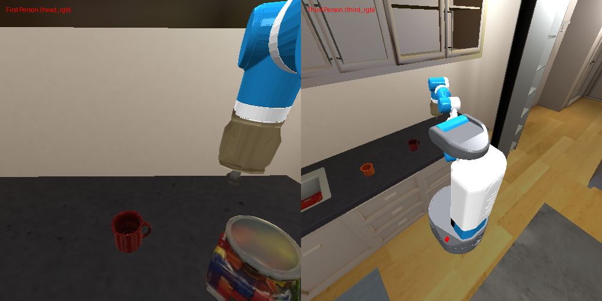
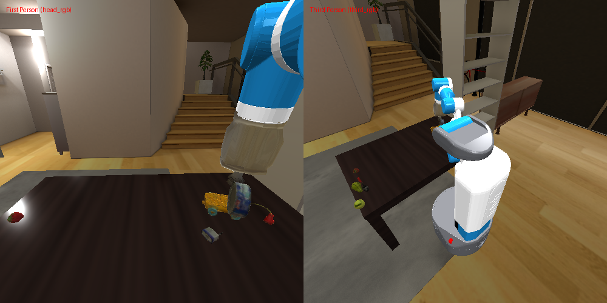
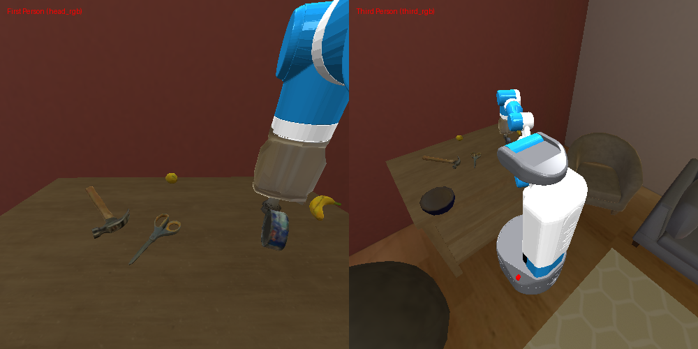
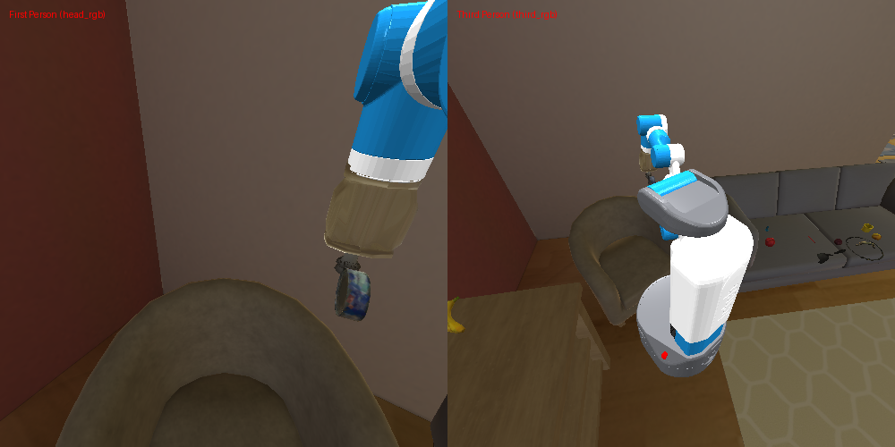
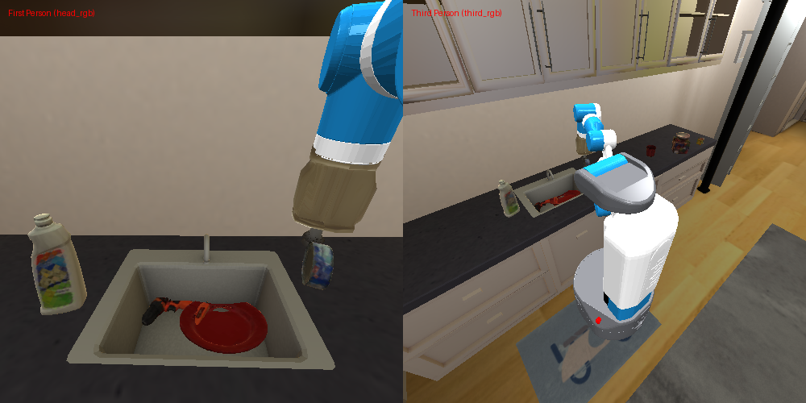
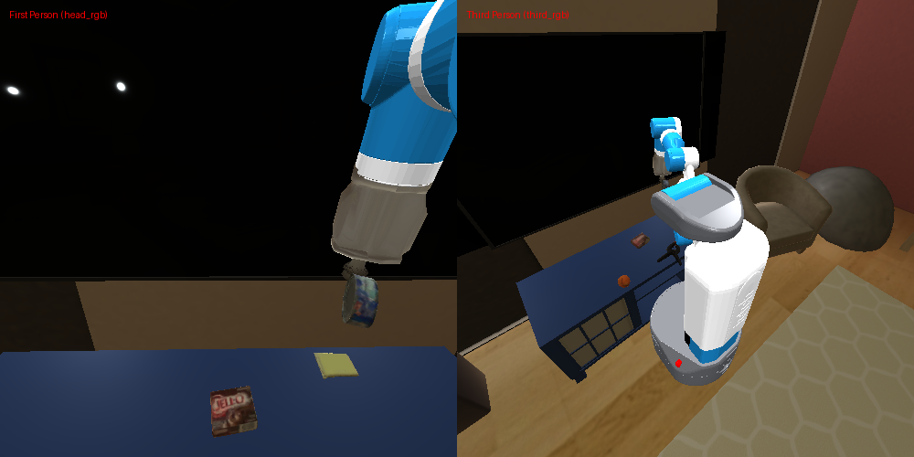
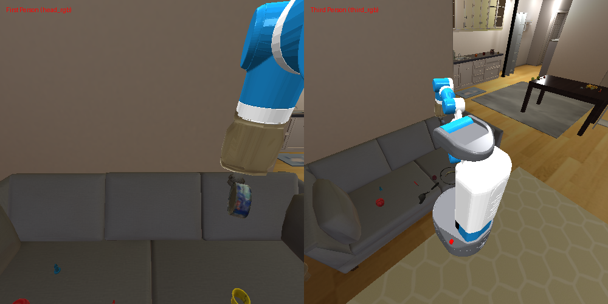
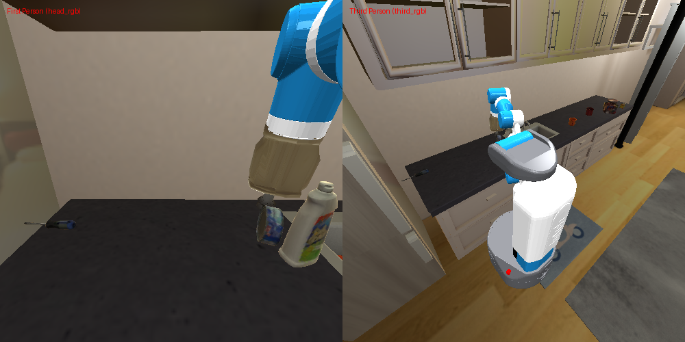
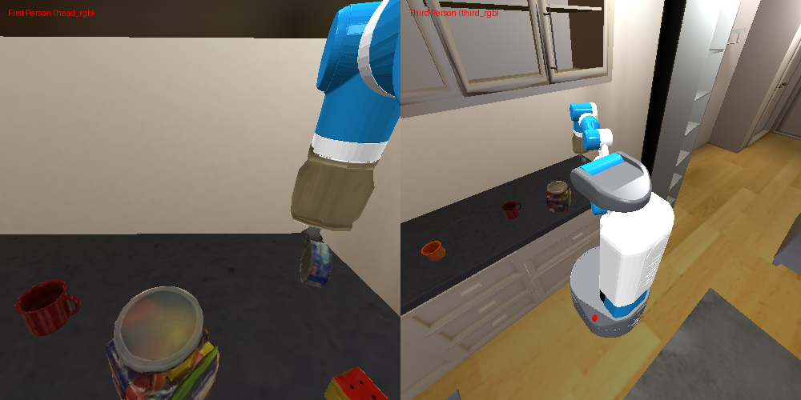

# Intent Reasoning Agent Run Summary
**Episode ID:** test_interactive  
**Timestamp:** 20260503_194358  

---

### Step 0 - GoalReasoner (Module A)

```json
{
  "original_target": "可乐",
  "reasoning_chain": [
    {
      "question": "Why does the user want this object?",
      "answer": "The user wants to drink it."
    },
    {
      "question": "Why is that important?",
      "answer": "The user is likely thirsty or wants to enjoy a refreshing beverage."
    }
  ],
  "deep_intent": "The user wants to quench thirst or enjoy a refreshing beverage.",
  "acceptable_alternatives_properties": [
    {
      "priority": 1,
      "description": "Beverages that are refreshing and can quench thirst, such as other carbonated drinks or fruit juices."
    },
    {
      "priority": 2,
      "description": "Any drinkable liquid that can provide hydration, such as water or tea."
    }
  ]
}
```

---

### Step 0 - SolutionSpaceAnalyzer (Module B)


```json
{
  "capabilities_count": 70,
  "currently_visible": [
    "ball"
  ],
  "memory_objects": {
    "ball": "unknown starting location"
  }
}
```

---

### Step 0 - TaskValidator (Module C & D merged)

```json
{
  "reasoning": "The original target is '可乐' (cola), which is a beverage that the user wants to drink. However, it is not visible and not in memory. Since I need to explore to find the original target, I will navigate to a new location. Among the legal locations, the 'refrigerator' is a likely place to find beverages, including cola. Therefore, I will choose to navigate to the refrigerator.",
  "selected_target": "refrigerator",
  "action_id": 13,
  "communication_to_user": null
}
```

---

### Step 1 - SolutionSpaceAnalyzer (Module B)


```json
{
  "capabilities_count": 70,
  "currently_visible": [],
  "memory_objects": {
    "ball": "unknown starting location"
  }
}
```

---

### Step 1 - TaskValidator (Module C & D merged)

```json
{
  "reasoning": "The user wants a 可乐 (Coke), which is a refreshing beverage. However, it is not visible in the refrigerator, and there are no other drinks in memory. Since the original target is not visible and not in memory, I need to explore. The next logical step is to navigate to a new location from the legal locations that have not been visited yet. I will navigate to 'cabinet 7' as it is one of the unvisited locations and could potentially contain beverages.",
  "selected_target": "cabinet 7",
  "action_id": 0,
  "communication_to_user": null
}
```

---

### Step 2 - SolutionSpaceAnalyzer (Module B)


```json
{
  "capabilities_count": 70,
  "currently_visible": [
    "screwdriver",
    "cleanser"
  ],
  "memory_objects": {
    "ball": "unknown starting location",
    "screwdriver": "cabinet 7",
    "cleanser": "cabinet 7"
  }
}
```

---

### Step 2 - TaskValidator (Module C & D merged)

```json
{
  "reasoning": "The user is looking for '可乐' (cola), which is a beverage. Currently, I am in 'cabinet 7', but '可乐' is not visible and not in memory. I need to explore other locations to find it. The unvisited locations include 'cabinet 6', 'cabinet 5', 'cabinet 4', and others. Since 'cabinet 6' is the next logical place to check for beverages, I will navigate there.",
  "selected_target": null,
  "action_id": 1,
  "communication_to_user": null
}
```

---

### Step 3 - SolutionSpaceAnalyzer (Module B)


```json
{
  "capabilities_count": 70,
  "currently_visible": [
    "cup"
  ],
  "memory_objects": {
    "ball": "unknown starting location",
    "screwdriver": "cabinet 7",
    "cleanser": "cabinet 7",
    "cup": "cabinet 6"
  }
}
```

---

### Step 3 - TaskValidator (Module C & D merged)

```json
{
  "reasoning": "The user wants '可乐' (cola), which is a beverage that can quench thirst. However, '可乐' is not visible and not in memory. Therefore, I need to explore unvisited locations to find it. The unvisited locations include 'cabinet 5' and 'cabinet 4', which are likely candidates for containing beverages. I will navigate to 'cabinet 5' as my first exploration choice.",
  "selected_target": "cabinet 5",
  "action_id": 2,
  "communication_to_user": null
}
```

---

### Step 4 - SolutionSpaceAnalyzer (Module B)


```json
{
  "capabilities_count": 70,
  "currently_visible": [
    "cup",
    "can"
  ],
  "memory_objects": {
    "ball": "unknown starting location",
    "screwdriver": "cabinet 7",
    "cleanser": "cabinet 7",
    "cup": "cabinet 5",
    "can": "cabinet 5"
  }
}
```

---

### Step 4 - TaskValidator (Module C & D merged)

```json
{
  "reasoning": "The user wants a 可乐 (cola), which is a refreshing beverage. However, it is not visible in the current location (cabinet 5) and is not in memory. The only visible objects are a cup and a can, but neither of these is the original target. I need to explore unvisited locations to find the cola. The unvisited locations include cabinet 4, refrigerator push point, chair 1, table 1, table 2, TV stand, sink in the kitchen, right counter in the kitchen, left counter in the kitchen, sofa, left drawer of the kitchen counter, and right drawer of the kitchen counter. Since I have already visited cabinets 5, 6, and 7, I will navigate to cabinet 4, which is a logical location to search for beverages. This aligns with the exploration mode rule, as I must explore new locations to find the original target.",
  "selected_target": "cabinet 4",
  "action_id": 3,
  "communication_to_user": null
}
```

---

### Step 5 - SolutionSpaceAnalyzer (Module B)


```json
{
  "capabilities_count": 70,
  "currently_visible": [
    "cup",
    "can"
  ],
  "memory_objects": {
    "ball": "unknown starting location",
    "screwdriver": "cabinet 7",
    "cleanser": "cabinet 7",
    "cup": "cabinet 4",
    "can": "cabinet 4"
  }
}
```

---

### Step 5 - TaskValidator (Module C & D merged)

```json
{
  "reasoning": "The original target is '可乐' (cola), which is a beverage. It is not visible in the current location (cabinet 4) and is not in memory. I need to explore new locations to find it. The unvisited locations include several places that could potentially contain beverages. Since I have already visited all cabinets and the refrigerator, I will explore the 'refrigerator push point' next, as it is a logical place to find drinks.",
  "selected_target": "refrigerator push point",
  "action_id": 4,
  "communication_to_user": null
}
```

---

### Step 6 - SolutionSpaceAnalyzer (Module B)


```json
{
  "capabilities_count": 70,
  "currently_visible": [],
  "memory_objects": {
    "ball": "unknown starting location",
    "screwdriver": "cabinet 7",
    "cleanser": "cabinet 7",
    "cup": "cabinet 4",
    "can": "cabinet 4"
  }
}
```

---

### Step 6 - TaskValidator (Module C & D merged)

```json
{
  "reasoning": "The user wants a drink, specifically 可乐 (cola), which is not currently visible and not in memory. I need to explore new locations to find a refreshing beverage. The unvisited locations include several options, but I should prioritize locations that are likely to contain beverages. Since the refrigerator has already been visited and is a common place for drinks, I will navigate to the 'right counter in the kitchen', which is a plausible location for finding drinks.",
  "selected_target": "right counter in the kitchen",
  "action_id": 10,
  "communication_to_user": null
}
```

---

### Step 7 - SolutionSpaceAnalyzer (Module B)



```json
{
  "capabilities_count": 70,
  "currently_visible": [
    "cup"
  ],
  "memory_objects": {
    "ball": "unknown starting location",
    "screwdriver": "cabinet 7",
    "cleanser": "cabinet 7",
    "cup": "right counter in the kitchen",
    "can": "cabinet 4"
  }
}
```

---

### Step 7 - TaskValidator (Module C & D merged)

```json
{
  "reasoning": "The user wants a drink, specifically 可乐 (cola), which is not currently visible and not in memory. I have explored the refrigerator and several cabinets but did not find it. The next logical step is to explore unvisited locations that might contain beverages. Among the unvisited locations, 'cabinet 4' contains a 'can', which could potentially be a beverage. Therefore, I will navigate to 'cabinet 4' to check for the can.",
  "selected_target": "cabinet 4",
  "action_id": 3,
  "communication_to_user": null
}
```

---

### Step 8 - SolutionSpaceAnalyzer (Module B)


```json
{
  "capabilities_count": 70,
  "currently_visible": [
    "cup",
    "can"
  ],
  "memory_objects": {
    "ball": "unknown starting location",
    "screwdriver": "cabinet 7",
    "cleanser": "cabinet 7",
    "cup": "cabinet 4",
    "can": "cabinet 4"
  }
}
```

---

### Step 8 - TaskValidator (Module C & D merged)

```json
{
  "reasoning": "The user wants a drink, specifically 可乐 (cola), which is not currently visible. I have explored all cabinets and the refrigerator, and I know that the original target is not in memory or visible. The only drinks I can see are a cup and a can, but neither is cola. Since I have already visited all locations except for the unvisited ones, I need to explore a new location. Among the unvisited locations, the 'left counter in the kitchen' seems like a plausible place to find beverages. Therefore, I will navigate there to explore further.",
  "selected_target": "left counter in the kitchen",
  "action_id": 11,
  "communication_to_user": null
}
```

---

### Step 9 - SolutionSpaceAnalyzer (Module B)


```json
{
  "capabilities_count": 70,
  "currently_visible": [
    "screwdriver",
    "cleanser",
    "can"
  ],
  "memory_objects": {
    "ball": "unknown starting location",
    "screwdriver": "left counter in the kitchen",
    "cleanser": "left counter in the kitchen",
    "cup": "cabinet 4",
    "can": "left counter in the kitchen"
  }
}
```

---

### Step 9 - TaskValidator (Module C & D merged)

```json
{
  "reasoning": "The user wants a 可乐 (cola), which is a refreshing beverage. However, the 可乐 is not visible and does not exist in memory. The only visible objects are a screwdriver, a cleanser, and a can. The can is present in the visible objects list, and since it is a beverage, it can be considered a suitable alternative to the original target. I will select the action to pick up the can as it is the best option available that matches the user's intent of quenching thirst with a refreshing drink.",
  "selected_target": "can",
  "action_id": 35,
  "communication_to_user": null
}
```

---

### Step 10 - SolutionSpaceAnalyzer (Module B)


```json
{
  "capabilities_count": 70,
  "currently_visible": [
    "can"
  ],
  "memory_objects": {
    "ball": "unknown starting location",
    "screwdriver": "left counter in the kitchen",
    "cleanser": "left counter in the kitchen",
    "cup": "cabinet 4",
    "can": "left counter in the kitchen"
  }
}
```

---

### Step 10 - TaskValidator (Module C & D merged)

```json
{
  "reasoning": "The user wants a '可乐' (cola), which is a refreshing beverage. Currently, the only visible object is a 'can', which could potentially be a beverage. However, I need to explore further to confirm if it is indeed cola or another drink. Since the original target is not visible and not in memory, I must navigate to an unvisited location to explore for the desired beverage. Among the unvisited locations, 'table 1' seems like a reasonable choice to find beverages, so I will navigate there.",
  "selected_target": "table 1",
  "action_id": 6,
  "communication_to_user": null
}
```

---

### Step 11 - SolutionSpaceAnalyzer (Module B)



```json
{
  "capabilities_count": 70,
  "currently_visible": [
    "strawberry",
    "can",
    "box"
  ],
  "memory_objects": {
    "ball": "unknown starting location",
    "screwdriver": "left counter in the kitchen",
    "cleanser": "left counter in the kitchen",
    "cup": "cabinet 4",
    "can": "table 1",
    "strawberry": "table 1",
    "box": "table 1"
  }
}
```

---

### Step 11 - TaskValidator (Module C & D merged)

```json
{
  "reasoning": "The original target is '可乐' (cola), which is a beverage. It is not visible in the current scene and is also not in memory. Therefore, I need to explore unvisited locations to find it. The unvisited locations include 'chair 1', 'table 2', 'TV stand', 'sink in the kitchen', 'sofa', 'left drawer of the kitchen counter', and 'right drawer of the kitchen counter'. Among these, 'table 2' seems like a plausible location to find beverages, so I will navigate there first.",
  "selected_target": "table 2",
  "action_id": 7,
  "communication_to_user": null
}
```

---

### Step 12 - SolutionSpaceAnalyzer (Module B)



```json
{
  "capabilities_count": 70,
  "currently_visible": [
    "scissors",
    "lemon",
    "banana",
    "hammer"
  ],
  "memory_objects": {
    "ball": "unknown starting location",
    "screwdriver": "left counter in the kitchen",
    "cleanser": "left counter in the kitchen",
    "cup": "cabinet 4",
    "can": "table 1",
    "strawberry": "table 1",
    "box": "table 1",
    "scissors": "table 2",
    "lemon": "table 2",
    "banana": "table 2",
    "hammer": "table 2"
  }
}
```

---

### Step 12 - TaskValidator (Module C & D merged)

```json
{
  "reasoning": "The user wants a 可乐 (cola), which is a refreshing beverage. However, it is not visible and not in memory. I need to explore new locations to find it. The unvisited locations include 'chair 1', 'TV stand', 'sink in the kitchen', 'sofa', 'left drawer of the kitchen counter', and 'right drawer of the kitchen counter'. Since I have no prior knowledge of where the 可乐 might be, I will choose to navigate to 'chair 1', as it is a new location that could potentially have beverages.",
  "selected_target": "chair 1",
  "action_id": 5,
  "communication_to_user": null
}
```

---

### Step 13 - SolutionSpaceAnalyzer (Module B)



```json
{
  "capabilities_count": 70,
  "currently_visible": [],
  "memory_objects": {
    "ball": "unknown starting location",
    "screwdriver": "left counter in the kitchen",
    "cleanser": "left counter in the kitchen",
    "cup": "cabinet 4",
    "can": "table 1",
    "strawberry": "table 1",
    "box": "table 1",
    "scissors": "table 2",
    "lemon": "table 2",
    "banana": "table 2",
    "hammer": "table 2"
  }
}
```

---

### Step 13 - TaskValidator (Module C & D merged)

```json
{
  "reasoning": "The user is looking for 可乐 (cola), which is a refreshing beverage. However, it is not currently visible, and there is no record of it in Memory. I need to explore new locations to find it. The unvisited locations include the TV stand, sink in the kitchen, sofa, left drawer of the kitchen counter, and right drawer of the kitchen counter. Among these, the sink in the kitchen is a logical place to find beverages. Therefore, I will navigate to the sink in the kitchen to explore for the cola.",
  "selected_target": "sink in the kitchen",
  "action_id": 9,
  "communication_to_user": null
}
```

---

### Step 14 - SolutionSpaceAnalyzer (Module B)



```json
{
  "capabilities_count": 70,
  "currently_visible": [
    "cleanser",
    "bowl"
  ],
  "memory_objects": {
    "ball": "unknown starting location",
    "screwdriver": "left counter in the kitchen",
    "cleanser": "sink in the kitchen",
    "cup": "cabinet 4",
    "can": "table 1",
    "strawberry": "table 1",
    "box": "table 1",
    "scissors": "table 2",
    "lemon": "table 2",
    "banana": "table 2",
    "hammer": "table 2",
    "bowl": "sink in the kitchen"
  }
}
```

---

### Step 14 - TaskValidator (Module C & D merged)

```json
{
  "reasoning": "The user wants a 可乐 (cola), which is a refreshing beverage. However, it is not visible in the current location (sink in the kitchen) and is not present in memory. The only visible objects are 'cleanser' and 'bowl'. Since I have already explored all other locations except for the unvisited ones, I need to explore a new location that might contain a refreshing beverage. The unvisited locations are 'TV stand', 'sofa', 'left drawer of the kitchen counter', and 'right drawer of the kitchen counter'. Among these, the 'TV stand' seems like a plausible place to find beverages, so I will navigate there to explore further.",
  "selected_target": "TV stand",
  "action_id": 8,
  "communication_to_user": null
}
```

---

### Step 15 - SolutionSpaceAnalyzer (Module B)



```json
{
  "capabilities_count": 70,
  "currently_visible": [
    "can",
    "box"
  ],
  "memory_objects": {
    "ball": "unknown starting location",
    "screwdriver": "left counter in the kitchen",
    "cleanser": "sink in the kitchen",
    "cup": "cabinet 4",
    "can": "tv stand",
    "strawberry": "table 1",
    "box": "tv stand",
    "scissors": "table 2",
    "lemon": "table 2",
    "banana": "table 2",
    "hammer": "table 2",
    "bowl": "sink in the kitchen"
  }
}
```

---

### Step 15 - TaskValidator (Module C & D merged)

```json
{
  "reasoning": "The user wants '可乐' (cola), which is a beverage. However, '可乐' is not visible and not in memory. The only visible objects are 'can' and 'box', but they do not match the user's intent. I have already explored all locations except for the 'sofa', 'left drawer of the kitchen counter', and 'right drawer of the kitchen counter'. Since '可乐' is a beverage, I will explore the 'sofa' as it might have other beverages or items that can quench thirst. This follows the exploration rule since the original target is unknown and not visible.",
  "selected_target": "sofa",
  "action_id": 12,
  "communication_to_user": null
}
```

---

### Step 16 - SolutionSpaceAnalyzer (Module B)



```json
{
  "capabilities_count": 70,
  "currently_visible": [
    "cup",
    "bowl"
  ],
  "memory_objects": {
    "ball": "unknown starting location",
    "screwdriver": "left counter in the kitchen",
    "cleanser": "sink in the kitchen",
    "cup": "sofa",
    "can": "tv stand",
    "strawberry": "table 1",
    "box": "tv stand",
    "scissors": "table 2",
    "lemon": "table 2",
    "banana": "table 2",
    "hammer": "table 2",
    "bowl": "sofa"
  }
}
```

---

### Step 16 - TaskValidator (Module C & D merged)

```json
{
  "reasoning": "The user wants a '可乐' (cola), which is a refreshing beverage. Currently, the object is not visible and not in memory. The only unvisited locations are 'left drawer of the kitchen counter' and 'right drawer of the kitchen counter'. Since I need to explore new locations to find the original target, I will navigate to one of these unvisited locations. The left drawer of the kitchen counter seems like a reasonable place to find beverages, so I will choose to navigate there first.",
  "selected_target": "left drawer of the kitchen counter",
  "action_id": 14,
  "communication_to_user": null
}
```

---

### Step 17 - SolutionSpaceAnalyzer (Module B)


```json
{
  "capabilities_count": 70,
  "currently_visible": [
    "can"
  ],
  "memory_objects": {
    "ball": "unknown starting location",
    "screwdriver": "left counter in the kitchen",
    "cleanser": "sink in the kitchen",
    "cup": "sofa",
    "can": "left drawer of the kitchen counter",
    "strawberry": "table 1",
    "box": "tv stand",
    "scissors": "table 2",
    "lemon": "table 2",
    "banana": "table 2",
    "hammer": "table 2",
    "bowl": "sofa"
  }
}
```

---

### Step 17 - TaskValidator (Module C & D merged)

```json
{
  "reasoning": "The user wants a 可乐 (cola), which is a refreshing beverage. However, the only visible object is a 'can', which could potentially be a can of cola. Since the user has a preference for beverages that quench thirst, I will choose to pick up the 'can' as it might fulfill the user's intent. According to Rule 2, since the 'can' is visible, I can perform a 'pick' action on it.",
  "selected_target": "can",
  "action_id": 35,
  "communication_to_user": null
}
```

---

### Step 18 - SolutionSpaceAnalyzer (Module B)



```json
{
  "capabilities_count": 70,
  "currently_visible": [],
  "memory_objects": {
    "ball": "unknown starting location",
    "screwdriver": "left counter in the kitchen",
    "cleanser": "sink in the kitchen",
    "cup": "sofa",
    "can": "left drawer of the kitchen counter",
    "strawberry": "table 1",
    "box": "tv stand",
    "scissors": "table 2",
    "lemon": "table 2",
    "banana": "table 2",
    "hammer": "table 2",
    "bowl": "sofa"
  }
}
```

---

### Step 18 - TaskValidator (Module C & D merged)

```json
{
  "reasoning": "The user wants a '可乐' (cola), which is a refreshing beverage. However, it is not currently visible, and I have not encountered it in my memory. The only unvisited location is the 'right drawer of the kitchen counter'. Since I need to explore to find the original target, I will navigate to this unvisited location to see if the cola is there.",
  "selected_target": "right drawer of the kitchen counter",
  "action_id": 15,
  "communication_to_user": null
}
```

---

### Step 19 - SolutionSpaceAnalyzer (Module B)



```json
{
  "capabilities_count": 70,
  "currently_visible": [
    "cup",
    "can"
  ],
  "memory_objects": {
    "ball": "unknown starting location",
    "screwdriver": "left counter in the kitchen",
    "cleanser": "sink in the kitchen",
    "cup": "right drawer of the kitchen counter",
    "can": "right drawer of the kitchen counter",
    "strawberry": "table 1",
    "box": "tv stand",
    "scissors": "table 2",
    "lemon": "table 2",
    "banana": "table 2",
    "hammer": "table 2",
    "bowl": "sofa"
  }
}
```

---

### Step 19 - TaskValidator (Module C & D merged)

```json
{
  "reasoning": "The user wants '可乐' (cola), which is a beverage that can quench thirst. However, '可乐' is not visible and not in memory. I have explored all locations except for the 'right drawer of the kitchen counter', which I am currently in. Since there are no unvisited locations left, I need to explore alternatives. The only visible objects are 'cup' and 'can'. The 'can' is a beverage and can be a suitable alternative to '可乐'. Therefore, I will pick up the 'can' as it matches the acceptable alternatives properties of being a refreshing beverage.",
  "selected_target": "can",
  "action_id": 35,
  "communication_to_user": "I explored the whole scene but couldn't find the 可乐. However, I found a can which can also quench your thirst. Would you like me to grab it?"
}
```

---

