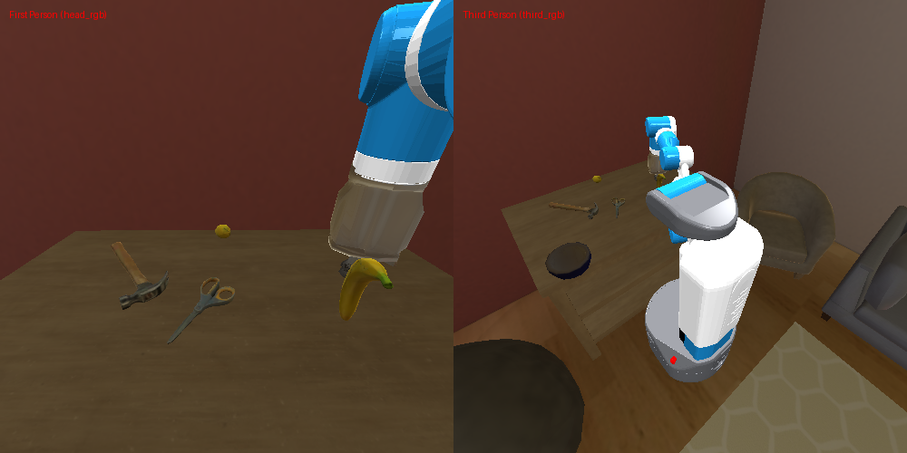

# Intent Reasoning Agent Run Summary
**Episode ID:** test_interactive  
**Timestamp:** 20260503_195532  

---

### Step 0 - SolutionSpaceAnalyzer (Module B)


```json
{
  "capabilities_count": 70,
  "currently_visible": [
    "ball"
  ],
  "memory_objects": {
    "ball": "unknown starting location",
    "screwdriver": "left counter in the kitchen",
    "cleanser": "sink in the kitchen",
    "cup": "right drawer of the kitchen counter",
    "can": "right drawer of the kitchen counter",
    "strawberry": "table 1",
    "box": "tv stand",
    "scissors": "table 2",
    "lemon": "table 2",
    "banana": "table 2",
    "hammer": "table 2",
    "bowl": "sofa"
  }
}
```

---

### Step 0 - TaskValidator (Module C & D merged)

```json
{
  "reasoning": "The user wants to satisfy hunger with nutritious food, specifically preferring bananas. I have explored all locations and the only visible object is a ball, which does not satisfy the user's intent. However, I have memory of a banana located at 'table 2'. Since the banana is not currently visible but is in memory, I need to navigate to 'table 2' to retrieve it. This aligns with the rules that state if the original target is not visible but exists in memory, I should choose a 'navigate' action to its known location.",
  "selected_target": "table 2",
  "action_id": 7,
  "communication_to_user": null
}
```

---

### Step 1 - SolutionSpaceAnalyzer (Module B)


```json
{
  "capabilities_count": 70,
  "currently_visible": [
    "scissors",
    "banana"
  ],
  "memory_objects": {
    "ball": "unknown starting location",
    "screwdriver": "left counter in the kitchen",
    "cleanser": "sink in the kitchen",
    "cup": "right drawer of the kitchen counter",
    "can": "right drawer of the kitchen counter",
    "strawberry": "table 1",
    "box": "tv stand",
    "scissors": "table 2",
    "lemon": "table 2",
    "banana": "table 2",
    "hammer": "table 2",
    "bowl": "sofa"
  }
}
```

---

### Step 1 - TaskValidator (Module C & D merged)

```json
{
  "reasoning": "The user wants to satisfy hunger with nutritious food, specifically fruit. The banana is currently visible and matches the user's preference for fruit. According to Rule 2, since the banana is visible, I can directly pick it up. There is no need to navigate to any other location or explore further, as I have a suitable target available right now.",
  "selected_target": "banana",
  "action_id": 37,
  "communication_to_user": null
}
```

---

### Step 2 - SolutionSpaceAnalyzer (Module B)


```json
{
  "capabilities_count": 70,
  "currently_visible": [
    "scissors",
    "banana"
  ],
  "memory_objects": {
    "ball": "unknown starting location",
    "screwdriver": "left counter in the kitchen",
    "cleanser": "sink in the kitchen",
    "cup": "right drawer of the kitchen counter",
    "can": "right drawer of the kitchen counter",
    "strawberry": "table 1",
    "box": "tv stand",
    "scissors": "table 2",
    "lemon": "table 2",
    "banana": "table 2",
    "hammer": "table 2",
    "bowl": "sofa"
  }
}
```

---

### Step 2 - TaskValidator (Module C & D merged)

```json
{
  "reasoning": "The user wants to satisfy hunger with nutritious food, specifically fruit. The banana is currently visible and matches the user's preference for fruit. According to the rules, since the banana is visible, I can pick it up directly. This satisfies the user's intent without needing to explore further or consider alternatives.",
  "selected_target": "banana",
  "action_id": 37,
  "communication_to_user": null
}
```

---

### Step 3 - SolutionSpaceAnalyzer (Module B)


```json
{
  "capabilities_count": 70,
  "currently_visible": [
    "scissors",
    "banana",
    "lemon",
    "wrench"
  ],
  "memory_objects": {
    "ball": "unknown starting location",
    "screwdriver": "left counter in the kitchen",
    "cleanser": "sink in the kitchen",
    "cup": "right drawer of the kitchen counter",
    "can": "right drawer of the kitchen counter",
    "strawberry": "table 1",
    "box": "tv stand",
    "scissors": "table 2",
    "lemon": "table 2",
    "banana": "table 2",
    "hammer": "table 2",
    "bowl": "sofa",
    "wrench": "table 2"
  }
}
```

---

### Step 3 - TaskValidator (Module C & D merged)

```json
{
  "reasoning": "The user wants to satisfy hunger with nutritious food, specifically fruit. The banana is currently visible on the table 2, and it matches the user's preference for bananas when hungry. According to Rule 2, since the banana is visible, I can select the 'pick' action for it. This is the best action to fulfill the user's intent.",
  "selected_target": "banana",
  "action_id": 37,
  "communication_to_user": null
}
```

---

### Step 4 - SolutionSpaceAnalyzer (Module B)


```json
{
  "capabilities_count": 70,
  "currently_visible": [
    "scissors",
    "banana"
  ],
  "memory_objects": {
    "ball": "unknown starting location",
    "screwdriver": "left counter in the kitchen",
    "cleanser": "sink in the kitchen",
    "cup": "right drawer of the kitchen counter",
    "can": "right drawer of the kitchen counter",
    "strawberry": "table 1",
    "box": "tv stand",
    "scissors": "table 2",
    "lemon": "table 2",
    "banana": "table 2",
    "hammer": "table 2",
    "bowl": "sofa",
    "wrench": "table 2"
  }
}
```

---

### Step 4 - TaskValidator (Module C & D merged)

```json
{
  "reasoning": "The user wants to satisfy hunger with nutritious food, specifically fruit. The banana is currently visible and matches the user's preference for fruit. According to the rules, since the banana is visible, I can directly pick it up. Therefore, I will select the action to pick up the banana.",
  "selected_target": "banana",
  "action_id": 37,
  "communication_to_user": null
}
```

---

### Step 5 - SolutionSpaceAnalyzer (Module B)


```json
{
  "capabilities_count": 70,
  "currently_visible": [
    "scissors",
    "banana",
    "lemon",
    "wrench"
  ],
  "memory_objects": {
    "ball": "unknown starting location",
    "screwdriver": "left counter in the kitchen",
    "cleanser": "sink in the kitchen",
    "cup": "right drawer of the kitchen counter",
    "can": "right drawer of the kitchen counter",
    "strawberry": "table 1",
    "box": "tv stand",
    "scissors": "table 2",
    "lemon": "table 2",
    "banana": "table 2",
    "hammer": "table 2",
    "bowl": "sofa",
    "wrench": "table 2"
  }
}
```

---

### Step 5 - TaskValidator (Module C & D merged)

```json
{
  "reasoning": "The user wants to satisfy hunger with nutritious food, specifically fruit. The banana is currently visible and matches the user's preference for fruit. According to the rules, since the banana is visible, I can directly pick it up. This aligns with the user's intent to eat something nutritious.",
  "selected_target": "banana",
  "action_id": 37,
  "communication_to_user": null
}
```

---

### Step 6 - SolutionSpaceAnalyzer (Module B)


```json
{
  "capabilities_count": 70,
  "currently_visible": [
    "scissors",
    "banana",
    "lemon",
    "wrench"
  ],
  "memory_objects": {
    "ball": "unknown starting location",
    "screwdriver": "left counter in the kitchen",
    "cleanser": "sink in the kitchen",
    "cup": "right drawer of the kitchen counter",
    "can": "right drawer of the kitchen counter",
    "strawberry": "table 1",
    "box": "tv stand",
    "scissors": "table 2",
    "lemon": "table 2",
    "banana": "table 2",
    "hammer": "table 2",
    "bowl": "sofa",
    "wrench": "table 2"
  }
}
```

---

### Step 6 - TaskValidator (Module C & D merged)

```json
{
  "reasoning": "The user wants to satisfy hunger with nutritious food, specifically fruit. The user's preference indicates they like bananas, which are currently visible. According to the rules, since the banana is visible, I can directly pick it up. Therefore, I will select the action to pick up the banana.",
  "selected_target": "banana",
  "action_id": 37,
  "communication_to_user": null
}
```

---

### Step 7 - SolutionSpaceAnalyzer (Module B)


```json
{
  "capabilities_count": 70,
  "currently_visible": [
    "scissors",
    "banana",
    "lemon",
    "wrench"
  ],
  "memory_objects": {
    "ball": "unknown starting location",
    "screwdriver": "left counter in the kitchen",
    "cleanser": "sink in the kitchen",
    "cup": "right drawer of the kitchen counter",
    "can": "right drawer of the kitchen counter",
    "strawberry": "table 1",
    "box": "tv stand",
    "scissors": "table 2",
    "lemon": "table 2",
    "banana": "table 2",
    "hammer": "table 2",
    "bowl": "sofa",
    "wrench": "table 2"
  }
}
```

---

### Step 7 - TaskValidator (Module C & D merged)

```json
{
  "reasoning": "The user wants to satisfy hunger with nutritious food, specifically preferring bananas. The banana is currently visible on the table 2, which means I can directly pick it up. According to the rules, since the original target (fruit) is visible and I have a specific target (banana) that matches the user's preference, I will choose to pick it up. This adheres to the rules of selecting a visible object for action.",
  "selected_target": "banana",
  "action_id": 37,
  "communication_to_user": null
}
```

---

### Step 8 - SolutionSpaceAnalyzer (Module B)


```json
{
  "capabilities_count": 70,
  "currently_visible": [
    "scissors",
    "banana",
    "lemon",
    "wrench"
  ],
  "memory_objects": {
    "ball": "unknown starting location",
    "screwdriver": "left counter in the kitchen",
    "cleanser": "sink in the kitchen",
    "cup": "right drawer of the kitchen counter",
    "can": "right drawer of the kitchen counter",
    "strawberry": "table 1",
    "box": "tv stand",
    "scissors": "table 2",
    "lemon": "table 2",
    "banana": "table 2",
    "hammer": "table 2",
    "bowl": "sofa",
    "wrench": "table 2"
  }
}
```

---

### Step 8 - TaskValidator (Module C & D merged)

```json
{
  "reasoning": "The user wants to satisfy hunger with nutritious food, specifically fruit, and has a preference for bananas. Currently, the banana is visible on the table 2, which is also where I am located. According to the rules, since the banana is visible, I can directly pick it up. Therefore, I will select the action to pick up the banana.",
  "selected_target": "banana",
  "action_id": 37,
  "communication_to_user": null
}
```

---

### Step 9 - SolutionSpaceAnalyzer (Module B)



```json
{
  "capabilities_count": 70,
  "currently_visible": [
    "scissors",
    "banana"
  ],
  "memory_objects": {
    "ball": "unknown starting location",
    "screwdriver": "left counter in the kitchen",
    "cleanser": "sink in the kitchen",
    "cup": "right drawer of the kitchen counter",
    "can": "right drawer of the kitchen counter",
    "strawberry": "table 1",
    "box": "tv stand",
    "scissors": "table 2",
    "lemon": "table 2",
    "banana": "table 2",
    "hammer": "table 2",
    "bowl": "sofa",
    "wrench": "table 2"
  }
}
```

---

### Step 9 - TaskValidator (Module C & D merged)

```json
{
  "reasoning": "The user wants to satisfy hunger with nutritious food, specifically preferring bananas. The banana is currently visible in the environment. According to the rules, since the original target (banana) is visible, I should select a 'pick' action for that object. The action to pick up the banana is the most appropriate choice here.",
  "selected_target": "banana",
  "action_id": 37,
  "communication_to_user": null
}
```

---

### Step 10 - SolutionSpaceAnalyzer (Module B)


```json
{
  "capabilities_count": 70,
  "currently_visible": [
    "scissors",
    "banana"
  ],
  "memory_objects": {
    "ball": "unknown starting location",
    "screwdriver": "left counter in the kitchen",
    "cleanser": "sink in the kitchen",
    "cup": "right drawer of the kitchen counter",
    "can": "right drawer of the kitchen counter",
    "strawberry": "table 1",
    "box": "tv stand",
    "scissors": "table 2",
    "lemon": "table 2",
    "banana": "table 2",
    "hammer": "table 2",
    "bowl": "sofa",
    "wrench": "table 2"
  }
}
```

---

### Step 10 - TaskValidator (Module C & D merged)

```json
{
  "reasoning": "The user wants to satisfy hunger with nutritious food, specifically preferring bananas. The banana is currently visible in the environment, which means I can directly pick it up. According to Rule 2, since the original target (banana) is visible, I will choose the action to pick it up. There is no need to navigate or explore further as the target is already accessible.",
  "selected_target": "banana",
  "action_id": 37,
  "communication_to_user": null
}
```

---

### Step 11 - SolutionSpaceAnalyzer (Module B)


```json
{
  "capabilities_count": 70,
  "currently_visible": [
    "scissors",
    "banana",
    "lemon",
    "wrench"
  ],
  "memory_objects": {
    "ball": "unknown starting location",
    "screwdriver": "left counter in the kitchen",
    "cleanser": "sink in the kitchen",
    "cup": "right drawer of the kitchen counter",
    "can": "right drawer of the kitchen counter",
    "strawberry": "table 1",
    "box": "tv stand",
    "scissors": "table 2",
    "lemon": "table 2",
    "banana": "table 2",
    "hammer": "table 2",
    "bowl": "sofa",
    "wrench": "table 2"
  }
}
```

---

### Step 11 - TaskValidator (Module C & D merged)

```json
{
  "reasoning": "The user wants to satisfy hunger with nutritious food, specifically preferring bananas as indicated in their persistent memory. Currently, the banana is visible on the table 2. According to Rule 2, since the original target (banana) is visible, I should select a 'pick' action for that object. Therefore, I will choose the action to pick up the banana.",
  "selected_target": "banana",
  "action_id": 37,
  "communication_to_user": null
}
```

---

