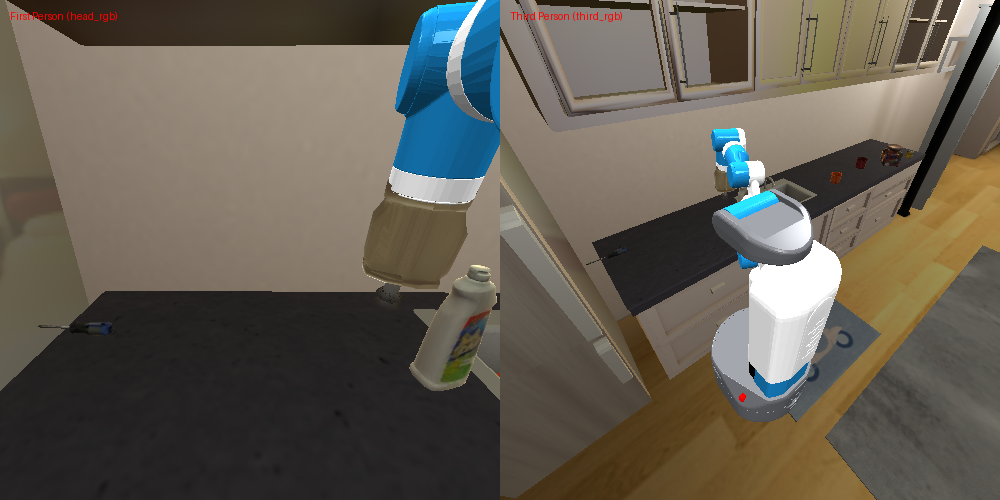

# Intent Reasoning Agent Run Summary
**Episode ID:** test_interactive  
**Timestamp:** 20260503_200355  

---

### Step 0 - GoalReasoner (Module A)

```json
{
  "original_target": "一杯可乐",
  "reasoning_chain": [
    {
      "question": "Why does the user want this object?",
      "answer": "The user wants to drink cola."
    },
    {
      "question": "Why is that important?",
      "answer": "The user might be thirsty or wants to enjoy the taste of cola."
    }
  ],
  "deep_intent": "The user wants to quench their thirst or enjoy a refreshing beverage.",
  "acceptable_alternatives_properties": [
    {
      "priority": 1,
      "description": "Beverages that are refreshing and can quench thirst (e.g., other sodas, juice, or iced tea)"
    },
    {
      "priority": 2,
      "description": "Any cold drink that can provide refreshment (e.g., water, flavored water, or cold milk)"
    }
  ]
}
```

---

### Step 0 - SolutionSpaceAnalyzer (Module B)


```json
{
  "capabilities_count": 70,
  "currently_visible": [
    "ball"
  ],
  "memory_objects": {
    "apple": "fridge",
    "banana": "bedroom",
    "ball": "unknown starting location"
  }
}
```

---

### Step 0 - TaskValidator (Module C & D merged)

```json
{
  "reasoning": "The user wants a cup of cola, which is a beverage to quench their thirst. However, the cola is not visible and not in memory. I need to explore new locations to find a suitable alternative. The user has a preference for bananas, but since I need to explore first, I will navigate to a new location. Among the unvisited locations, 'cabinet 7' seems like a reasonable choice to explore for beverages.",
  "selected_target": "cabinet 7",
  "action_id": 0,
  "communication_to_user": null
}
```

---

### Step 1 - SolutionSpaceAnalyzer (Module B)



```json
{
  "capabilities_count": 70,
  "currently_visible": [
    "screwdriver",
    "cleanser"
  ],
  "memory_objects": {
    "apple": "fridge",
    "banana": "bedroom",
    "ball": "unknown starting location",
    "screwdriver": "cabinet 7",
    "cleanser": "cabinet 7"
  }
}
```

---

### Step 1 - TaskValidator (Module C & D merged)

```json
{
  "reasoning": "The original target is '一杯可乐' (a cup of cola), which is not visible and not in memory. Therefore, I need to explore unvisited locations to find it. The unvisited locations include several cabinets and other areas. Since I have already visited cabinet 7 and the fridge, I will navigate to cabinet 6, which is a logical place to check for beverages like cola.",
  "selected_target": "cabinet 6",
  "action_id": 1,
  "communication_to_user": null
}
```

---

### Step 2 - SolutionSpaceAnalyzer (Module B)


```json
{
  "capabilities_count": 70,
  "currently_visible": [
    "cup"
  ],
  "memory_objects": {
    "apple": "fridge",
    "banana": "bedroom",
    "ball": "unknown starting location",
    "screwdriver": "cabinet 7",
    "cleanser": "cabinet 7",
    "cup": "cabinet 6"
  }
}
```

---

### Step 2 - TaskValidator (Module C & D merged)

```json
{
  "reasoning": "The user wants a cup of cola, which is not currently visible. However, I have explored the cabinet 6 and cabinet 7, and I know that the original target is not in memory or visible. Therefore, I need to explore new locations to find a refreshing beverage. The unvisited locations include cabinet 5, refrigerator push point, and others. Since the refrigerator is likely to contain beverages, I will navigate to the refrigerator, which is a logical choice for finding a drink.",
  "selected_target": "refrigerator",
  "action_id": 13,
  "communication_to_user": null
}
```

---

### Step 3 - SolutionSpaceAnalyzer (Module B)


```json
{
  "capabilities_count": 70,
  "currently_visible": [],
  "memory_objects": {
    "apple": "fridge",
    "banana": "bedroom",
    "ball": "unknown starting location",
    "screwdriver": "cabinet 7",
    "cleanser": "cabinet 7",
    "cup": "cabinet 6"
  }
}
```

---

### Step 3 - TaskValidator (Module C & D merged)

```json
{
  "reasoning": "The original target, 一杯可乐 (a cup of cola), is not visible and not in memory. Therefore, I need to explore new locations to find it. The unvisited locations include several cabinets and other areas. Since I have already visited the refrigerator and cabinet 6, I will navigate to cabinet 5, which is a new location that may contain beverages.",
  "selected_target": "cabinet 5",
  "action_id": 2,
  "communication_to_user": null
}
```

---

