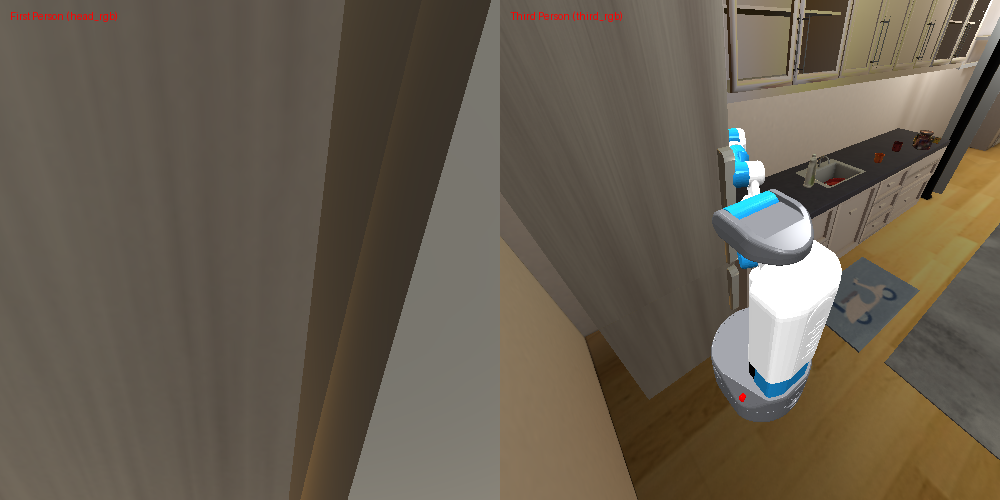
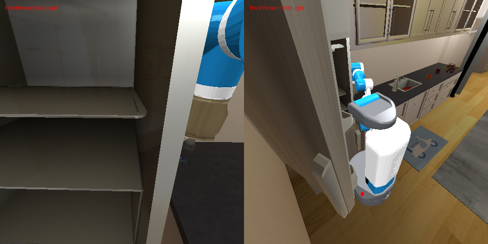

# Intent Reasoning Agent Run Summary
**Episode ID:** test_interactive  
**Timestamp:** 20260507_222621  

---

### Step 0

- **手持物品 (Held Object)**: `None`
- **可选动作数量**: `3` 个
- **已探索地点**: `{}`
- **记忆物品**: `['ball']`
- **Ranker 决策 (Top-2)**:
- **最终执行**: `Action 4 -> navigate to the refrigerator push point`

---

### Step 1

- **手持物品 (Held Object)**: `None`
- **可选动作数量**: `3` 个
- **已探索地点**: `{'refrigerator push point': 'visited_closed'}`
- **记忆物品**: `['ball']`
- **Ranker 决策 (Top-2)**:
- **最终执行**: `Action 60 -> open the refrigerator`

---

### Step 2

- **手持物品 (Held Object)**: `None`
- **可选动作数量**: `3` 个
- **已探索地点**: `{'refrigerator push point': 'visited_opened'}`
- **记忆物品**: `['ball', 'refrigerator']`
- **Ranker 决策 (Top-2)**:
- **最终执行**: `Action 60 -> open the refrigerator`

---

### Step 3

- **手持物品 (Held Object)**: `None`
- **可选动作数量**: `3` 个
- **已探索地点**: `{'refrigerator push point': 'visited_opened'}`
- **记忆物品**: `['ball', 'refrigerator', 'cabinet 4']`
- **Ranker 决策 (Top-2)**:
- **最终执行**: `Action 60 -> open the refrigerator`

---

### Step 4

- **手持物品 (Held Object)**: `None`
- **可选动作数量**: `3` 个
- **已探索地点**: `{'refrigerator push point': 'visited_opened'}`
- **记忆物品**: `['ball', 'refrigerator', 'cabinet 4']`
- **Ranker 决策 (Top-2)**:
- **最终执行**: `Action 60 -> open the refrigerator`

---

### Step 5

- **手持物品 (Held Object)**: `None`
- **可选动作数量**: `3` 个
- **已探索地点**: `{'refrigerator push point': 'visited_opened'}`
- **记忆物品**: `['ball', 'refrigerator', 'cabinet 4', 'cabinet 6']`
- **Ranker 决策 (Top-2)**:
- **最终执行**: `Action 57 -> place at the refrigerator`

---

### Step 6

- **手持物品 (Held Object)**: `None`
- **可选动作数量**: `3` 个
- **已探索地点**: `{'refrigerator push point': 'visited_opened'}`
- **记忆物品**: `['ball', 'refrigerator', 'cabinet 4', 'cabinet 6']`
- **Ranker 决策 (Top-2)**:
- **最终执行**: `Action 60 -> open the refrigerator`

---

