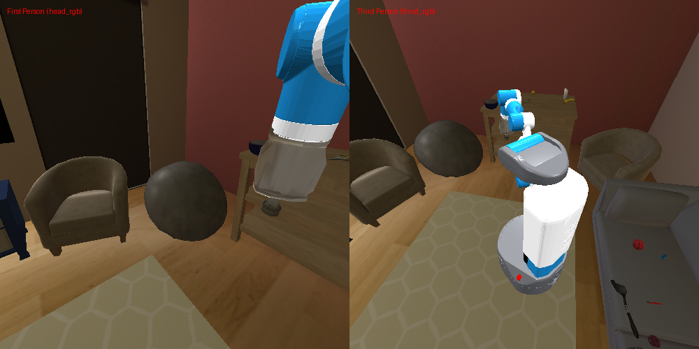
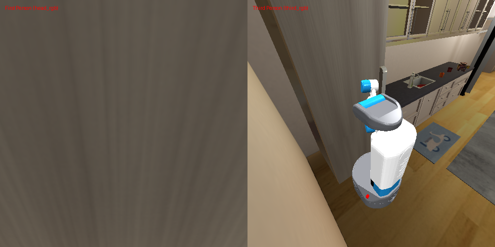
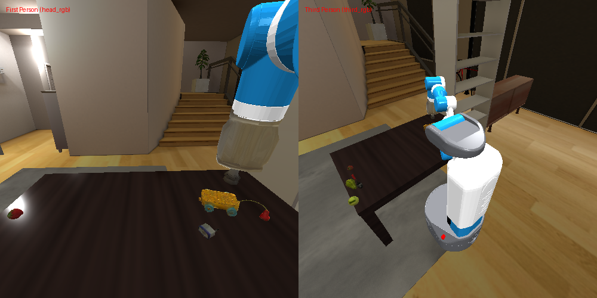

# Intent Reasoning Agent Run Summary
**Episode ID:** test_interactive  
**Timestamp:** 20260507_223907  

---

### Step 0

- **手持物品 (Held Object)**: `None`
- **可选动作数量**: `14` 个
- **已探索地点**: `{}`
- **记忆物品**: `['ball']`
- **Ranker 决策 (Top-2)**:
- **最终执行**: `Action 8 -> navigate to the TV stand`

---

### Step 1

- **手持物品 (Held Object)**: `None`
- **可选动作数量**: `16` 个
- **已探索地点**: `{'tv stand': 'fully_explored'}`
- **记忆物品**: `['ball', 'box', 'book']`
- **Ranker 决策 (Top-2)**:
- **最终执行**: `Action 13 -> navigate to the refrigerator`

---

### Step 2

- **手持物品 (Held Object)**: `None`
- **可选动作数量**: `2` 个
- **已探索地点**: `{'tv stand': 'fully_explored', 'refrigerator': 'visited_closed'}`
- **记忆物品**: `['ball', 'box', 'book']`
- **Ranker 决策 (Top-2)**:
- **最终执行**: `Action 57 -> place at the refrigerator`

---

### Step 3

- **手持物品 (Held Object)**: `None`
- **可选动作数量**: `2` 个
- **已探索地点**: `{'tv stand': 'fully_explored', 'refrigerator': 'visited_closed'}`
- **记忆物品**: `['ball', 'box', 'book']`
- **Ranker 决策 (Top-2)**:
- **最终执行**: `Action 57 -> place at the refrigerator`

---

### Step 4

- **手持物品 (Held Object)**: `None`
- **可选动作数量**: `2` 个
- **已探索地点**: `{'tv stand': 'fully_explored', 'refrigerator': 'visited_closed'}`
- **记忆物品**: `['ball', 'box', 'book']`
- **Ranker 决策 (Top-2)**:
- **最终执行**: `Action 60 -> open the refrigerator`

---

### Step 5

- **手持物品 (Held Object)**: `None`
- **可选动作数量**: `2` 个
- **已探索地点**: `{'tv stand': 'fully_explored', 'refrigerator': 'fully_explored'}`
- **记忆物品**: `['ball', 'box', 'book']`
- **Ranker 决策 (Top-2)**:
- **最终执行**: `Action 61 -> close the refrigerator`

---

### Step 6

- **手持物品 (Held Object)**: `None`
- **可选动作数量**: `14` 个
- **已探索地点**: `{'tv stand': 'fully_explored', 'refrigerator': 'fully_explored'}`
- **记忆物品**: `['ball', 'box', 'book']`
- **Ranker 决策 (Top-2)**:
- **最终执行**: `Action 6 -> navigate to the table 1`

---

### Step 7

- **手持物品 (Held Object)**: `None`
- **可选动作数量**: `15` 个
- **已探索地点**: `{'tv stand': 'fully_explored', 'refrigerator': 'fully_explored', 'table 1': 'fully_explored'}`
- **记忆物品**: `['ball', 'box', 'book', 'strawberry', 'lego']`
- **Ranker 决策 (Top-2)**:
- **最终执行**: `Action 38 -> pick up the strawberry`

---

